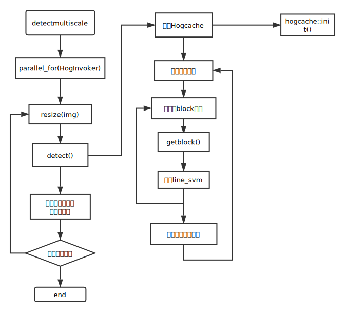

[svm+hog 训练](http://blog.csdn.net/yongshengsilingsa/article/details/7535496)
[hand data](http://www.idiap.ch/resource/gestures/)
[svm + hog](http://blog.csdn.net/lonely_geek/article/details/52357544?locationNum=6)

## [opencv hog](http://docs.opencv.org/master/d5/d33/structcv_1_1HOGDescriptor.html#a723b95b709cfd3f95cf9e616de988fc8)
opencv自带的hog svm detector 只支持linear svm classifier


## [hog参数图解](http://blog.csdn.net/raodotcong/article/details/6239431)
```cpp
// nbins是梯度方向计算的数目，多数为9，即180/20=9，多数以半圆180计算方向
size_t HOGDescriptor::getDescriptorSize() const  
{  
    CV_Assert(blockSize.width % cellSize.width == 0 &&  
        blockSize.height % cellSize.height == 0);  
    CV_Assert((winSize.width - blockSize.width) % blockStride.width == 0 &&  
        (winSize.height - blockSize.height) % blockStride.height == 0 );  
    return (size_t)nbins*  
        (blockSize.width/cellSize.width)*  
        (blockSize.height/cellSize.height)*  
        ((winSize.width - blockSize.width)/blockStride.width + 1)*  
        ((winSize.height - blockSize.height)/blockStride.height + 1);  
}  
```

## [比较完整HOG+SVM ，，模型加载](http://blog.csdn.net/qianqing13579/article/details/46509037)
<!--包含很多注意事项-->


## histograms of oriented gradients for human detection
- author Navneet Dalal and Bill Triggs. 2005
- gamma/colour normalization  
    gamma变换是用于矫正计算机系统上显卡或显示器出现的亮度偏差，gamma矫正源自显示器的矫正，一般取0.4或0.45，其最接近人类视觉系统．在hog特征上，它的作用不是很明显．  
    计算公式  

    $$I^{'}(x,y)=I(x,y)^{gamma}$$
- spatial/orientation binning  
    每一个像素对梯度直方图通道做加权投影，论文中写的是方向与位置的双线性插值。  
- normalization and descriptor blocks  
    一个block进行一次归一化，所以在不同block中的cell进行了多次归一化  
    R-hog(rectangular block hog)  
    C-hog(circle block hog)  
- detector window and context  
    算法进行训练时，制作数据集的窗口额外包含8-16像素的背景信息有助于进行目标检测，说明数据集窗口内只包含人物的部分有点不合理，但这样做应该有助于人物的准确定位．
- discussion  
    图像滤波会破坏掉hog检测用到的纹理特征，进而降低检测质量．  
    图像的局部归一化有助于检测质量，每一个cell被包含在了不同的block中，进行了不同区域的归一化，都包含在了hog特征向量中．  


[opencv hog1](http://blog.csdn.net/ttransposition/article/details/11874285)  
[opencv hog2](http://www.cnblogs.com/tornadomeet/archive/2012/08/15/2640754.html)  
#### 有两个问题
1. hog的每个像素的梯度是如何插值到梯度直方图的bin的
    这个可以根据上面的spatial/orientation binning获知
2. hog的权重是怎么计算的。
  
```cpp
/*M///////////////////////////////////////////////////////////////////////////////////////
//
//  IMPORTANT: READ BEFORE DOWNLOADING, COPYING, INSTALLING OR USING.
//
//  By downloading, copying, installing or using the software you agree to this license.
//  If you do not agree to this license, do not download, install,
//  copy or use the software.
//
//
//                           License Agreement
//                For Open Source Computer Vision Library
//
// Copyright (C) 2000-2008, Intel Corporation, all rights reserved.
// Copyright (C) 2009, Willow Garage Inc., all rights reserved.
// Third party copyrights are property of their respective owners.
//
// Redistribution and use in source and binary forms, with or without modification,
// are permitted provided that the following conditions are met:
//
//   * Redistribution's of source code must retain the above copyright notice,
//     this list of conditions and the following disclaimer.
//
//   * Redistribution's in binary form must reproduce the above copyright notice,
//     this list of conditions and the following disclaimer in the documentation
//     and/or other materials provided with the distribution.
//
//   * The name of the copyright holders may not be used to endorse or promote products
//     derived from this software without specific prior written permission.
//
// This software is provided by the copyright holders and contributors "as is" and
// any express or implied warranties, including, but not limited to, the implied
// warranties of merchantability and fitness for a particular purpose are disclaimed.
// In no event shall the Intel Corporation or contributors be liable for any direct,
// indirect, incidental, special, exemplary, or consequential damages
// (including, but not limited to, procurement of substitute goods or services;
// loss of use, data, or profits; or business interruption) however caused
// and on any theory of liability, whether in contract, strict liability,
// or tort (including negligence or otherwise) arising in any way out of
// the use of this software, even if advised of the possibility of such damage.
//
//M*/
#include <stdio.h>
#include "precomp.hpp"
#include <iterator>
#ifdef HAVE_IPP
#include "ipp.h"
#endif
/****************************************************************************************\
      The code below is implementation of HOG (Histogram-of-Oriented Gradients)
      descriptor and object detection, introduced by Navneet Dalal and Bill Triggs.

      The computed feature vectors are compatible with the
      INRIA Object Detection and Localization Toolkit
      (http://pascal.inrialpes.fr/soft/olt/)
\****************************************************************************************/

namespace cv
{

size_t HOGDescriptor::getDescriptorSize() const
{
    CV_Assert(blockSize.width % cellSize.width == 0 &&
        blockSize.height % cellSize.height == 0);
    CV_Assert((winSize.width - blockSize.width) % blockStride.width == 0 &&
        (winSize.height - blockSize.height) % blockStride.height == 0 );
    return (size_t)nbins*
        (blockSize.width/cellSize.width)*
        (blockSize.height/cellSize.height)*
        ((winSize.width - blockSize.width)/blockStride.width + 1)*
        ((winSize.height - blockSize.height)/blockStride.height + 1);
}

double HOGDescriptor::getWinSigma() const
{
    return winSigma >= 0 ? winSigma : (blockSize.width + blockSize.height)/8.;
}

bool HOGDescriptor::checkDetectorSize() const
{
    size_t detectorSize = svmDetector.size(), descriptorSize = getDescriptorSize();
    return detectorSize == 0 ||
        detectorSize == descriptorSize ||
        detectorSize == descriptorSize + 1;
}

void HOGDescriptor::setSVMDetector(InputArray _svmDetector)
{
    _svmDetector.getMat().convertTo(svmDetector, CV_32F);
    CV_Assert( checkDetectorSize() );
}

#define CV_TYPE_NAME_HOG_DESCRIPTOR "opencv-object-detector-hog"

bool HOGDescriptor::read(FileNode& obj)
{
    if( !obj.isMap() )
        return false;
    FileNodeIterator it = obj["winSize"].begin();
    it >> winSize.width >> winSize.height;
    it = obj["blockSize"].begin();
    it >> blockSize.width >> blockSize.height;
    it = obj["blockStride"].begin();
    it >> blockStride.width >> blockStride.height;
    it = obj["cellSize"].begin();
    it >> cellSize.width >> cellSize.height;
    obj["nbins"] >> nbins;
    obj["derivAperture"] >> derivAperture;
    obj["winSigma"] >> winSigma;
    obj["histogramNormType"] >> histogramNormType;
    obj["L2HysThreshold"] >> L2HysThreshold;
    obj["gammaCorrection"] >> gammaCorrection;
    obj["nlevels"] >> nlevels;

    FileNode vecNode = obj["SVMDetector"];
    if( vecNode.isSeq() )
    {
        vecNode >> svmDetector;
        CV_Assert(checkDetectorSize());
    }
    return true;
}

void HOGDescriptor::write(FileStorage& fs, const String& objName) const
{
    if( !objName.empty() )
        fs << objName;

    fs << "{" CV_TYPE_NAME_HOG_DESCRIPTOR
    << "winSize" << winSize
    << "blockSize" << blockSize
    << "blockStride" << blockStride
    << "cellSize" << cellSize
    << "nbins" << nbins
    << "derivAperture" << derivAperture
    << "winSigma" << getWinSigma()
    << "histogramNormType" << histogramNormType
    << "L2HysThreshold" << L2HysThreshold
    << "gammaCorrection" << gammaCorrection
    << "nlevels" << nlevels;
    if( !svmDetector.empty() )
        fs << "SVMDetector" << svmDetector;
    fs << "}";
}

bool HOGDescriptor::load(const String& filename, const String& objname)
{
    FileStorage fs(filename, FileStorage::READ);
    FileNode obj = !objname.empty() ? fs[objname] : fs.getFirstTopLevelNode();
    return read(obj);
}

void HOGDescriptor::save(const String& filename, const String& objName) const
{
    FileStorage fs(filename, FileStorage::WRITE);
    write(fs, !objName.empty() ? objName : FileStorage::getDefaultObjectName(filename));
}

void HOGDescriptor::copyTo(HOGDescriptor& c) const
{
    c.winSize = winSize;
    c.blockSize = blockSize;
    c.blockStride = blockStride;
    c.cellSize = cellSize;
    c.nbins = nbins;
    c.derivAperture = derivAperture;
    c.winSigma = winSigma;
    c.histogramNormType = histogramNormType;
    c.L2HysThreshold = L2HysThreshold;
    c.gammaCorrection = gammaCorrection;
    c.svmDetector = svmDetector;
    c.nlevels = nlevels;
}

void HOGDescriptor::computeGradient(const Mat& img, Mat& grad, Mat& qangle,
                                    Size paddingTL, Size paddingBR) const
{
    CV_Assert( img.type() == CV_8U || img.type() == CV_8UC3 );

    Size gradsize(img.cols + paddingTL.width + paddingBR.width,
                  img.rows + paddingTL.height + paddingBR.height);
    grad.create(gradsize, CV_32FC2);  // <magnitude*(1-alpha), magnitude*alpha>
    qangle.create(gradsize, CV_8UC2); // [0..nbins-1] - quantized gradient orientation
    Size wholeSize;
    Point roiofs;
    img.locateROI(wholeSize, roiofs);

    int i, x, y;
    int cn = img.channels();

    Mat_<float> _lut(1, 256);
    const float* lut = &_lut(0,0);

    if( gammaCorrection )
        for( i = 0; i < 256; i++ )
            _lut(0,i) = std::sqrt((float)i);
    else
        for( i = 0; i < 256; i++ )
            _lut(0,i) = (float)i;

    AutoBuffer<int> mapbuf(gradsize.width + gradsize.height + 4);
    int* xmap = (int*)mapbuf + 1;
    int* ymap = xmap + gradsize.width + 2;

    const int borderType = (int)BORDER_REFLECT_101;

    for( x = -1; x < gradsize.width + 1; x++ )
        xmap[x] = borderInterpolate(x - paddingTL.width + roiofs.x,
                        wholeSize.width, borderType) - roiofs.x;
    for( y = -1; y < gradsize.height + 1; y++ )
        ymap[y] = borderInterpolate(y - paddingTL.height + roiofs.y,
                        wholeSize.height, borderType) - roiofs.y;

    // x- & y- derivatives for the whole row
    int width = gradsize.width;
    AutoBuffer<float> _dbuf(width*4);
    float* dbuf = _dbuf;
    Mat Dx(1, width, CV_32F, dbuf);
    Mat Dy(1, width, CV_32F, dbuf + width);
    Mat Mag(1, width, CV_32F, dbuf + width*2);
    Mat Angle(1, width, CV_32F, dbuf + width*3);

    int _nbins = nbins;
    float angleScale = (float)(_nbins/CV_PI);
#ifdef HAVE_IPP
    Mat lutimg(img.rows,img.cols,CV_MAKETYPE(CV_32F,cn));
    Mat hidxs(1, width, CV_32F);
    Ipp32f* pHidxs  = (Ipp32f*)hidxs.data;
    Ipp32f* pAngles = (Ipp32f*)Angle.data;

    IppiSize roiSize;
    roiSize.width = img.cols;
    roiSize.height = img.rows;

    for( y = 0; y < roiSize.height; y++ )
    {
       const uchar* imgPtr = img.data + y*img.step;
       float* imglutPtr = (float*)(lutimg.data + y*lutimg.step);

       for( x = 0; x < roiSize.width*cn; x++ )
       {
          imglutPtr[x] = lut[imgPtr[x]];
       }
    }

#endif
    for( y = 0; y < gradsize.height; y++ )
    {
#ifdef HAVE_IPP
        const float* imgPtr  = (float*)(lutimg.data + lutimg.step*ymap[y]);
        const float* prevPtr = (float*)(lutimg.data + lutimg.step*ymap[y-1]);
        const float* nextPtr = (float*)(lutimg.data + lutimg.step*ymap[y+1]);
#else
        const uchar* imgPtr  = img.data + img.step*ymap[y];
        const uchar* prevPtr = img.data + img.step*ymap[y-1];
        const uchar* nextPtr = img.data + img.step*ymap[y+1];
#endif
        float* gradPtr = (float*)grad.ptr(y);
        uchar* qanglePtr = (uchar*)qangle.ptr(y);

        if( cn == 1 )
        {
            for( x = 0; x < width; x++ )
            {
                int x1 = xmap[x];
#ifdef HAVE_IPP
                dbuf[x] = (float)(imgPtr[xmap[x+1]] - imgPtr[xmap[x-1]]);
                dbuf[width + x] = (float)(nextPtr[x1] - prevPtr[x1]);
#else
                dbuf[x] = (float)(lut[imgPtr[xmap[x+1]]] - lut[imgPtr[xmap[x-1]]]);
                dbuf[width + x] = (float)(lut[nextPtr[x1]] - lut[prevPtr[x1]]);
#endif
            }
        }
        else
        {
            for( x = 0; x < width; x++ )
            {
                int x1 = xmap[x]*3;
                float dx0, dy0, dx, dy, mag0, mag;
#ifdef HAVE_IPP
                const float* p2 = imgPtr + xmap[x+1]*3;
                const float* p0 = imgPtr + xmap[x-1]*3;

                dx0 = p2[2] - p0[2];
                dy0 = nextPtr[x1+2] - prevPtr[x1+2];
                mag0 = dx0*dx0 + dy0*dy0;

                dx = p2[1] - p0[1];
                dy = nextPtr[x1+1] - prevPtr[x1+1];
                mag = dx*dx + dy*dy;

                if( mag0 < mag )
                {
                    dx0 = dx;
                    dy0 = dy;
                    mag0 = mag;
                }

                dx = p2[0] - p0[0];
                dy = nextPtr[x1] - prevPtr[x1];
                mag = dx*dx + dy*dy;
#else
                const uchar* p2 = imgPtr + xmap[x+1]*3;
                const uchar* p0 = imgPtr + xmap[x-1]*3;

                dx0 = lut[p2[2]] - lut[p0[2]];
                dy0 = lut[nextPtr[x1+2]] - lut[prevPtr[x1+2]];
                mag0 = dx0*dx0 + dy0*dy0;

                dx = lut[p2[1]] - lut[p0[1]];
                dy = lut[nextPtr[x1+1]] - lut[prevPtr[x1+1]];
                mag = dx*dx + dy*dy;

                if( mag0 < mag )
                {
                    dx0 = dx;
                    dy0 = dy;
                    mag0 = mag;
                }

                dx = lut[p2[0]] - lut[p0[0]];
                dy = lut[nextPtr[x1]] - lut[prevPtr[x1]];
                mag = dx*dx + dy*dy;
 #endif
                if( mag0 < mag )
                {
                    dx0 = dx;
                    dy0 = dy;
                    mag0 = mag;
                }

                dbuf[x] = dx0;
                dbuf[x+width] = dy0;
            }
        }
#ifdef HAVE_IPP
        ippsCartToPolar_32f((const Ipp32f*)Dx.data, (const Ipp32f*)Dy.data, (Ipp32f*)Mag.data, pAngles, width);
        for( x = 0; x < width; x++ )
        {
           if(pAngles[x] < 0.f)
             pAngles[x] += (Ipp32f)(CV_PI*2.);
        }

        ippsNormalize_32f(pAngles, pAngles, width, 0.5f/angleScale, 1.f/angleScale);
        ippsFloor_32f(pAngles,(Ipp32f*)hidxs.data,width);
        ippsSub_32f_I((Ipp32f*)hidxs.data,pAngles,width);
        ippsMul_32f_I((Ipp32f*)Mag.data,pAngles,width);

        ippsSub_32f_I(pAngles,(Ipp32f*)Mag.data,width);
        ippsRealToCplx_32f((Ipp32f*)Mag.data,pAngles,(Ipp32fc*)gradPtr,width);
#else
        cartToPolar( Dx, Dy, Mag, Angle, false );
#endif
        for( x = 0; x < width; x++ )
        {
#ifdef HAVE_IPP
            int hidx = (int)pHidxs[x];
#else
            float mag = dbuf[x+width*2], angle = dbuf[x+width*3]*angleScale - 0.5f;
            int hidx = cvFloor(angle);
            angle -= hidx;
            gradPtr[x*2] = mag*(1.f - angle);
            gradPtr[x*2+1] = mag*angle;
#endif
            if( hidx < 0 )
                hidx += _nbins;
            else if( hidx >= _nbins )
                hidx -= _nbins;
            assert( (unsigned)hidx < (unsigned)_nbins );

            qanglePtr[x*2] = (uchar)hidx;
            hidx++;
            hidx &= hidx < _nbins ? -1 : 0;
            qanglePtr[x*2+1] = (uchar)hidx;
        }
    }
}


struct HOGCache
{
    // 查找表
    struct BlockData
    {
        BlockData() : histOfs(0), imgOffset() {}
        int histOfs;
        Point imgOffset;
    };

    // 查找表
    struct PixData
    {
        size_t gradOfs, qangleOfs;
        int histOfs[4];
        float histWeights[4];
        float gradWeight;
    };

    HOGCache();
    HOGCache(const HOGDescriptor* descriptor,
        const Mat& img, Size paddingTL, Size paddingBR,
        bool useCache, Size cacheStride);
    virtual ~HOGCache() {};
    virtual void init(const HOGDescriptor* descriptor,
        const Mat& img, Size paddingTL, Size paddingBR,
        bool useCache, Size cacheStride);

    Size windowsInImage(Size imageSize, Size winStride) const;
    Rect getWindow(Size imageSize, Size winStride, int idx) const;

    const float* getBlock(Point pt, float* buf);
    virtual void normalizeBlockHistogram(float* histogram) const;

    vector<PixData> pixData;
    vector<BlockData> blockData;

    bool useCache;
    vector<int> ymaxCached;
    Size winSize, cacheStride;
    Size nblocks, ncells;
    int blockHistogramSize;
    int count1, count2, count4;
    Point imgoffset;
    Mat_<float> blockCache;
    Mat_<uchar> blockCacheFlags;

    Mat grad, qangle;
    const HOGDescriptor* descriptor;
};


HOGCache::HOGCache()
{
    useCache = false;
    blockHistogramSize = count1 = count2 = count4 = 0;
    descriptor = 0;
}

HOGCache::HOGCache(const HOGDescriptor* _descriptor,
        const Mat& _img, Size _paddingTL, Size _paddingBR,
        bool _useCache, Size _cacheStride)
{
    init(_descriptor, _img, _paddingTL, _paddingBR, _useCache, _cacheStride);
}

void HOGCache::init(const HOGDescriptor* _descriptor,
        const Mat& _img, Size _paddingTL, Size _paddingBR,
        bool _useCache, Size _cacheStride)
{
    descriptor = _descriptor;
    cacheStride = _cacheStride;
    useCache = _useCache;

    // 计算梯度图，grad是两通道的，为该像素梯度在相邻bin的插值，qangle为该像素梯度的相邻bin的标号
    descriptor->computeGradient(_img, grad, qangle, _paddingTL, _paddingBR);
    imgoffset = _paddingTL;

    winSize = descriptor->winSize;
    Size blockSize = descriptor->blockSize; // 一个块的像素尺寸(16,16)
    Size blockStride = descriptor->blockStride;// (8,8)
    Size cellSize = descriptor->cellSize;// (8,8)
    int i, j, nbins = descriptor->nbins;// 9
    int rawBlockSize = blockSize.width*blockSize.height;// 16*16=256

    // 一个窗口中的块数目 (64-16)/8+1=7,(128-16)/8+1=15
    nblocks = Size((winSize.width - blockSize.width)/blockStride.width + 1,
                   (winSize.height - blockSize.height)/blockStride.height + 1);
    //　一个块中的细胞数目 (2,2)
    ncells = Size(blockSize.width/cellSize.width, blockSize.height/cellSize.height);
    // 一个块的直方图中的筒数目 2*2*9=36
    blockHistogramSize = ncells.width*ncells.height*nbins;

    if( useCache )
    {
        Size cacheSize((grad.cols - blockSize.width)/cacheStride.width+1,
                       (winSize.height/cacheStride.height)+1);
        blockCache.create(cacheSize.height, cacheSize.width*blockHistogramSize);
        blockCacheFlags.create(cacheSize);
        size_t cacheRows = blockCache.rows;
        ymaxCached.resize(cacheRows);
        for(size_t ii = 0; ii < cacheRows; ii++ )
            ymaxCached[ii] = -1;
    }

    Mat_<float> weights(blockSize);　//以block中心为原点，高斯权重
    float sigma = (float)descriptor->getWinSigma();　　//sigma的意思？？？
    float scale = 1.f/(sigma*sigma*2);

    for(i = 0; i < blockSize.height; i++)
        for(j = 0; j < blockSize.width; j++)
        {
            float di = i - blockSize.height*0.5f;
            float dj = j - blockSize.width*0.5f;
            weights(i,j) = std::exp(-(di*di + dj*dj)*scale);
        }

    blockData.resize(nblocks.width*nblocks.height);
    pixData.resize(rawBlockSize*3);

    // Initialize 2 lookup tables, pixData & blockData.
    // Here is why:
    //
    // The detection algorithm runs in 4 nested loops (at each pyramid layer):
    //  loop over the windows within the input image
    //    loop over the blocks within each window
    //      loop over the cells within each block
    //        loop over the pixels in each cell
    //
    // As each of the loops runs over a 2-dimensional array,
    // we could get 8(!) nested loops in total, which is very-very slow. 4*2
    //
    // To speed the things up, we do the following:
    //   1. loop over windows is unrolled in the HOGDescriptor::{compute|detect} methods;
    //         inside we compute the current search window using getWindow() method.
    //         Yes, it involves some overhead (function call + couple of divisions),
    //         but it's tiny in fact.
    //   2. loop over the blocks is also unrolled. Inside we use pre-computed blockData[j]
    //         to set up gradient and histogram pointers.
    //   3. loops over cells and pixels in each cell are merged
    //       (since there is no overlap between cells, each pixel in the block is processed once)
    //      and also unrolled. Inside we use PixData[k] to access the gradient values and
    //      update the histogram
    //
    count1 = count2 = count4 = 0;
    // 块的像素大小遍历
    for( j = 0; j < blockSize.width; j++ )
        for( i = 0; i < blockSize.height; i++ )
        {
            PixData* data = 0;
            float cellX = (j+0.5f)/cellSize.width - 0.5f;
            float cellY = (i+0.5f)/cellSize.height - 0.5f;
            int icellX0 = cvFloor(cellX);
            int icellY0 = cvFloor(cellY);
            int icellX1 = icellX0 + 1, icellY1 = icellY0 + 1;
            cellX -= icellX0;
            cellY -= icellY0;

            
            if( (unsigned)icellX0 < (unsigned)ncells.width &&
                (unsigned)icellX1 < (unsigned)ncells.width )
            {
                // 相当于一个block中的左上角cell
                if( (unsigned)icellY0 < (unsigned)ncells.height &&
                    (unsigned)icellY1 < (unsigned)ncells.height )
                {
                    data = &pixData[rawBlockSize*2 + (count4++)];
                    data->histOfs[0] = (icellX0*ncells.height + icellY0)*nbins;
                    data->histWeights[0] = (1.f - cellX)*(1.f - cellY);
                    data->histOfs[1] = (icellX1*ncells.height + icellY0)*nbins;
                    data->histWeights[1] = cellX*(1.f - cellY);
                    data->histOfs[2] = (icellX0*ncells.height + icellY1)*nbins;
                    data->histWeights[2] = (1.f - cellX)*cellY;
                    data->histOfs[3] = (icellX1*ncells.height + icellY1)*nbins;
                    data->histWeights[3] = cellX*cellY;
                }
                else//相当于一个block中的左下角cell
                {
                    data = &pixData[rawBlockSize + (count2++)];
                    if( (unsigned)icellY0 < (unsigned)ncells.height )
                    {
                        icellY1 = icellY0;
                        cellY = 1.f - cellY;
                    }
                    data->histOfs[0] = (icellX0*ncells.height + icellY1)*nbins;
                    data->histWeights[0] = (1.f - cellX)*cellY;
                    data->histOfs[1] = (icellX1*ncells.height + icellY1)*nbins;
                    data->histWeights[1] = cellX*cellY;
                    data->histOfs[2] = data->histOfs[3] = 0;
                    data->histWeights[2] = data->histWeights[3] = 0;
                }
            }
            else
            {
                if( (unsigned)icellX0 < (unsigned)ncells.width )
                {
                    icellX1 = icellX0;
                    cellX = 1.f - cellX;
                }
                // 一个block中的右上角cell
                if( (unsigned)icellY0 < (unsigned)ncells.height &&
                    (unsigned)icellY1 < (unsigned)ncells.height )
                {
                    data = &pixData[rawBlockSize + (count2++)];
                    data->histOfs[0] = (icellX1*ncells.height + icellY0)*nbins;
                    data->histWeights[0] = cellX*(1.f - cellY);
                    data->histOfs[1] = (icellX1*ncells.height + icellY1)*nbins;
                    data->histWeights[1] = cellX*cellY;
                    data->histOfs[2] = data->histOfs[3] = 0;
                    data->histWeights[2] = data->histWeights[3] = 0;
                }
                else // 一个block中的右下角cell
                {
                    data = &pixData[count1++];
                    if( (unsigned)icellY0 < (unsigned)ncells.height )
                    {
                        icellY1 = icellY0;
                        cellY = 1.f - cellY;
                    }
                    data->histOfs[0] = (icellX1*ncells.height + icellY1)*nbins;
                    data->histWeights[0] = cellX*cellY;
                    data->histOfs[1] = data->histOfs[2] = data->histOfs[3] = 0;
                    data->histWeights[1] = data->histWeights[2] = data->histWeights[3] = 0;
                }
            }
            data->gradOfs = (grad.cols*i + j)*2;
            data->qangleOfs = (qangle.cols*i + j)*2;
            data->gradWeight = weights(i,j);
        }

    assert( count1 + count2 + count4 == rawBlockSize );
    // defragment pixData
    for( j = 0; j < count2; j++ )
        pixData[j + count1] = pixData[j + rawBlockSize];
    for( j = 0; j < count4; j++ )
        pixData[j + count1 + count2] = pixData[j + rawBlockSize*2];
    count2 += count1;
    count4 += count2;

    // initialize blockData
    for( j = 0; j < nblocks.width; j++ )
        for( i = 0; i < nblocks.height; i++ )
        {
            BlockData& data = blockData[j*nblocks.height + i];
            data.histOfs = (j*nblocks.height + i)*blockHistogramSize;
            data.imgOffset = Point(j*blockStride.width,i*blockStride.height);
        }
}


const float* HOGCache::getBlock(Point pt, float* buf)
{
    float* blockHist = buf;
    assert(descriptor != 0);

    Size blockSize = descriptor->blockSize;
    pt += imgoffset;

    CV_Assert( (unsigned)pt.x <= (unsigned)(grad.cols - blockSize.width) &&
               (unsigned)pt.y <= (unsigned)(grad.rows - blockSize.height) );

    if( useCache )
    {
        CV_Assert( pt.x % cacheStride.width == 0 &&
                   pt.y % cacheStride.height == 0 );
        Point cacheIdx(pt.x/cacheStride.width,
                      (pt.y/cacheStride.height) % blockCache.rows);
        if( pt.y != ymaxCached[cacheIdx.y] )
        {
            Mat_<uchar> cacheRow = blockCacheFlags.row(cacheIdx.y);
            cacheRow = (uchar)0;
            ymaxCached[cacheIdx.y] = pt.y;
        }

        blockHist = &blockCache[cacheIdx.y][cacheIdx.x*blockHistogramSize];
        uchar& computedFlag = blockCacheFlags(cacheIdx.y, cacheIdx.x);
        if( computedFlag != 0 )
            return blockHist;
        computedFlag = (uchar)1; // set it at once, before actual computing
    }

    int k, C1 = count1, C2 = count2, C4 = count4;
    const float* gradPtr = (const float*)(grad.data + grad.step*pt.y) + pt.x*2;
    const uchar* qanglePtr = qangle.data + qangle.step*pt.y + pt.x*2;

    CV_Assert( blockHist != 0 );
#ifdef HAVE_IPP
    ippsZero_32f(blockHist,blockHistogramSize);
#else
    for( k = 0; k < blockHistogramSize; k++ )
        blockHist[k] = 0.f;
#endif

    const PixData* _pixData = &pixData[0];

    for( k = 0; k < C1; k++ )
    {
        const PixData& pk = _pixData[k];
        const float* a = gradPtr + pk.gradOfs;
        float w = pk.gradWeight*pk.histWeights[0];
        const uchar* h = qanglePtr + pk.qangleOfs;
        int h0 = h[0], h1 = h[1];
        float* hist = blockHist + pk.histOfs[0];
        float t0 = hist[h0] + a[0]*w;
        float t1 = hist[h1] + a[1]*w;
        hist[h0] = t0; hist[h1] = t1;
    }

    for( ; k < C2; k++ )
    {
        const PixData& pk = _pixData[k];
        const float* a = gradPtr + pk.gradOfs;
        float w, t0, t1, a0 = a[0], a1 = a[1];
        const uchar* h = qanglePtr + pk.qangleOfs;
        int h0 = h[0], h1 = h[1];

        float* hist = blockHist + pk.histOfs[0];
        w = pk.gradWeight*pk.histWeights[0];
        t0 = hist[h0] + a0*w;
        t1 = hist[h1] + a1*w;
        hist[h0] = t0; hist[h1] = t1;

        hist = blockHist + pk.histOfs[1];
        w = pk.gradWeight*pk.histWeights[1];
        t0 = hist[h0] + a0*w;
        t1 = hist[h1] + a1*w;
        hist[h0] = t0; hist[h1] = t1;
    }

    for( ; k < C4; k++ )
    {
        const PixData& pk = _pixData[k];
        const float* a = gradPtr + pk.gradOfs;
        float w, t0, t1, a0 = a[0], a1 = a[1];
        const uchar* h = qanglePtr + pk.qangleOfs;
        int h0 = h[0], h1 = h[1];

        float* hist = blockHist + pk.histOfs[0];
        w = pk.gradWeight*pk.histWeights[0];
        t0 = hist[h0] + a0*w;
        t1 = hist[h1] + a1*w;
        hist[h0] = t0; hist[h1] = t1;

        hist = blockHist + pk.histOfs[1];
        w = pk.gradWeight*pk.histWeights[1];
        t0 = hist[h0] + a0*w;
        t1 = hist[h1] + a1*w;
        hist[h0] = t0; hist[h1] = t1;

        hist = blockHist + pk.histOfs[2];
        w = pk.gradWeight*pk.histWeights[2];
        t0 = hist[h0] + a0*w;
        t1 = hist[h1] + a1*w;
        hist[h0] = t0; hist[h1] = t1;

        hist = blockHist + pk.histOfs[3];
        w = pk.gradWeight*pk.histWeights[3];
        t0 = hist[h0] + a0*w;
        t1 = hist[h1] + a1*w;
        hist[h0] = t0; hist[h1] = t1;
    }

    normalizeBlockHistogram(blockHist);

    return blockHist;
}


void HOGCache::normalizeBlockHistogram(float* _hist) const
{
    float* hist = &_hist[0];
#ifdef HAVE_IPP
    size_t sz = blockHistogramSize;
#else
    size_t i, sz = blockHistogramSize;
#endif

    float sum = 0;
#ifdef HAVE_IPP
    ippsDotProd_32f(hist,hist,sz,&sum);
#else
    for( i = 0; i < sz; i++ )
        sum += hist[i]*hist[i];
#endif

    float scale = 1.f/(std::sqrt(sum)+sz*0.1f), thresh = (float)descriptor->L2HysThreshold;
#ifdef HAVE_IPP
    ippsMulC_32f_I(scale,hist,sz);
    ippsThreshold_32f_I( hist, sz, thresh, ippCmpGreater );
    ippsDotProd_32f(hist,hist,sz,&sum);
#else
    for( i = 0, sum = 0; i < sz; i++ )
    {
        hist[i] = std::min(hist[i]*scale, thresh);
        sum += hist[i]*hist[i];
    }
#endif

    scale = 1.f/(std::sqrt(sum)+1e-3f);
#ifdef HAVE_IPP
    ippsMulC_32f_I(scale,hist,sz);
#else
    for( i = 0; i < sz; i++ )
        hist[i] *= scale;
#endif
}


Size HOGCache::windowsInImage(Size imageSize, Size winStride) const
{
    return Size((imageSize.width - winSize.width)/winStride.width + 1,
                (imageSize.height - winSize.height)/winStride.height + 1);
}

Rect HOGCache::getWindow(Size imageSize, Size winStride, int idx) const
{
    int nwindowsX = (imageSize.width - winSize.width)/winStride.width + 1;
    int y = idx / nwindowsX;
    int x = idx - nwindowsX*y;
    return Rect( x*winStride.width, y*winStride.height, winSize.width, winSize.height );
}


void HOGDescriptor::compute(const Mat& img, vector<float>& descriptors,
                            Size winStride, Size padding,
                            const vector<Point>& locations) const
{
    if( winStride == Size() )
        winStride = cellSize;
    Size cacheStride(gcd(winStride.width, blockStride.width),
                     gcd(winStride.height, blockStride.height));
    size_t nwindows = locations.size();
    padding.width = (int)alignSize(std::max(padding.width, 0), cacheStride.width);
    padding.height = (int)alignSize(std::max(padding.height, 0), cacheStride.height);
    Size paddedImgSize(img.cols + padding.width*2, img.rows + padding.height*2);

    HOGCache cache(this, img, padding, padding, nwindows == 0, cacheStride);

    if( !nwindows )
        nwindows = cache.windowsInImage(paddedImgSize, winStride).area();

    const HOGCache::BlockData* blockData = &cache.blockData[0];

    int nblocks = cache.nblocks.area();
    int blockHistogramSize = cache.blockHistogramSize;
    size_t dsize = getDescriptorSize();
    descriptors.resize(dsize*nwindows);

    for( size_t i = 0; i < nwindows; i++ )
    {
        float* descriptor = &descriptors[i*dsize];

        Point pt0;
        if( !locations.empty() )
        {
            pt0 = locations[i];
            if( pt0.x < -padding.width || pt0.x > img.cols + padding.width - winSize.width ||
                pt0.y < -padding.height || pt0.y > img.rows + padding.height - winSize.height )
                continue;
        }
        else
        {
            pt0 = cache.getWindow(paddedImgSize, winStride, (int)i).tl() - Point(padding);
            CV_Assert(pt0.x % cacheStride.width == 0 && pt0.y % cacheStride.height == 0);
        }

        for( int j = 0; j < nblocks; j++ )
        {
            const HOGCache::BlockData& bj = blockData[j];
            Point pt = pt0 + bj.imgOffset;

            float* dst = descriptor + bj.histOfs;
            const float* src = cache.getBlock(pt, dst);
            if( src != dst )
#ifdef HAVE_IPP
               ippsCopy_32f(src,dst,blockHistogramSize);
#else
                for( int k = 0; k < blockHistogramSize; k++ )
                    dst[k] = src[k];
#endif
        }
    }
}

/*
 * 对一个尺度的图像进行检测，窗口遍历
 *　weights输出窗口为目标的可信度
 */
void HOGDescriptor::detect(const Mat& img,
    vector<Point>& hits, vector<double>& weights, double hitThreshold,
    Size winStride, Size padding, const vector<Point>& locations) const
{
    hits.clear();
    if( svmDetector.empty() )
        return;

    if( winStride == Size() )
        winStride = cellSize;
    // gcd(great common divisor,最大公约数) (8,8)
    Size cacheStride(gcd(winStride.width, blockStride.width),
                     gcd(winStride.height, blockStride.height));
    size_t nwindows = locations.size();
    padding.width = (int)alignSize(std::max(padding.width, 0), cacheStride.width);
    padding.height = (int)alignSize(std::max(padding.height, 0), cacheStride.height);
    Size paddedImgSize(img.cols + padding.width*2, img.rows + padding.height*2);

    // 计算图像梯度的模和方向
    // 预先计算一个block的bin基偏移、高斯权重、插值距离
    HOGCache cache(this, img, padding, padding, nwindows == 0, cacheStride);

    if( !nwindows )
        nwindows = cache.windowsInImage(paddedImgSize, winStride).area();　　//　图片中的窗口数目

    const HOGCache::BlockData* blockData = &cache.blockData[0];

    int nblocks = cache.nblocks.area(); // 检测窗口的block数目
    int blockHistogramSize = cache.blockHistogramSize; // 一个block中的histogram的bin总数 2*2*9=36
    size_t dsize = getDescriptorSize(); // 一个窗口的描述子总数

    double rho = svmDetector.size() > dsize ? svmDetector[dsize] : 0;
    vector<float> blockHist(blockHistogramSize);

    // 图像内窗口遍历
    for( size_t i = 0; i < nwindows; i++ )
    {
        Point pt0;
        if( !locations.empty() )
        {
            pt0 = locations[i];
            if( pt0.x < -padding.width || pt0.x > img.cols + padding.width - winSize.width ||
                pt0.y < -padding.height || pt0.y > img.rows + padding.height - winSize.height )
                continue;
        }
        else
        {
            pt0 = cache.getWindow(paddedImgSize, winStride, (int)i).tl() - Point(padding);
            CV_Assert(pt0.x % cacheStride.width == 0 && pt0.y % cacheStride.height == 0);
        }
        double s = rho;
        const float* svmVec = &svmDetector[0];
#ifdef HAVE_IPP
        int j;
#else
        int j, k;
#endif
        // 一个窗口内的所有block遍历
        for( j = 0; j < nblocks; j++, svmVec += blockHistogramSize )
        {
            const HOGCache::BlockData& bj = blockData[j];
            Point pt = pt0 + bj.imgOffset;

            // 得到以pt为tl坐标的block梯度直方图
            const float* vec = cache.getBlock(pt, &blockHist[0]);
#ifdef HAVE_IPP
            Ipp32f partSum;
            ippsDotProd_32f(vec,svmVec,blockHistogramSize,&partSum);
            s += (double)partSum;
#else
            // 计算到超平面的距离
            for( k = 0; k <= blockHistogramSize - 4; k += 4 )
                s += vec[k]*svmVec[k] + vec[k+1]*svmVec[k+1] +
                    vec[k+2]*svmVec[k+2] + vec[k+3]*svmVec[k+3];
            for( ; k < blockHistogramSize; k++ )
                s += vec[k]*svmVec[k];
#endif
        }
        if( s >= hitThreshold )
        {
            hits.push_back(pt0);
            weights.push_back(s);
        }
    }
}

void HOGDescriptor::detect(const Mat& img, vector<Point>& hits, double hitThreshold,
                           Size winStride, Size padding, const vector<Point>& locations) const
{
    vector<double> weightsV;
    detect(img, hits, weightsV, hitThreshold, winStride, padding, locations);
}

class HOGInvoker : public ParallelLoopBody
{
public:
    HOGInvoker( const HOGDescriptor* _hog, const Mat& _img,
                double _hitThreshold, Size _winStride, Size _padding,
                const double* _levelScale, std::vector<Rect> * _vec, Mutex* _mtx,
                std::vector<double>* _weights=0, std::vector<double>* _scales=0 )
    {
        hog = _hog;
        img = _img;
        hitThreshold = _hitThreshold;
        winStride = _winStride;
        padding = _padding;
        levelScale = _levelScale;
        vec = _vec;
        weights = _weights;
        scales = _scales;
        mtx = _mtx;
    }

    void operator()( const Range& range ) const
    {
        int i, i1 = range.start, i2 = range.end;
        double minScale = i1 > 0 ? levelScale[i1] : i2 > 1 ? levelScale[i1+1] : std::max(img.cols, img.rows);
        Size maxSz(cvCeil(img.cols/minScale), cvCeil(img.rows/minScale));
        Mat smallerImgBuf(maxSz, img.type());
        vector<Point> locations;
        vector<double> hitsWeights;

        // 图像尺度循环
        for( i = i1; i < i2; i++ )
        {
            double scale = levelScale[i];
            Size sz(cvRound(img.cols/scale), cvRound(img.rows/scale));
            Mat smallerImg(sz, img.type(), smallerImgBuf.data);
            if( sz == img.size() )
                smallerImg = Mat(sz, img.type(), img.data, img.step);
            else
                resize(img, smallerImg, sz);
            hog->detect(smallerImg, locations, hitsWeights, hitThreshold, winStride, padding);
            Size scaledWinSize = Size(cvRound(hog->winSize.width*scale), cvRound(hog->winSize.height*scale));

            mtx->lock();
            for( size_t j = 0; j < locations.size(); j++ )
            {
                // 保存窗口位置，尺度
                vec->push_back(Rect(cvRound(locations[j].x*scale),
                                    cvRound(locations[j].y*scale),
                                    scaledWinSize.width, scaledWinSize.height));
                if (scales)
                {
                    scales->push_back(scale);
                }
            }
            mtx->unlock();
            // 保存权重
            if (weights && (!hitsWeights.empty()))
            {
                mtx->lock();
                for (size_t j = 0; j < locations.size(); j++)
                {
                    weights->push_back(hitsWeights[j]);
                }
                mtx->unlock();
            }
        }
    }

    const HOGDescriptor* hog;
    Mat img;
    double hitThreshold;
    Size winStride;
    Size padding;
    const double* levelScale;
    std::vector<Rect>* vec;
    std::vector<double>* weights;
    std::vector<double>* scales;
    Mutex* mtx;
};


void HOGDescriptor::detectMultiScale(
    const Mat& img, vector<Rect>& foundLocations, vector<double>& foundWeights,
    double hitThreshold, Size winStride, Size padding,
    double scale0, double finalThreshold, bool useMeanshiftGrouping) const
{
    double scale = 1.;
    int levels = 0;

    vector<double> levelScale;
    // nlevels是固定值
    for( levels = 0; levels < nlevels; levels++ )
    {
        levelScale.push_back(scale);
        if( cvRound(img.cols/scale) < winSize.width ||
            cvRound(img.rows/scale) < winSize.height ||
            scale0 <= 1 )
            break;
        scale *= scale0;
    }
    levels = std::max(levels, 1);
    levelScale.resize(levels);

    std::vector<Rect> allCandidates;
    std::vector<double> tempScales;
    std::vector<double> tempWeights;
    std::vector<double> foundScales;
    Mutex mtx;

    parallel_for_(Range(0, (int)levelScale.size()),
                 HOGInvoker(this, img, hitThreshold, winStride, padding, &levelScale[0], &allCandidates, &mtx, &tempWeights, &tempScales));

    // 得到检测窗口的尺度，尺寸位置，置信度 
    std::copy(tempScales.begin(), tempScales.end(), back_inserter(foundScales));
    foundLocations.clear();
    std::copy(allCandidates.begin(), allCandidates.end(), back_inserter(foundLocations));
    foundWeights.clear();
    std::copy(tempWeights.begin(), tempWeights.end(), back_inserter(foundWeights));

    if ( useMeanshiftGrouping )
    {
        groupRectangles_meanshift(foundLocations, foundWeights, foundScales, finalThreshold, winSize);
    }
    else
    {
        groupRectangles(foundLocations, foundWeights, (int)finalThreshold, 0.2);
    }
}

void HOGDescriptor::detectMultiScale(const Mat& img, vector<Rect>& foundLocations,
                                     double hitThreshold, Size winStride, Size padding,
                                     double scale0, double finalThreshold, bool useMeanshiftGrouping) const
{
    vector<double> foundWeights;
    detectMultiScale(img, foundLocations, foundWeights, hitThreshold, winStride,
                     padding, scale0, finalThreshold, useMeanshiftGrouping);
}

typedef RTTIImpl<HOGDescriptor> HOGRTTI;

CvType hog_type( CV_TYPE_NAME_HOG_DESCRIPTOR, HOGRTTI::isInstance,
                 HOGRTTI::release, HOGRTTI::read, HOGRTTI::write, HOGRTTI::clone);

vector<float> HOGDescriptor::getDefaultPeopleDetector()
{
    static const float detector[] = {
       0.05359386f, -0.14721455f, -0.05532170f, 0.05077307f,
       0.11547081f, -0.04268804f, 0.04635834f, -0.05468199f, 0.08232084f,
       0.10424068f, -0.02294518f, 0.01108519f, 0.01378693f, 0.11193510f,
       ……
       -0.03250246f, 3.38630192e-003f, 2.64779478e-003f, 0.03359732f,
       -0.02411991f, -0.04229729f, 0.10666174f, -6.66579151f };
    return vector<float>(detector, detector + sizeof(detector)/sizeof(detector[0]));
}
//This function renurn 1981 SVM coeffs obtained from daimler's base.
//To use these coeffs the detection window size should be (48,96)
vector<float> HOGDescriptor::getDaimlerPeopleDetector()
{
    static const float detector[] = {
        0.294350f, -0.098796f, -0.129522f, 0.078753f,
        0.387527f, 0.261529f, 0.145939f, 0.061520f,
        0.328699f, 0.227148f, -0.066467f, -0.086723f,
        0.047559f, 0.106714f, 0.037897f, 0.111461f,
        ……
        0.142913f, 0.040597f, 0.019907f, 0.025963f,
        -0.119002f, 0.026722f, 0.034853f, -0.060934f,
        -0.025054f, -0.093026f, -0.035372f, -0.233209f,
        -0.049869f, -0.039151f, -0.022279f, -0.065380f,
        -9.063785f};
        return vector<float>(detector, detector + sizeof(detector)/sizeof(detector[0]));
}

class HOGConfInvoker : public ParallelLoopBody
{
public:
       HOGConfInvoker( const HOGDescriptor* _hog, const Mat& _img,
                               double _hitThreshold, Size _padding,
                               std::vector<DetectionROI>* locs,
                               std::vector<Rect>* _vec, Mutex* _mtx )
       {
               hog = _hog;
               img = _img;
               hitThreshold = _hitThreshold;
               padding = _padding;
               locations = locs;
               vec = _vec;
               mtx = _mtx;
       }

       void operator()( const Range& range ) const
       {
               int i, i1 = range.start, i2 = range.end;

               Size maxSz(cvCeil(img.cols/(*locations)[0].scale), cvCeil(img.rows/(*locations)[0].scale));
               Mat smallerImgBuf(maxSz, img.type());
               vector<Point> dets;

               for( i = i1; i < i2; i++ )
               {
                       double scale = (*locations)[i].scale;

                       Size sz(cvRound(img.cols / scale), cvRound(img.rows / scale));
                       Mat smallerImg(sz, img.type(), smallerImgBuf.data);

                       if( sz == img.size() )
                               smallerImg = Mat(sz, img.type(), img.data, img.step);
                       else
                               resize(img, smallerImg, sz);

                       hog->detectROI(smallerImg, (*locations)[i].locations, dets, (*locations)[i].confidences, hitThreshold, Size(), padding);
                       Size scaledWinSize = Size(cvRound(hog->winSize.width*scale), cvRound(hog->winSize.height*scale));
                       mtx->lock();
                       for( size_t j = 0; j < dets.size(); j++ )
                       {
                               vec->push_back(Rect(cvRound(dets[j].x*scale),
                                                                       cvRound(dets[j].y*scale),
                                                                       scaledWinSize.width, scaledWinSize.height));
                       }
                       mtx->unlock();
               }
       }

       const HOGDescriptor* hog;
       Mat img;
       double hitThreshold;
       std::vector<DetectionROI>* locations;
       Size padding;
       std::vector<Rect>* vec;
       Mutex* mtx;
};

void HOGDescriptor::detectROI(const cv::Mat& img, const vector<cv::Point> &locations,
                                       CV_OUT std::vector<cv::Point>& foundLocations, CV_OUT std::vector<double>& confidences,
                                       double hitThreshold, cv::Size winStride,
                                       cv::Size padding) const
{
   foundLocations.clear();

   confidences.clear();

   if( svmDetector.empty() )
       return;

   if( locations.empty() )
       return;

   if( winStride == Size() )
       winStride = cellSize;

   Size cacheStride(gcd(winStride.width, blockStride.width),
                                    gcd(winStride.height, blockStride.height));

   size_t nwindows = locations.size();
   padding.width = (int)alignSize(std::max(padding.width, 0), cacheStride.width);
   padding.height = (int)alignSize(std::max(padding.height, 0), cacheStride.height);
   Size paddedImgSize(img.cols + padding.width*2, img.rows + padding.height*2);

   // HOGCache cache(this, img, padding, padding, nwindows == 0, cacheStride);
   HOGCache cache(this, img, padding, padding, true, cacheStride);
   if( !nwindows )
           nwindows = cache.windowsInImage(paddedImgSize, winStride).area();

   const HOGCache::BlockData* blockData = &cache.blockData[0];

   int nblocks = cache.nblocks.area();
   int blockHistogramSize = cache.blockHistogramSize;
   size_t dsize = getDescriptorSize();

   double rho = svmDetector.size() > dsize ? svmDetector[dsize] : 0;
   vector<float> blockHist(blockHistogramSize);

   for( size_t i = 0; i < nwindows; i++ )
   {
           Point pt0;
           pt0 = locations[i];
           if( pt0.x < -padding.width || pt0.x > img.cols + padding.width - winSize.width ||
                   pt0.y < -padding.height || pt0.y > img.rows + padding.height - winSize.height )
           {
               // out of image
               confidences.push_back(-10.0);
               continue;
           }

           double s = rho;
           const float* svmVec = &svmDetector[0];
           int j, k;

           for( j = 0; j < nblocks; j++, svmVec += blockHistogramSize )
           {
                   const HOGCache::BlockData& bj = blockData[j];
                   Point pt = pt0 + bj.imgOffset;
                   // need to devide this into 4 parts!
                   const float* vec = cache.getBlock(pt, &blockHist[0]);
                   for( k = 0; k <= blockHistogramSize - 4; k += 4 )
                           s += vec[k]*svmVec[k] + vec[k+1]*svmVec[k+1] +
                                   vec[k+2]*svmVec[k+2] + vec[k+3]*svmVec[k+3];
                   for( ; k < blockHistogramSize; k++ )
                           s += vec[k]*svmVec[k];
           }
           // cv::waitKey();
           confidences.push_back(s);

           if( s >= hitThreshold )
                   foundLocations.push_back(pt0);
   }
 }

void HOGDescriptor::detectMultiScaleROI(const cv::Mat& img,
                                                           CV_OUT std::vector<cv::Rect>& foundLocations,
                                                           std::vector<DetectionROI>& locations,
                                                           double hitThreshold,
                                                           int groupThreshold) const
{
   std::vector<Rect> allCandidates;
   Mutex mtx;

   parallel_for_(Range(0, (int)locations.size()),
                        HOGConfInvoker(this, img, hitThreshold, Size(8, 8), &locations, &allCandidates, &mtx));

   foundLocations.resize(allCandidates.size());
   std::copy(allCandidates.begin(), allCandidates.end(), foundLocations.begin());
   cv::groupRectangles(foundLocations, groupThreshold, 0.2);
}

void HOGDescriptor::readALTModel(std::string modelfile)
{
   // read model from SVMlight format..
   FILE *modelfl;
   if ((modelfl = fopen(modelfile.c_str(), "rb")) == NULL)
   {
       std::string eerr("file not exist");
       std::string efile(__FILE__);
       std::string efunc(__FUNCTION__);
       throw Exception(CV_StsError, eerr, efile, efunc, __LINE__);
   }
   char version_buffer[10];
   if (!fread (&version_buffer,sizeof(char),10,modelfl))
   {
       std::string eerr("version?");
       std::string efile(__FILE__);
       std::string efunc(__FUNCTION__);
       throw Exception(CV_StsError, eerr, efile, efunc, __LINE__);
   }
   if(strcmp(version_buffer,"V6.01")) {
       std::string eerr("version doesnot match");
       std::string efile(__FILE__);
       std::string efunc(__FUNCTION__);
       throw Exception(CV_StsError, eerr, efile, efunc, __LINE__);
   }
   /* read version number */
   int version = 0;
   if (!fread (&version,sizeof(int),1,modelfl))
   { throw Exception(); }
   if (version < 200)
   {
       std::string eerr("version doesnot match");
       std::string efile(__FILE__);
       std::string efunc(__FUNCTION__);
       throw Exception();
   }
   int kernel_type;
   size_t nread;
   nread=fread(&(kernel_type),sizeof(int),1,modelfl);

   {// ignore these
       int poly_degree;
       nread=fread(&(poly_degree),sizeof(int),1,modelfl);

       double rbf_gamma;
       nread=fread(&(rbf_gamma),sizeof(double), 1, modelfl);
       double coef_lin;
       nread=fread(&(coef_lin),sizeof(double),1,modelfl);
       double coef_const;
       nread=fread(&(coef_const),sizeof(double),1,modelfl);
       int l;
       nread=fread(&l,sizeof(int),1,modelfl);
       char* custom = new char[l];
       nread=fread(custom,sizeof(char),l,modelfl);
       delete[] custom;
   }
   int totwords;
   nread=fread(&(totwords),sizeof(int),1,modelfl);
   {// ignore these
       int totdoc;
       nread=fread(&(totdoc),sizeof(int),1,modelfl);
       int sv_num;
       nread=fread(&(sv_num), sizeof(int),1,modelfl);
   }

   double linearbias;
   nread=fread(&linearbias, sizeof(double), 1, modelfl);

   std::vector<float> detector;
   detector.clear();
   if(kernel_type == 0) { /* linear kernel */
       /* save linear wts also */
       double *linearwt = new double[totwords+1];
       int length = totwords;
       nread = fread(linearwt, sizeof(double), totwords + 1, modelfl);
       if(nread != static_cast<size_t>(length) + 1) {
           delete [] linearwt;
           throw Exception();
       }

       for(int i = 0; i < length; i++)
           detector.push_back((float)linearwt[i]);

       detector.push_back((float)-linearbias);
       setSVMDetector(detector);
       delete [] linearwt;
   } else {
       throw Exception();
   }
   fclose(modelfl);
}

void HOGDescriptor::groupRectangles(vector<cv::Rect>& rectList, vector<double>& weights, int groupThreshold, double eps) const
{
    if( groupThreshold <= 0 || rectList.empty() )
    {
        return;
    }

    CV_Assert(rectList.size() == weights.size());

    vector<int> labels;
    int nclasses = partition(rectList, labels, SimilarRects(eps));

    vector<cv::Rect_<double> > rrects(nclasses);
    vector<int> numInClass(nclasses, 0);
    vector<double> foundWeights(nclasses, DBL_MIN);
    int i, j, nlabels = (int)labels.size();

    for( i = 0; i < nlabels; i++ )
    {
        int cls = labels[i];
        rrects[cls].x += rectList[i].x;
        rrects[cls].y += rectList[i].y;
        rrects[cls].width += rectList[i].width;
        rrects[cls].height += rectList[i].height;
        foundWeights[cls] = max(foundWeights[cls], weights[i]);
        numInClass[cls]++;
    }

    for( i = 0; i < nclasses; i++ )
    {
        // find the average of all ROI in the cluster
        cv::Rect_<double> r = rrects[i];
        double s = 1.0/numInClass[i];
        rrects[i] = cv::Rect_<double>(cv::saturate_cast<double>(r.x*s),
            cv::saturate_cast<double>(r.y*s),
            cv::saturate_cast<double>(r.width*s),
            cv::saturate_cast<double>(r.height*s));
    }

    rectList.clear();
    weights.clear();

    for( i = 0; i < nclasses; i++ )
    {
        cv::Rect r1 = rrects[i];
        int n1 = numInClass[i];
        double w1 = foundWeights[i];
        if( n1 <= groupThreshold )
            continue;
        // filter out small rectangles inside large rectangles
        for( j = 0; j < nclasses; j++ )
        {
            int n2 = numInClass[j];

            if( j == i || n2 <= groupThreshold )
                continue;

            cv::Rect r2 = rrects[j];

            int dx = cv::saturate_cast<int>( r2.width * eps );
            int dy = cv::saturate_cast<int>( r2.height * eps );

            if( r1.x >= r2.x - dx &&
                r1.y >= r2.y - dy &&
                r1.x + r1.width <= r2.x + r2.width + dx &&
                r1.y + r1.height <= r2.y + r2.height + dy &&
                (n2 > std::max(3, n1) || n1 < 3) )
                break;
        }

        if( j == nclasses )
        {
            rectList.push_back(r1);
            weights.push_back(w1);
        }
    }
}
}

```