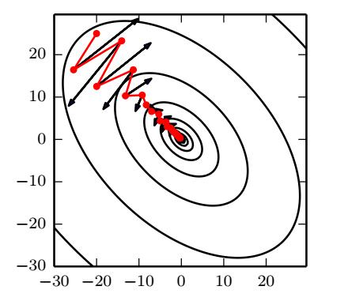

## how learning differs from pure optimization
机器学习往往不是直接优化目标函数的，比如通过降低训练集的误差来降低测试集的误差，而optimization是直接的。
1. batch gradient methods ：指使用全部数据集估计梯度  
2. minibatch gradient methods ：指把数据集分成子集，然后用子集估计梯度
3. stochastic gradient methods :指只使用一个样本估计梯度，也称为 online gradient methods。(online 指从一个stream中获取到的样本，而不是一个固定大小的数据集，比如摄像机的在线标定，就是打开摄像头时，利用实时获取的图像进行标定，而不是离线的视频来做标定)

只进行一个epoch的训练才是无偏估计，即每个样本只使用一次。当训练集足够大时，不会发生过拟合，但是要多大，如何计算这个数值？

## challenges in neural network optimization

## Basic Algorithms
- Stochastic Gradient Descent
batch gradient descent可以使用固定学习率，因为损失函数在接近最小值时，梯度几乎为0；而minibatch gradient descent要使用递减的学习率，因为minibatch是随机抽取的样本，会引入噪声，常见衰减公式如下：
> $$\epsilon_k=(1-\alpha)\epsilon_{0} + \alpha \epsilon_{\tau}, \qquad \alpha=\frac{k}{\tau}$$
- momentum  

