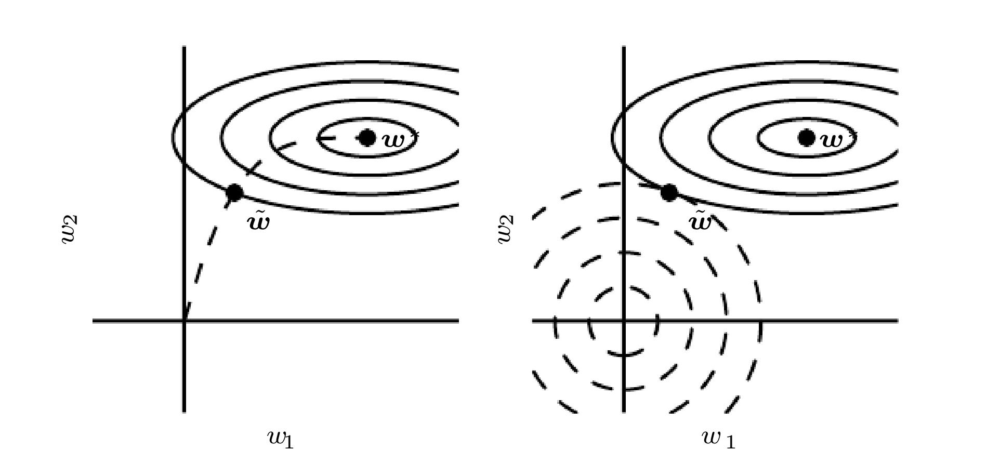

规则化是以降低泛化误差而不是训练误差为目的时，对模型做的修改的总称。

## 1.parameter norm penalties
通过使用规则项降低模型容量来提升泛化性能  
- L2规则项  
- L1规则项  
L1规则项有稀疏特性，可以用于特征选择

## 2. Norm as Constrained Optimization

## 4. dataset augmentation
- 朝各个方向平移
- 旋转
- 缩放
- 水平、上下翻转
- 引入输入噪声、隐藏层噪声
- dropout can be seen as a process of constructing new inputs by multiplying by noise
数据增强的划分有很强的主管性，如图像剪切被认为是一种预处理操作而不是增强，通用的对输入添加高斯噪声被认为是一种机器学习算法而不是增强。

## 5. noise robustness
一般情况下，为输入增加噪声比添加权重规则项更有用，特别是对隐藏层神经元引入噪声后的泛化能力更强，dropout就是基于这个原理的。  
给参数添加噪声，相当于寻找一个参数点使得代价函数最低，并且这个点周围的参数点也使得代价函数最低。  
给标签引入噪声。

## 6. semi-supervised learning
分开的，使用无标签数据学习数据的表达，例如，主成分分析，然后再使用有标签数据训练分类器  
一起的，生成模型与判别模型共享参数，不懂？？

## 7. multi-task learning
多任务学习有助于提升泛化性能，但是有个前提假设是各任务应该存在潜在的关系。

## 8. early stopping
可以解释为一种超参数或者一种规则化技术
- 超参数解释  
许多超参数的验证误差都是一个U型曲线，迭代次数也是这样，那么就可以通过调整训练次数来控制模型的有效容量(effective capacity of the model)。
要做到early stopping就需要一个单独的没有输入到训练过程中的验证集，而这个验证集在训练完成后的使用方法包括两种，一是记录下达到验证误差最小的迭代次数，然后把验证集添加入训练集，从头开始训练记录下的迭代次数次训练；二是在前面保存的最有验证误差时的模型的基础上，使用训练集加上验证集进行微调。
- 规则化解释  

首先，在左图中，假设代价函数的最优解是$w^*$，而$w^*$周围的实线圈表示等代价函数值时的各参数值，然后由内向外代价函数依次变高，注意，坐标系为参数。early stopping相当于虚线中，参数由原点周围经过SGD一步步趋向于最优解，然后在这个过程中，取使验证集误差最小的参数。  
右图是带有L2规则化项的代价函数，虚线表示等代价函数中使规则化项数值相等的参数。由于规则化项的存在，最有解不再在$w^*$，而变为了在$\tilde w$
> 例子继续看

