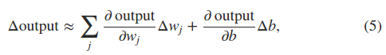
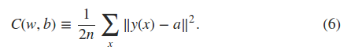
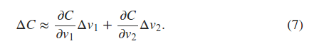
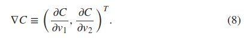
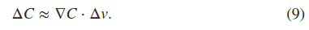
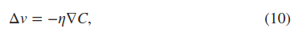

neural networks and deep learning  Michael Nielsen  
book [draft online](http://neuralnetworksanddeeplearning.com/index.html)  
source [code](https://github.com/mnielsen/neural-networks-and-deep-learning)
```
In 2006, neural network surpass the traditional approaches by deep neural network what we call it today neural network;    
master a solid understanding of the core principles, such as, program language has syntax, libraries and data structures;
```
### using neural nets to recognize handwritten digits
key ideas, **build your neural networks intuition**
 1. two important artificial neuron  
    perceptron  
    sigmoid neuron(modified perceptron that small changes in their weights and bias cause only a small change in their output)}
2. standard learning algorithm  
    stochastic gradient descent   

#### perceptrons  
b = -threshold 
所以b越大越容易输出1，b越小越容易输出0。
感知机的一种用途是加权重来做决定，另一种用途是实现逻辑与、或、与非(nand)。它们的输出都是二值的(0或1)
输入感知机可以看做是一种特殊形式的感知机，它没有输入。
#### sigmoid neurons
把按照感知机形式的输出作为sigmoid函数的输入。
sigmoid函数是一个单调递增函数，所以函数的输出与perceptrons类似。
在这里sigmoid函数是一种激活函数(activation function)。  
  
根据微积分，Δoutput is a linear function of the changes Δwj and Δb in the weights and bias. 
    
### the architecture of neural networks
- input layer, the neurons within this layer are called input neuron, 
- hidden layer,(just not an input or an output)
- output layer, output neurons  

feedforward neural network //前馈网络，指没有闭环，never feed back  
recurrent neural network//循环神经网络，loops???    
### a simple network to classify handwritten digits  
digits segmentation  //把一张图片内的所有数字区域提取成一个数字图片序列  
digits recognization  //隐藏层的具体作用？？做实验  
输入是图像的每一个像素的灰度值(0~1)，0表示白色，1表示黑色。
因为输出结果包含10种情况(0,1,,,9)，可以采用4位的二进制编码表示输出，也可以直接用0~9表示输出，根据文中的实验结果，0~9的输出格式训练结果较好。
### learning with gradient descent  
[hand writen digits DataBase](http://yann.lecun.com/exdb/mnist/)  
MNIST数据集包含两个部分，第一部分包含60,000幅图像做训练集，是从250人的手写数字扫描得到，是28*28的灰度图像。第二部分包含10,000幅图像做训练集。  
cost function： mean squared error(MSE) is a smooth function of weights and biases,so it is easier to compute.   
因为直接让输出趋向于结果的学习方法，对参数做一个小改变对结果有可能不会有影响，所以采用了MSE作为代价函数。  

**以二元变量代价函数为例子来考虑梯度下降法**
当只有两个变量时，可以利用微积分学，求解函数的导数，让导数为0，可以求得最小值。但是当变量数目过多时，这种方法就行不通了。
- 代价函数  
  
- 当假设一个球沿着v1方向运动一个小的delta v1， 沿着v2方向运动一个小的delta v2时，微积分学告诉我们C的改变形式如下？？？微积分求导？？  
  
根据上式可以知道，我们只需要选择合适的delta v1,和delta v2，就能使delta C的符号为负的。为了弄清如何选择合适的delta v1,delta v2，定义如下的梯度向量。
- gradient vector  

- 重写7式，这样可以很清楚的看到要让delta C小于0时，delta v的取值  
  
- delta v的取值  
  
总结起来就是不断重复计算梯度向量，然后将球沿着梯度相反的方向移动。

根据代价函数C的形式可以知道，神经网络的训练时间主要浪费在求梯度上，因为每计算一次梯度，所有的训练样本都要用到。    
随机梯度下降法(stochastic gradient descet)是用来加速学习过程的方法，它的要点主要体现在随机从训练数据中随机选取样本来计算梯度，而没有采用所有的训练数据。抽取的训练数据称为mini_bath。
当所有的训练数据都被用来过计算梯度时，称为完成了一次 **a epoch of training**，之后就是开始了一次新的**training epoch**


gradient descent: 和一个球在山谷滚动类似，最后稳定在最低处。  
stochastic gradient descent  
implementing our network to classify digits  
example codes and its usage  
toward deep learning  
deep learning (iran goodfellow and yoshua bengio, an MIT press book) 周志华赞
deep learning tutorial downloaded(by Yann LeCun and MarcAurello Ranzato Facebook) <deep learning>
LISA Deep Learning Tutorial PPT(by Yoshua Benglo LISA Lab) https://sites.google.com/site/deeplearningcvpr2014/
