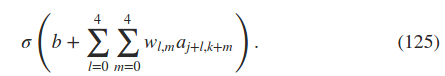

[Deep learning](http://neuralnetworksanddeeplearning.com/chap6.html)
----------------
### 1. introducing convolutional networks
<<<<<<< HEAD
前面用到的网络模型是全连接网络(network layers are fully connected to one another)，这种结构没有用到像素的位置信息，即便有用到，也需要网络自己训练出相应的信息。convolutional neural networks利用到了这种空间结构信息。
- local receptive fields.  
输入神经元是整幅图像28*28，隐藏层神经元连接的是整幅图像的一个个小区域(local receptive fields,5*5)，这也构成了一幅图像(24*24)。
- shared weights and biases
所有隐藏层神经元的计算使用相同的权重系数和偏置系数，激励公式如下：  
  
相同的系数和权重意味着神经网络检测的是相同的结构，但是它是对输入图像做遍历的，所以这样对特征位置没有要求。
kernel or filter: the shared weights  
[Visualizing and Understanding Convolutional Networks](https://arxiv.org/abs/1311.2901)  
- pooling layers  
to simplify the information in the output from the convolutional layer.
max-pooling: take the maximum activation of a 2×2 region of neurons
L2 pooling: take the square root of the sum of the squares of the activations in the 2×2 region
### 2. convolutional neural networks in practice
Theano: a cpu and gpu math exprssion compiler in python
- using the tanh activation funcntion
- expanding the training data
- using rectified 
- inserting an extra fully-connected layer  
增加层数的同时，使用了dropout来避免over-fitting，结果到了99.60  
- using an ensemble of networks  
- why we only applied dropout to the fully-connected layers
卷基层本身对过拟合有抗性，因为它对整幅图像有shared weights，不会限于图像的局部特征。
- go futher
- why are we able to train  
- how deep are these networks, anyway  
deep networks仅仅是对于2000年以前网络结构只有1-2层的隐藏层来说的，并不能以隐藏层的数目来衡量how deep。
- a word on procedure  
如何选择网络的参数？chapter3  
### 3. the code for our convolutional networks
problems
- early sropping strategy
### 4. recent progress in image recognition
### 5. other approaches to deep neural nets
### 6. on the future of neural networks
=======
- convolutional layer  
- pooling layer  
### 2. convolutional neural networks in practice
theano: a cpu and gpu math expression compiler in python

### recent progress in image recognition
### other approacches to deep neural nets
### on the future of neural networks
intention-driven interfaces  
data science   
>>>>>>> 70cd4a74f61c4005e0d2e4e75560faebfcb43394
