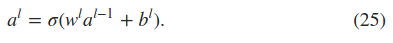
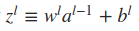
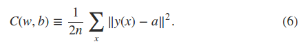
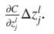
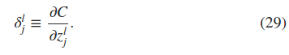
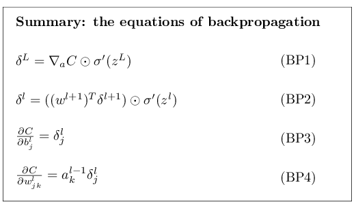
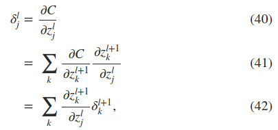

[how the backpropagation algorithm works](http://neuralnetworksanddeeplearning.com/chap2.html)
-------
梯度下降算法是一种优化算法，它需要求解梯度，反向传播算法是一种求解梯度的算法。  
backpropagation就是关于改变一个神经网络的权值系数和偏置是如何改变代价函数的方法，也就是代价函数关于参数的偏微分，梯度。  

**backpropagation : an algorithm for computing gradients，一个快速的计算代价函数梯度的算法**

### 1. warm up: a fast matrix-based approach to computing the output from a neural network
神经网络激励函数的向量化  
- 网络层之间激励的传播  
  
- 中间值，网络层之间用权值加偏置之后的输入  

### 2. the two assumptions we need about the cost function
反向传播(backpropagation)的目的是为了计算代价函数的梯度。  
对于backpropagation能够起作用用的前提是两个假设：
- ？？代价函数可以写成平均的形式，因为backpropagation需要的是对单独一个训练数据求偏微分，而我们的是求所有训练样本代价函数的偏微分和然后做平均的形式。
- 神经网络的输出可以写成一个函数的输出。

### 3. the hadamard product  s圈点t
### 4. the four fundamental equations behind backpropagation

backpropagation就是关于改变一个神经网络的权值系数和偏置是如何改变代价函数的方法，也就是代价函数关于参数的偏微分，梯度。  

- 代价函数  
  

backpropagation就是关于改变一个神经网络的权值系数和偏置是如何改变代价函数的方法，也就是代价函数关于参数的偏微分。      
- 假设在第l层、第j神经元的输入上有一个误差deltazjl， 通过之后神经网络的传递，最后造成的误差为(**这是微积分推导？？？为什么，这就是？？展开**)  

- 根据上式，由于deltaZjl基本是一个比较小的值，所以误差的大小基本取决于上式的左部分，这样可以有如下定义，第l层、第j神经元的误差的定义  

- BP4公式  
BP1表示输出层L层的误差  

### 5. proof of the four fundamental equations(optional，指选择性的证明，而不是可以选择性的看)
- BP2的证明，**为什么是和的形式**  
这一层的某一个神经元的误差传递给下一层所有的神经元，因为代价函数是下一层所有神经元输出的函数，所以采用和的形式。  

### 6. the backpropagation algorithm
### 7. the code for backpropagation
### 8. in what sense is backpropagation a fast algorithm
### 9. backpropagation:the big picture

