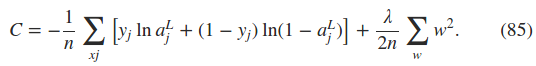
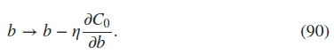
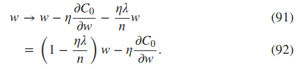
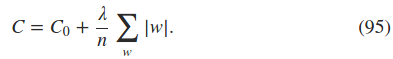
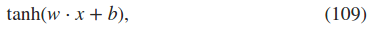
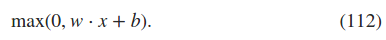

The philosophy is that the best entree to the plethora of available techniques is in-depth study of a few of the most important
----------

### 1. the cross-entropy cost function

**By contrast, we learn more slowly when our errors are less well-defined**  
讲解只有一个神经元时，权重和偏置系数的更新。并抛出当误差非常大时学习速度反而较慢的问题。

### 2. introducing the cross-entropy cost function
为了解决学习速度慢的问题，替换二范数代价函数为交叉熵(cross-entropy)代价函数。
- 一个神经元的代价函数，x是样本  
$$C=-\frac{1}{n}\sum _{x}[y*ln(a)+(1-y)*ln(1-a)$$(57)
- 多个神经元的代价函数  

- 对于回归问题，采用代价函数形式，binary entropy??  

**problems**  
using the quadratic cost when we have linear neurons in the output layer  
那么在每一个神经网络的最后一层都加上一个linear neurons的话，是不是都可以用quadratic cost函数了？？？
### 3. using the cross-entropy to classify MNIST digits
cross-entropy代价函数在手写数字识别问题中的正确率并没有明显改善，但是它可以解决neuron saturation的问题。

### 4. what does the cross-entropy mean? where does it come from?
**problem**  

### 5. softmax 
它指神经网络的输出神经元换为一种新的类型，它的函数为：
- softmax funtion  
    

softmax layer的单调性；  
softmax layer每个神经元的输出同时依赖于同一层其它神经元的输出。  
**problem**  
  log-likelihood cost function
softmax output layer + log-likelihood cost funciton的梯度与  
sigmoid output layer + cross-entropy cost functiond的梯度都避免了neuron saturation的问题。   
**problems** 

### 6. overfitting and regularization
overfitting or overtraining  
检测overfitting，当测试数据集的识别正确率不再改善的时候，就到了overfitting点了，也就可以终止训练。  
- training_data  
- validation_data，使用这个数据集来检测overfitting，这个策略称为*early stopping*；验证数据集也是为了找到合适的hyper-parameters; **To put it another way, you can think of the validation data as a type of training data that helps us learn good hyper-parameters(hold out method)** 。提高训练数据集的大小也可以减小over-fitting。 
- test_data  

**regularization**  
是一种减小over-fitting的方法，例如，*weight decay* or *L2 regularization*，方法就是在代价函数公式后加上一个 regularization term，如下：，lambda称为regularization parameter  
  
直觉上，规则化是要让网络系数越小越好。为什么加上规则化项可以减少over-fitting   
  
  
**why does regularization help reduce overfitting**  
神经网络的系数较小，意味着如果神经网络的少数几个输入存在噪声的话，输出并不会被影响太多。  
规则化项并没有包括偏置系数b，因为一个比较大的偏置，可以让我们更容易改变网络的行为。  
**other techniques for regualrization**  
- L1 regularization  
  
- dropout  ?
- artificiallly expanding the training data，如对数字进行旋转，就得到了新的数据  
### 6. weight initialization  
前面用到的权重、偏置初始化是用的均值为0，标准差为1的独立高斯分布随机数。  
改变权重、偏置的初始化，可以让神经网络的最初结果较好，也就加速了训练过程。当前，对最后的正确率影响不打，但在第四章会讲到，对最后结果的改善。  
权重初始化的目的也就是为了避免saturation，选择标准偏差为1/根号下n in  
### 7. handwriting recognition revisited: the code
代码中新添了L2正则化项
神经网络的保存方法，save，加载方法，load，使用了json，而不是pickle
### 8. how to choose a neural network's hyper-parameters  
**broad strategy**
-----
### 9. other techniques
-----
### 10. variations on stochastic gradient descent
- hessian technique
- momentum-based gradient descent
### 11. other models of artificial neuron
- tanh neuron  

- rectified linear neuron  

### 12. on stories in neural networks

