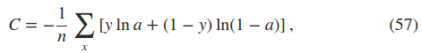
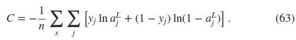
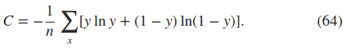
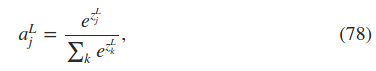

The philosophy is that the best entree to the plethora of available techniques is in-depth study of a few of the most important
----------

### 1. the cross-entropy cost function

**By contrast, we learn more slowly when our errors are less well-defined**
讲解只有一个神经元时，权重和偏置系数的更新。并抛出当误差非常大时学习速度反而较慢的问题。

### 2. introducing the cross-entropy cost function
为了解决学习速度慢的问题，替换二范数代价函数为cross-entropy代价函数。
- 一个神经元的代价函数  
  
- 多层神经元的代价函数  

- 对于回归问题，采用代价函数形式，binary entropy  

**problems**  
using the quadratic cost when we have linear neurons in the output layer  
那么在每一个神经网络的最后一层都加上一个liear neurons的话，是不是都可以用quadratic cost函数了？？？
### 3. using the cross-entropy to classify MNIST digits
cross-entropy代价函数在手写数字识别问题中的正确率并没有明显改善，但是它可以解决neuron saturation的问题。

### 4. what does the cross-entropy mean? where does it come from?
**problem**  
**softmax layer**  
神经网络最后输出的是一个概率。  
  
**exercise**  
**exercises**  
softmax layer的单调性；  
softmax layer每个神经元的输出同时依赖于同一层其它神经元的输出。  
**problem**  
  log-likelihood cost function
softmax output layer + log-likelihood cost funciton的梯度与  
sigmoid output layer + cross-entropy cost functiond的梯度都避免了neuron saturation的问题。   
**problems** 
### 5. overfitting and regularization

