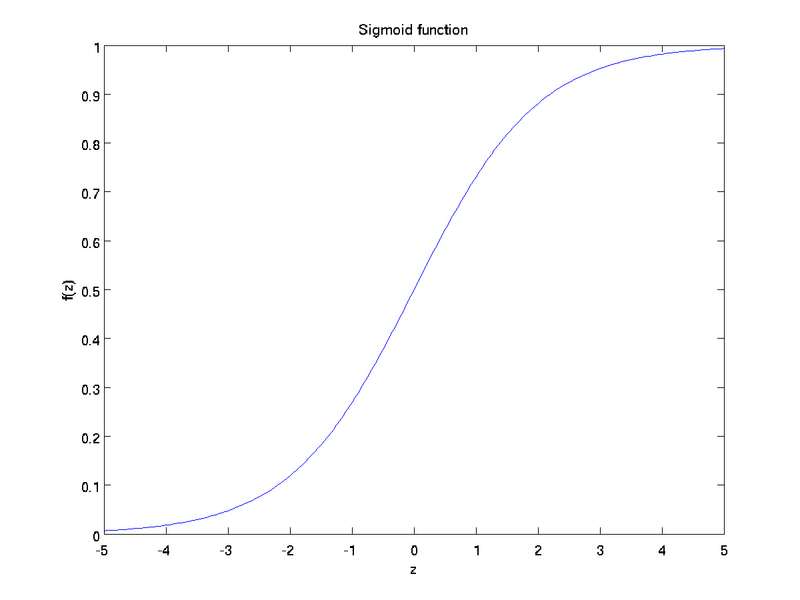
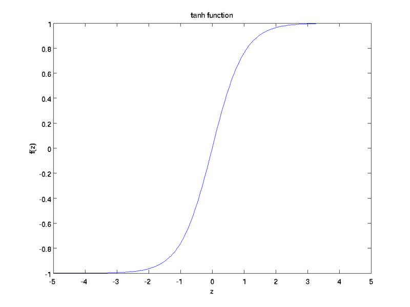

### neural networks
```
hyperbolic tangent 双曲正切函数  
bias units / bias terms 偏置项  
activation 激活值  
forward propagation 前向传播  
feedforward neural network 前馈神经网络  
activate function 激活函数  
```
sigmoid 激活函数
$$f(z)=\frac{1}{1+exp(-z)}$$
<!--    -->
双曲正切激活函数
$$f(z)=tanh(z)=\frac{exp(z)-exp(-z)}{exp(z)+exp(-z)}=2*\frac{1}{1+exp(-2x)}-1$$
<!--  -->

神经元计算模型，f是激活函数
$$z=W^{T}x+b$$(1)
$$a=f(z)$$(2) 

### backpropagation algorithm 反向传播算法
- 均方差代价函数 + 正则项 + 稀疏约束(这里是两层的稀疏自编码网络，$s_2$表示第二层隐藏层的神经元数目)
$$\begin{aligned}
J(W,b)&=avgSquare+weightDecay+ sparsityPenalty\\
&=\frac{1}{m}[\sum_{i=1}^m(\frac{1}{2}||y-h_{W,b}(x)||^2)]+\frac {\lambda}{2}\sum_{l=1}^{n_l-1}\sum_{i=1}^{s_l}\sum_{j=1}^{s_l+1}(W_{ji}^{(l)})^2+\beta \sum_{j=1}^{s_2}KL(\rho||\hat{\rho}_j)
\end{aligned}$$

其中$sparsityPenalty$的衡量公式叫相对熵(KL divergence)，$\rho$为人为设置的参数，即期望的活跃度，定义式如下：
$$KL(\rho||\hat{\rho}_j)=\rho *log(\frac{\rho}{\hat{\rho}_j})+(1-\rho)*log(\frac{1-\rho}{1-\hat{\rho}_j})$$
$\hat{\rho}_j$表示第二层隐藏层的第$j$神经元的平均活跃度：
$$\hat{\rho_j}=\frac{1}{m}\sum_{i=1}^{m}[a_j^{(2)}(x)^i]$$  
- 代价函数的求导
$$\frac{\partial J(W,b)}{\partial W} = \frac{\partial (avgSquare)}{\partial W}+\frac{\partial (weightDecay)}{\partial W}+\frac{\partial (sparsityPenalty)}{\partial W}$$
即可以将代价函数的三部分分别求导，最后再将三部分导数求和。  
这里使用的是方差代价函数（2范数）
$$J(W,b,x,y)=\frac{1}{2}||y-h_{W,b}(x)||^2$$

这里只是公式的推导，没有给出为什么残差要这样定义，可以参见*neural networks and deep learning*
$$\begin{aligned}
\delta_i^l&=\frac{\partial{J(W,b,x,y)}}{\partial{z_i^l}} \\
&=\frac{\partial{J(W,b,x,y)}}{\partial{a_i^l}}*\frac{\partial a_i^l}{\partial z_i^l}
\end{aligned}$$

### gradient checking and advanced optimizaiton(梯度检验和高级优化)
高级优化只是提了L-BFGS和共轭梯度算法等名词，并没有展开讲。  
梯度检验是根据梯度的定义来验证反向传播时梯度计算的正确性，公式即：  
$$\frac{d}{d\theta}J(\theta)=\lim_{\epsilon \to 0}\frac{J(\theta + \epsilon) - J(\theta - \epsilon)}{2\epsilon}$$
### autoencoders and sparsity(自编码算法与稀疏性)
自编码是让输出与输入保持一致，是一种无监督学习算法，通过为自编码神经网络加一些限制，可以得到有趣的事情。例如控制隐藏层神经元的数目少于输入层神经元的数目可以起到数据压缩的作用；通过对惩罚函数加入对某些神经元的激活度限制，可以起到稀疏化的结果，这里有点让人费解。
### visualizing a trained autoencoder(可视化自编码器训练结果)
计算令各个隐藏层神经元得到最大激活度的输入，并可视化输入。？？这个是学习到的。
### 稀疏自编码器符号
### exercise 
[参考1](http://blog.csdn.net/dinosoft/article/details/50103503)  
[参考2](http://www.cnblogs.com/hrlnw/archive/2013/06/08/3127162.html)  
weight decay term 权重衰减    
mnist数据集中的数据是已经归一化了的，每个像素的取值范围为(0,1)。


