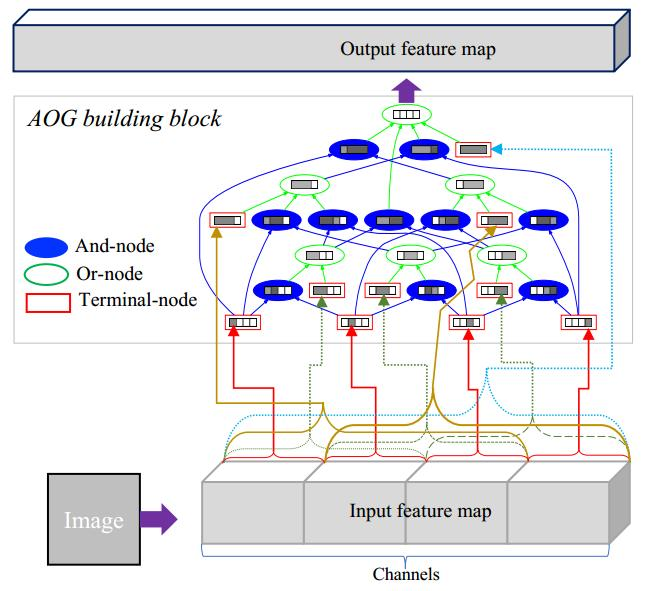

# AOGnets: deep and-or grammer networks for visual recognition

## abstract
and-or grammer network(AOGnet)，它由几个AOG building block组成的stage构成。每一个AOG building block以and-or grammer为原则组建and-or graph，每一个节点对输入做一些基本的操作，包括以下三种节点，
- and node: 它的输入由子节点的特征concatenate得到
- or node: 输入由子节点特征element-wise sum得到
- terminal node: 输入为AOG building block 的输入的 channel-wise slice形式(即把输入分片，然后每一片输入到一个终叶节点里)

AOGNet尝试组合这两个最好的模型grammer model和DNN，最后在图像分类及目标检测上适用性都很好。

## introduction
hinton指出CNN的缺点：’根据生物神经网络的研究，现有的人工网络没有足够多的层次结构‘   
由此，设计神经网络结构的关键在于构造新的特征及利用前几层的特征。从表示学习的观点看，ResNet的skip-connections能够构造新特征并重复利用已有特征，(**但是其出发点是为了设计更深的网络，以防止梯度回传时的梯度消失**)
- method review  
and-or grammer framework，建立grammer的method  
AOG building block的关键在于以层次结构和组合的形式的探索新的特征并重复利用已有特征。仅仅使用了binary composition rule(二元组合规则，即只有两个输入的组合规则)

## related work
- hand-crafted network architectures
- learned network architectures
- grammer structures

## aognets
对于AOG builing block的输入输出，遵循了传统，减少宽度(即减少特征图的尺寸)以增大感受野，增加深度(增加特征图的通道数)以得到更多特征。  
terminal node执行Conv-BatchNorm-ReLU   
[算法1的视频](http://v.youku.com/v_show/id_XMzIxNDU4MTQ4NA)   
图需要从上往下看(top-down)，是分解结构，从输出分解到输入即终叶节点，从而连接到输入。图中的$N=4$表示将输入分为$4$个词向量，输出分成$4$份

## tips
[k-gram](https://en.wikipedia.org/wiki/N-gram)
