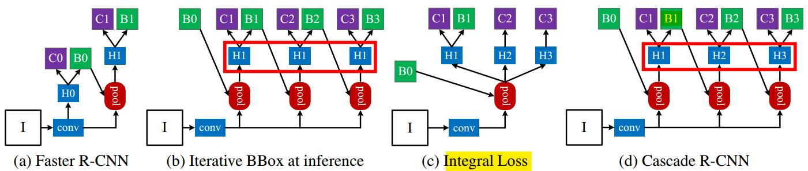

# casecade R-CNN: delving into high quality object detect 2017
## abstract
目标检测任务中，为判定一个box是正样本还是负样本需要一个IOU阈值。当以较低阈值$0.5$展开训练时，容易引入噪声(不应该是正样本的被看做了正样本，正如yolo中使用回归来操作)。当阈值较高时，检测器性能会下降，主要是因为，1.正样本过少，导致过拟合，2.推断时，检测器输出的box与输入的box不一致？？。Cascade R-CNN用于解决这些问题，训练各阶段检测器时，IOU阈值是递增的。上一个stage的输出，用于下一stage的训练，这样就避免了过拟合。

## introduction
定义
quality of an hypothesis: 一个hypothesis对应一个预测的proposal box，quality表示它与ground truth box的IOU
quality of detector: 训练时采用的IOU阈值u

## related work
R-FCN是为了减轻region-wise的计算，从而提高速度  
MS-CNN, FPN在多层特征图上进行目标检测，从而减轻RPN感受野大小与目标实际大小的不匹配。  

## object detection
- bounding box regression  
这里有个细节以前没有注意到，因为回归的是偏差，所以一般值很小，这样会比分类的损失小得多，为了改善多任务学习的效率，对回归的偏差量$\Delta = (\delta_x, \delta_y, \delta_w, \delta_h)$，使用它的均值、方差做了归一化，如
> $$\delta_x^{'} = (\delta_x - \mu_x)/\sigma_x$$
联想到SSD源代码中的方差$variances=[0.1,0.2]$，把均值看做$0$，这样就很合理了。
有的论文迭代使用bounding box regression，来提高目标定位精度，即iterative BBox。但是值得注意的是，这种方式忽略了两个问题，1.以IOU阈值$0.5$训练的回归器并不适用于IOU$>0.5$的情形；2.每一次bounding box regression输出的bounding box分布是不同的，所以迭代使用同一个regression的模型效果并不好。
- classification  
交叉熵损失
- detection quality  
有的使用类似integral loss[34]的方法，对不同IOU阈值的box进行分类，但是这样也没有解决高IOU阈值时，由于正样本稀少导致的过拟合问题
> $$L_{cls}(h(x),y)=\sum_{u\in U} L_{cls}(h_u(x)y)$$
其中，$U=\{0.5,0.55,……,0.75\}$，依据COCO数据集设定的阈值。

## cascade R-CNN
- cascaded bounding box regression  
由cascade Pose regression与face alignment启发。  
cascade式的regression不同于iterative BBox，
- cascaded detection  
resampling机制，即在上一阶段进行regression的box的结果，从新使用更大的IOU阈值对proposal box进行采样。  

## 启发
1. 既然设置阈值IOU会引入噪声，是否可以直接使用IOU值作为标签，而不是二值的标签，这样训练时，使用sigmoid的交叉熵损失函数。好像在另一篇文章中看到过？？
2. 如果把NMS的导数引用到里面，是否可以直接根据把NMS也训练到，以目标数目为标签进行训练。MAX操作，多到一的映射。