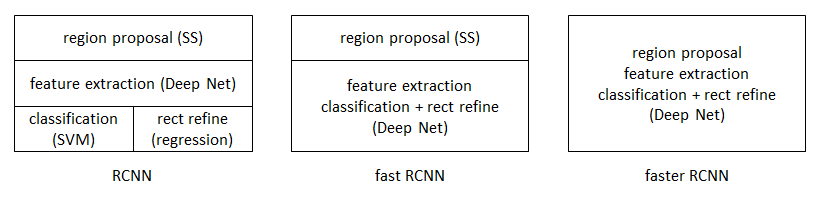
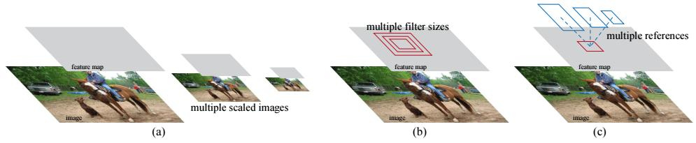

  
[faster rcnn](http://blog.csdn.net/shenxiaolu1984/article/details/51152614)

## faster rcnn: towards real-time object detection with region proposal networks
## abstract
提出了region proposal net(RPN)，并且RPN与目标检测框架使用同一个卷积网络来提取特征。
RPN是一个全卷机网络，用于输出目标框及目标框为目标的概率。
使用VGG16模型的Faster R-CNN，在GPU上的检测速率是5fps。
使用ZFnet模型的Faster R-CNN，在GPU上的检测速率是17fps。

## introduction
当忽略selective search 的时间，Fast R-CNN也是实时的。  selective search在CPU上一张图片2s，EdgeBoxes一张图像0.2s。
RPN网络是在与Fast R-CNN的共享特征图上额外接了几层卷积网路输出目标框的位置与类别，所以RPN是FCN网络。RPN网络使用 anchors 来完成多尺度目标框提取，具体就是pyramid of regression references。为了统一RPN与Fast R-CNN，采用了交替训练的方法。

## related work
object proposals: 基于超像素的方式，基于滑窗的方式。
dnn for object detection: overfeat,multibox,sppnet

## faster rcnn
由两个模块组成，1.RPN 2.Fast R-CNN detector
两个模块组成一个统一的一体，使用流行的术语，注意力机制，RPN告诉Fast R-CNN检测哪里。

### region proposal networks  
输入为一张图片，输出为框及框中是否包含目标的概率。  
作者尝试了5层卷积网络的ZFnet，13层卷积网络的VGGnet16。为了输出框及框包含目标的概率，在共享的卷积层输出特征中，让一个小型网络以$3\times 3$为窗口进行卷积特征图输出低维度特征向量，(256-d for ZF-net, 512-d for VGG)，特征向量再用于回归坐标及分类。可以看出，mini-network是以滑窗的形式在特征图上计算，那么也可以看做是一个卷积层。
- anchors  
k表示每一个slinding window中要提出的proposal region的数目。  
k个proposal box是以k个reference box为参考的参数表达的，这k个reference boxes叫做anchors，一个anchor是一个带有尺度和长宽比的以slinding window的中心为中心的框。    
anchor具有平移不变性，这是通过FCN实现的，而MultiBox使用聚类提出的框，是没有平移不变性的。  
achors是一种新的解决多尺度问题的方法，因为anchors是multi-scale的。  
  
图中特征的多尺度实现方式出现了3种，第一种方法是图像是多尺度的，第二种方法是特征图是多尺度的，第三种方法是slinding window多尺度的。
- loss function    
训练时，把两种anchors看做正样本，1.与ground-truth box的IOU最大的anchor，也就是说有多少个ground-truth box就会有多少个anchor被标注为正样本。2.所有的与ground-truth box的IOU大于0.7的anchor。这两种标注策略最终会导致一个ground-truth box对应到多个anchor上，通常使用策略2就可以生成多个正确的正样本，但是有时会是0个，所以增加了策略1。负样本是所有与ground-truth box的IOU少于0.3的框。  
一个mini batch的损失的计算函数，这里一个mini-batch就是一张图片  
> $$L(\{p_i\}, \{t_i\})=\frac{1}{N_{cls}}\sum_i L_{cls}(p_i,p_i^*)+\lambda \frac{1}{N_{reg}}\sum_i p_i^* L_{reg}(t_i,t_i^*)$$
$p_i$表示预测的一个anchor为目标的概率，$p_i^*$表示表示一个anchor的label为1或0，$t_i$表示预测的4个参数化的bounding box，$t_i^*$表示一个关于正样本anchor的ground truth box，这里regression loss选用了smooth L1损失，分类层与回归层的输出分别为$\{p_i\}$和$\{t_i\}$。  
$N_{cls}$表示mini-batch的大小，$N_{reg}$表示一张图像里anchor location的数量，与anchor的数量不同，(对于$1000\times 600$的输入图像，输出的特征图是$60\times 40=2400$，也就是有$2400$个anchor location)。这里不同于以往的bounding box regression，因为以往的用的特征是从不同大小的roi pool到的，并且参数要适用与所有不同大小的roi size，而这里regression是针对固定大小窗口($3\times 3$)的特征的，针对k个不同大小的anchor，学习了k个专用的regressor，用于针对不同的scale与aspect ratio。
- training rpns    
采用了image-centric来训练rpn，image-centric指fast-rcnn中训练样本是从一张图像中**随机**抽取的，针对SPPnet无法训练的问题提出的。每一个mini-batch是由一张图像抽取出的256个正样本、负样本achor组成的。从一张图像中按正、负样本1:1比例抽取256个anchors，如果正样本不够，拿负样本填充。

### sharing features for rpn and fast r-cnn
尝试了3种方法来训练feature shared的rpn与fast r-cnn
1. 交替训练，先训练rpn，然后使用rpn提出的框训练fast r-cnn，参数初始化的方式没有讲，然后再用fast-rcnn的参数初始化rpn来，接着训练rpn，这篇文章的实验就是这个方法做的。
2. 近似联合训练，这里将rpn与fast-rcnn当做一个整体训练，两个损失在shared feature处交汇相加，但是忽略了继承性？？，rpn的输出也是fast-rcnn的输入，所以也是网络的响应，实验结果与1相近。
3. 联合训练，因为2中rpn的输出同样是fast-rcnn的输入，所以计算梯度时，fast-rcnn的损失也会传导到rpn中，
最后作者采用了4步来训练，第一步，使用ImageNet预训练模型初始化网络，训练RPN，第二步，Fast R-CNN使用ImageNet初始化网络，使用第一步输出的框做训练集训练，第三步，使用第二步训练好的Fast R-CNN网络初始化RPN，训练时，固定共享卷积网络的参数，只训练RPN独有的网络参数，第四步，固定共享卷积网络的参数，训练Fast R-CNN独有的网络参数。

### implementation detailes
训练时忽略boundary crossing outliers的anchor，因为他们会使网络训练不收敛。

## 实验
### 使用PASCAL VOC2007数据集进行测试
PASCAL VOC 2007，目标检测数据集中包含5000训练图像，5000测试图像，包含20类目标
使用以ZFnet为基础的Fast R-CNN，不同region proposal 的方法的性能(ss是selective search,eb是edgebox)
方法|#proposal数目|mAP(%)
----|-------|-------
ss | 2000 | 58.7
eb | 2000 | 58.6
rpn | 300 | 59.9
使用以VGG-16为基础的Fast R-CNN，不同region proposal 的方法的性能(ss是selective search,eb是edgebox)
训练数据集|方法|#proposal数目|mAP(%)
-------|----|-------|-------
VOC07+VOC12| ss | 2000 | 70.0
COCO+07+12 | rpn | 300 | 78.8
one-stage detection  VS two-stage proposal + detection
one-stage模型 Overfeat，使用滑动窗口，直接生成框的位置及类别
two-stage模型 Faster R-CNN，先生成region proposal box，再生成类别及框的准确位置

## conclusion