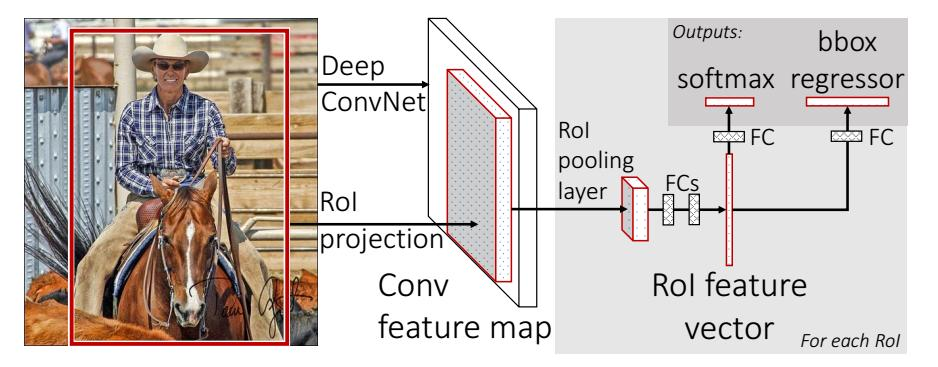

## [fast r-cnn](http://blog.csdn.net/shenxiaolu1984/article/details/51036677)

## Abstract
fast-rcnn是基于rcnn上的改进，能够对一张图像的object proposal分类，object proposal 的获取方法还是selective search，使用VGG16网络
与SPPnet(spatial pyramid pooling networks)相比，更快

## introduction
目标检测有两个主要问题：
1. 大量的候选框 (Proposal) 需要处理
2. 为了精准定位目标，候选框仍要 refine

以前的方法大都是 multi-stage piplines   
fast-rcnn 是 single stage training that jointly learns to classify object proposals and refine their spatial locations
改善后的结果就是速度上9倍于R-CNN, 3倍于SPPnet， mAP达到66%

R-CNN有如下缺点：
1. training is multi-stage pipeline， 包括三个stage， 首先是微调一个分类网络，然后使用卷积层特征把ConvNet 的 softmax 分类器换成svm训练object detector， 最后训练bounding-box regressors
2. 为训练 SVM 和 bounding box regressor 很花费空间、时间，因为要先使用VGG16为每一张图像的 proposal box 提取特征
3. 检测很慢

SPPnet使用了空间金字塔最大值池化，为每一个 proposal 在一个尺度上特征图提取固定大小特征(6x6)，然后将多个尺度的特征 concatentate 到一起  
SPPnet的缺点：和R-CNN相同，训练是多阶段的(包括提取特征，使用log loss微调网络，训练svm，训练bounding box regressor)

 ## Fast R-CNN architecture and training
   
 输入是一张图像与object proposal，输出是类别及bounding box regressor。在图像的卷积特征图上为每一个 proposal box 提取特征的方法 a region of interest(ROI) pooling layer，提取固定维度的特征向量
- roi pooling layer  
roi pooling layer可以看做是SPPnet中的spatial pyramid pooling layer的一个特例，因为它只使用了一层特征。
具体步骤，每一个roi使用左上角点的坐标(r,c)，与宽和高(w,h)来定义，roi pooling是把roi均分成$H\times W$个小格子，每一个channel中一个小格子取像素最大值代表这个小格子，然后就组成了$H\times W \times C$的特征图。

- initalizing from pre-trained networks  
使用了3中在ImageNet预训练的模型，在迁移学习中，有三个地方需要改变，1.pooling layer，2.输出网络，3.输入
- fine-tuning for detection  
**这里解释SPPnet不能进行训练的原因是每一个 minibatch 训练 ROI 都没有规定为来自同一张图像，更进一步解释是每一个 ROI 的 receptive field 都是全图，也就是说网络的前向传播使用了全图，而反向传播只针对于图像的ROI部分计算出的 loss**。在 Fast R-CNN 中训练集准备的策略是先选出 N 张图像，然后从每张图像中选出 R/N 个ROI，即一个 mini-batch 共 R 个 ROI。这样 ROI 在前向传播和反向传播时都共用了 computation and memory(反向传播是如何共享的？)。这样操作会产生一个这样的顾虑，就是来自同一张图像的 ROI 是 correlated 的，但是在实验过程中，没有发现有什么影响。

### Multi-task loss:  
对于分类任务，什么是 log loss  ？ 数学意义是什么？  
对于坐标回归任务， smoothL1 又意味着什么?  less sensitive to outliers than the L2 loss ?? 什么是 outliers??
有两个输出，第一，输出每一个ROI的分类概率，是一个离散概率，第二，为每一类ROI输出bounding box的回归偏差
> $$L(p,u,t^u,v)=L_{cls}(p,u) + \lambda [u\geqslant 1]L_{loc}(t^u,v)$$
其中，p为预测的分类概率，u真实分类的label，$t^u$为预测的坐标回归，v为真实的坐标误差label。训练样本为ROI，每一个ROI的ground-truth类为u，ground-truth bounding box regression target为v。  
对于分类输出label为true的误差为$L_{cls}(p,u)=-log{p_u}$，label为false的误差为0  
$[u\geqslant 1]$艾佛森括号，表示$u\geqslant 1$时，输出为1，否则为0
bounding box regression 损失为:
> $$L_{loc}(t^u,v)=\sum_{i\in \{x,y,w,h\}}smooth_{L1}(t^u_i-v_i)$$
这里与R-CNN、SPPnet不同，不再使用$L_2$损失，而是$smooth_L1$损失，因为其对外点(outliers)不敏感。(可以看出$|x|\geqslant 1$时，$smooth_{L1}$对$x$的梯度为1，这里原文解释，When the regression targets are unbounded, training with L2 loss can require careful tuning of learning rates in order to prevent exploding gradients. Eq. 3 eliminates this sensitivity.)
> $$smooth_{L1}(x) = \begin{cases} 
0.5\times x^2 &\text{if }|x| < 1 \\
|x| - 0.5 &\text{otherwise}\end{cases}$$ (3)
$\lambda$是一个平衡分类误差与坐标回归误差的超参数，论文中使用$\lambda =1$，这里将ground truth regression targets归一化为均值为0，方差为1的分布。

### Mini-batch sampling  
每次的SGD使用的mini-batch是从两张图像中抽取的ROI样本，每张图像抽取64个样本，共128个ROI
正样本的选取是as in rcnn，使用 25% (128*25%=32个ROI)的与 ground truth bounding box 的 IOU 大于 0.5 的 proposal 
负样本的选取是类似SPPnet，抽取与ground truth bounding box的IOU最大为[0.1,0.5)

### Back-propagation through ROI Pooling Layers

### SGD hyper-parameters
分类网络与位置回归网络的权重分别初始化为0均值，方差为0.01和0.001的高斯分布随机数，偏置初始化为0。所有的网络权重使用学习率1，偏置使用学习率2，而global learning rate 为0.001，动量为0.9，权重衰减项为0.0005

### scale invariance
1. brute force learning   
2. image pyramids

## Fast R-CNN detection
### truncated svd for faster detection
数据压缩技术