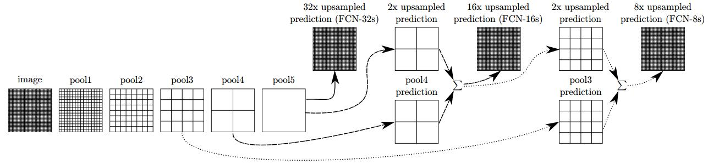

# Fully Convolutional Networks for segmantic segmentation 2015 CVPR best paper honorable mention.
这里的反卷积与zfnet中的可视化反卷积不是一个概念。  
[pytorch code](https://github.com/wkentaro/pytorch-fcn)  
[官方 code](https://github.com/shelhamer/fcn.berkeleyvision.org)
[知乎 blog](https://zhuanlan.zhihu.com/p/22976342`)

## abstract
建立全卷积网络的概念，它的输入、输出是任意大小的；提出一种新的网络结构skip，连接深层网络与浅层网络来整合深层语义信息，和浅层的appearance 信息。  
修改AlexNet,VGGnet,GoogLeNet为全卷积网络，实现网络像素的端到端的训练。 
PASCAL VOC 2012  62.2% mean IU  5fps

## introduce
patchwise training and fully concolutional training?   
语义分割自身就有一个争端在semantics和location上，    
介绍了一种'skip'结构，来连接深层语义信息与浅层appearance信息。  
in-network upsampling, multilayer combinations

## related works
fully concolutional networks: 历史上全卷积网络的出现及使用  
dense prediction with convnets: 输出被上采样到输入原图像的尺寸。

## fully convolutional networks
如果损失函数是最后一层卷积输出所有像素损失的和，如下式，那么随机梯度下降法中，梯度也是所有像素的和，这和将一张图像所有像素的感受野图像作为输入得到的输出看做一个mini-batch是一样的。
> $$L(x;\theta)=\sum_{i,j}L(x_{i,j},\theta)$$
### adapting classifiers for dense prediction
将全连接转为卷积，全连接输入特征图的大小就是卷积核的大小，特征图的通道数，就是卷积核的通道数，这样就将全连接转为卷积，整个网络能够输入任意大小图像，并输出分类的特征图。  
### shift-and-stitch is filter rarefaction
shift-and-stitch 来源于Overfeat。input-shift and output stitch，细节没看懂？？？ (估计是当时并没有输入全图的意识，网络最终输出的都是一个像素，而这里是输出特征图) 
作者只是做了初步实验，最后的模型中并没有采用shift-and-stitch，因为下一节的upsampling效果更好。
### upsampling is backwards strided convolution
可以说，以尺度$f$上采样是以输入步长为$1/f$的卷积。那么一个自然而然的想法是使用反卷积做上采样，backwards convolution(也叫作deconvolution，反卷积)，并且反卷积的滤波器参数也是可以通过训练学习的。
### patchwise training is loss sampling
patchwise training:完整图的部分输出
whole image training:把完整图像输入，label是热度图
dense prediction:输出热度图
样本不均衡可以通过改变loss权重来解决，loss sampling能解决spatial correlation。
## segmentation architecture
更改训练好的ImageNet图像分类网络为FCNs网络，使用in-network上采样和pixelwise损失来改为dense prediction。然后提出了一个skip结构来结合各层网络信息提高预测准确率。  
使用per-pixel multinomial logistic loss 实际就是softmax加cross entropy loss，多项分布($n\geqslant 2,k\geqslant 2$)，就是一个有k个输出的实验，独立地重复n次。
评价指标：mean pixel intersection over union，使用所有类预测的均值。
### from classifier to dense FCN
把VGG16最后的分类层去掉，把全连接换成卷积，后又接了输出$21$通道的$1\times 1$的卷积，后面是反卷积网络层。最后达到59.4 mean IU。
### combining what and where
  
skip结构生成的nonlinear local feature hierarchy 叫做deep jet。 加上skip结构后达到 62.7 mean IU
多层的数据是上采样到同一个尺度直接加起来的，细节
refinement by other means，失败
### experimental framework
- class balancing  
- Dense prediction  
通过反卷积进行上采样，反卷积的参数使用双线性插值系数初始化，最后一层反卷积参数固定为双线性插值，学习率为0。  
没有采用shift-and-stich，filter rarefaction equivalent。

## results
## conclusions

## tips
DAG：directed acyclic graph，有向无环图   

## 实现中的疑问
- 由全连接转为卷积的第一层卷积的卷积核为7？
是因为在VGG-16中，卷积层后的第一层全连接是直接reshape的，相当于卷积核为7时的连接状态
- 为什么输入的pad是100？
[知乎解释得比较清楚](https://zhuanlan.zhihu.com/p/22976342)  
简而言之，是因为卷积化后的第一层全连接，卷积核为7。  
假设原图大小为$h$，第5卷积后，
> $$h^5=1/{2^5} \times h$$
经过第6层卷积(全连接转化的)后，
> $$fc6:\quad h^6= (h^5-7)/1+1=(h-192)/2^5$$
所以输入图像要大于$192$，后面是$1\times 1$的卷积，不再有尺度的减小。  
pad $100$后，就不再有了这样的约束，**但会引入噪声?**，$198$由第一层减去固有卷积得到$200-2=198$
> $$fc6:\quad h^6= (h+198-192)/2^5=(h+6)/2^5$$
从这里可以看出来，没必要pad $100$，pad $96$后就会产生和原图一样大的输出
- 对输出结果的crop  
因为前面的pad100，所以进行反卷积后，要将这部分移除。  
第一层卷积后
> $$conv1: \quad h^1 = (h+200-2-1)/1+1=h+198 \quad \text{因为卷积核为3，输出要减去(kernelSize-1)}$$
第一层池化后
> $$pool1: \quad h^1 = (h+198)/2$$
第6层卷积
> $$fc6: \quad h^6=((h+198)/32-6-1)/1+1 = (h+6)/32$$
进行步长为$32$，卷积核为$64$的反卷积，
> $$\quad h^7=(h^6-1)*32+64= h+38$$
反卷积后，输出的图像尺寸与输入图像的大小不相等，所以需要crop到输出为$h$