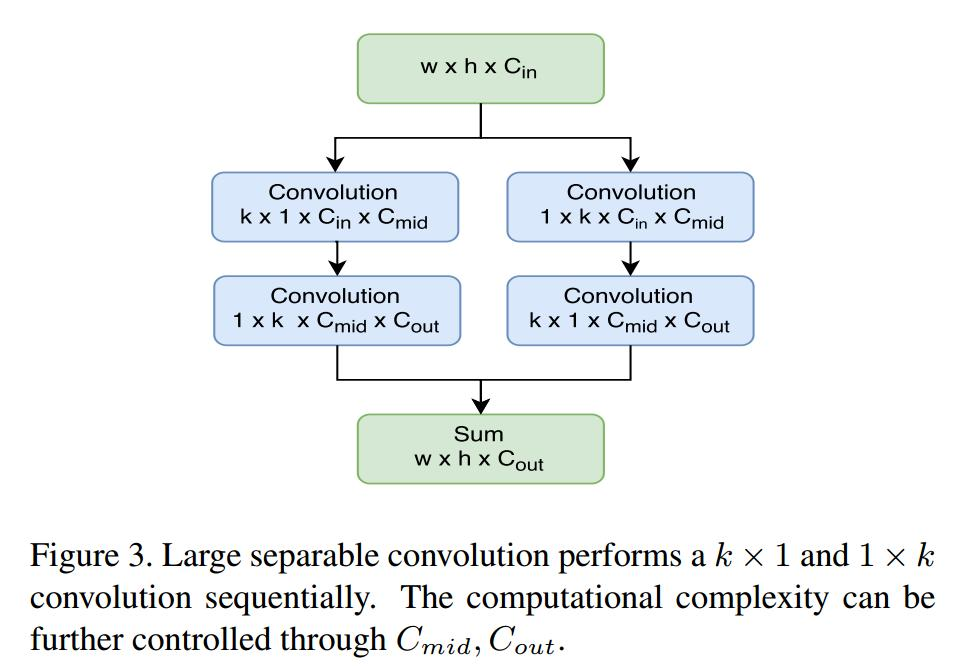

# light-head R-CNN: in defense of two stage object detector 2017
一个很好的点是global average pooling操作会丢失位置信息，所以目标检测中不要使用global average pooling  
## abstract
R-CNN、Fast R-CNN、Faster R-CNN(head subnetwork是两个全连接层)慢的主要原因是有太多的head subnetwork，R-FCN慢的主要原因是生成了太多的position sensitive score maps。为了解决two-stage速度慢的缺点，作者提出light-head R-CNN，使用更少的特征图、更小的head subnetwork(pool+full connected layer)，当使用Xception作为backbone 网络时，在coco数据集上达到102fps，准确率30.7mAP，在速度、准确率上超过yolo、ssd。

## introduction
和摘要类似，只不过详细了一点

## related work
引用文章很全面，可以细看。
accuracy perspective: R-CNN系列
speed perspective:

## our approach
light head R-CNN and details
### light head R-CNN
“head” 指接在backbone network后面的网络，具体指，R-CNN subnet及Roi warping
使用large separable convolution来降低特征图的通道数，接下来执行PSRoi或Roi pooling(Faster R-CNN)来得到固定尺度的Roi特征。
什么是PSRoi？？？指R-FCN中的position sensitive Roi poolinglayer。
### light head R-CNN for object detection
"L"表示large backbone network，使用ResNet101  
"S"表示small backbone network，使用Xception  
> $$\text{basic feature extractor} \rightarrow \text{thin feature maps}\rightarrow \text{R-CNN subnet}$$
thin feature maps的输出是$10\times p \times p$，$p$表示Roi pooling后的尺寸，如$3\times 3=9$？？  

## experiments
