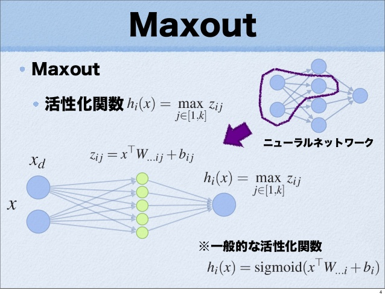

# maxout networks Ian Goodfellow 2013
[detail blog](http://www.cnblogs.com/tornadomeet/p/3428843.html)

为什么maxout要与dropout联合使用？？

## description of maxout
对于sigmoid激活函数，隐层神经元的输出是，
> $$h_i(x) = sigmoid(x^T W_{....i}+b_i)$$
其中，$x$是激活函数的输入，$x\in{\mathbb{R}^d}$，$W\in{\mathbb{R}^{d\times m}}$，$m$是隐含层节点的个数，$W_{....i}$表示第$i$个输出的网络权重。   

同样，可以将maxout看做一个激活函数，
> $$\begin{aligned} h_i(x) &= \max_{j\in[1,k]} z_{ij} \\
z_{ij} &= x^TW_{....ij}+b_{ij} \end{aligned}$$
其中，$x$是激活函数的输入，$x\in{\mathbb{R}^d}$，$W\in{\mathbb{R}^{d\times m \times k}}$(也就是输入到隐含层的层参数)，$m$表示隐含层节点的个数，$b\in{\mathbb{R}^{m\times k}}$

  
$x$表示输入层，$h$表示隐含层，$z_{ij}$可以叫做"隐隐含层"