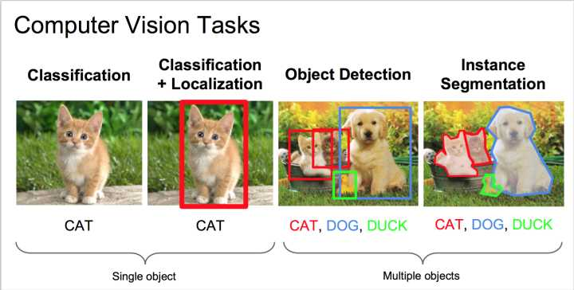

# overFeat: integrated recognition, localization and detection using convolutional networks

## abstract
1. multiscale and sliding window implented within ConvNet
2. deep learning approach to localization object boundaries
3. different tasks can be learned simultaneoulsy using a shared network
这个用作特征提取器的模型叫做OverFeat

## introduction
训练分类网络中的ConvNet是end to end，这是说，训练出的结果，直接把像素映射到了分类结果里，这可以省掉设计特征提取器的步骤，唯一的缺点是很依赖大量的数据集。
这篇文章主要介绍了一种训练集结了分类、定位、detect objects多任务为一体的卷积网络的方法。**这里说的detect object 与分类有什么区别？？**。同时提出了一种accumulating 预测框来实现localization 和 detection的。
通过与定位结合在一起，detection可以不再在background samples上进行训练，从而使网络更专心于分类正样本。
ImageNet图像分类数据集中大部分图像中的目标都有不同的大小，不同的位置，解决这个问题的方法有三种：
1. multi-scale sliding window，但是由于分类网络的平移不变特性，无法得到高质量的localization and detection
2. 训练一个系统能够同时给出输入window的类别，及window中物体的相对位置。
3. accumulate the evidence for each category at each location and size.

另一些人提出使用ConvNet-based segmentation来定位目标，这其中最简单的方法就是判断一个窗口的中心像素是不是boundary，但是当需要为regions分类的时候，那么更好的方法是semantic segmentation，也就是说根据window来预测central pixel的类别。

## vision tasks
classification 、localization 、detection
ImageNet数据集的介绍

## classification  
- model design and training  
ImageNet 2012训练集，1.2million图像，1000类  
把图像的最短边缩小到256像素，然后5random crops of $221\times 221$ pixels，之后mini-batch=128  

- feature extractor  
fast and accurate version

- multi-scale classification   
sliding-window对于其它算法模型可能会导致很大的计算量，但是对于convNet却是十分高效的。  
分成两部分: 第一，卷积特征提取层，分别使用了原图像与水平翻转后的图像的6个尺度共12幅图像作为输入提取特征，第二，分类层，对前面提取的特征进行了dense pooling( $ (\Delta x, \Delta y)$取值为0~3，实际作用与step为1的max-pooling相同)，对pooling后的特征图，以$5\times 5$输入classifier，得到$size \times size$ 的C维的分类结果，对每一类取spatial max后，得到$1\times 1$的C维分类结果，最后结合12幅图的输出做平均，取最大值作为最终的分类结果。

- results

- convNets and sliding Window efficiency  
与许多使用sliding-window方法对每一个候选的window都进行一次完整的pipeline运算的方法相比，convNet实际上以滑动窗口的方式更有效，因为convNet本身就是共享计算的。对于neighboring windows重叠的部分可以只计算一次。并且全连接可以使用$1\times 1$卷积来实现，这样可以输入不同大小的图像。  
对于整幅图进行一次convNet->max-pooling->thresholding operations，就可以得到结果

## localization
- generating predictions  
可以输出bounding box对应的configdence

- regressor training    
训练regressor时，要固定特征提取层的参数，使用L2损失函数，这里的regressor是class specific的，只训练那些与bouning box 的overlap大于50%的框。

- combining predictions
- experiments

## detection

## discussion
overfeat在ILSVRC2013上取得了，分类第四，定位第一，检测第一的成绩  
**解释了ConvNet为什么可以应用在目标检测和定位上**
可以改进的地方
1. 对于定位任务，训练时没有实现完整的反向传播
2. 使用的是L2损失，如果使用IOU计算损失的话，应该会更好，因为IOU也是differentiable的
3. 改变bounding box的参数表示方法

## tips
- classification:假设图形中只有一个主体，判断主体属于哪一类。如果图像中有多个物体，也只考虑一个主体。  
- localization:假设图像中有一个主体，给出主体的bounding box   
- detection:图像中有多个物体，给出每一个物体的bounding box，及对应的class  

