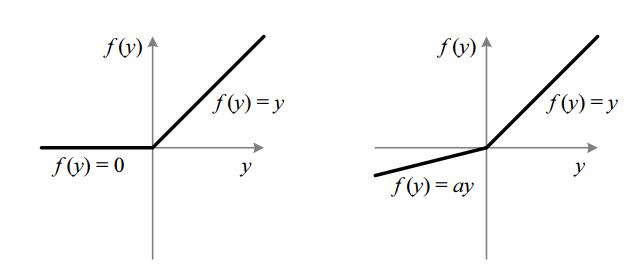

# delving deep into rectifiers: surpassing human-level performance on imagenet classification 2015
## abstract
relu激活函数应用非常广泛，这篇文章对此提出了改进，1.提出参数化的relu，即PReLU，在基本不增加计算量的情况下提高模型拟合能力，同时降低过拟合的风险。2.依据ReLU的非线性特性，提出一个鲁棒的参数初始化方法。  
使用PReLU-nets，在ImageNet 2012数据集上达到4.95% top-5 错误率，而ImageNet 2014冠军 GoogLeNet是6.66%，首次超越了人类，5.1%

## introduction
  
左侧是ReLU，右侧是PReLU，其中$a$是可学习的。

## Approach
> $$f(y_i)=\begin{cases} y_i &\text{if } y_i > 0 \\
a_i y_i &\text{if } y_i \leqslant 0\end{cases}$$