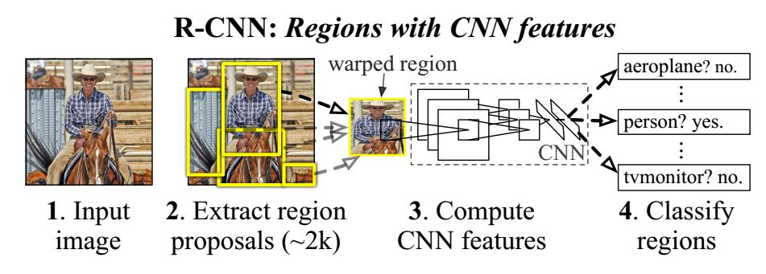
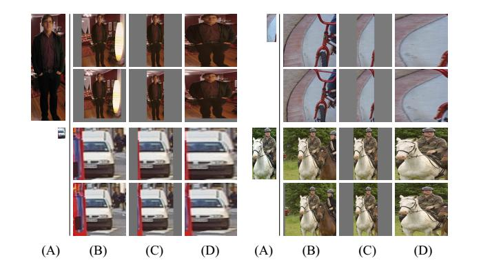

[blog](http://www.cnblogs.com/dudumiaomiao/p/6560841.html)  
[detail](http://blog.csdn.net/shenxiaolu1984/article/details/51152614)
# Rich feature hierarchies for accurate object detection and semantic segmentation

## convolution feature map
卷基层生成的特征图

## rcnn
- 训练集
    一个较大的识别库（ImageNet ILSVC 2012）：标定每张图片中物体的类别。一千万图像，1000类。 
    一个较小的检测库（PASCAL VOC 2007）：标定每张图片中，物体的类别和位置。一万图像，20类。 
- RCNN算法分为4个步骤 
    一张图像生成1K~2K个候选区域 selective search方法
    对每个候选区域，使用深度网络提取特征 
    特征送入每一类的SVM 分类器，判别是否属于该类 
    使用回归器精细修正候选框位置 

## introduction
该算法把VOC2012数据集上的mAP提升到了53.3%，相对于过去的算法，接近提升了30%的mAP  
这个方法主要有两个突破点:
1. 把CNN用在了基于bottom-up region proposals的框上面，来定位目标
2. 当训练集较少时，使用监督式的预训练，然后在此基础上进行微调，能够很好的改善算法的性能。(但应该也只是相关方面的数据集上的训练)  

这篇论文的核心思想就是把CNN结合到了region proposal上，所以称为RCNN，因为以往的CNN都是直接作用在全图的。

2012 目标分类在ImageNet上取得了很好的成绩，是因为有 1.2 million labeled images， ReLU， dropout regularization

要把目标分类的优异成绩泛化到目标检测主要面临着两个问题:
1. 如何定位目标
2. 如何在只有少量标注数据集上训练一个high-capacity model。

解决方法:
1. 把目标框看做位置回归的问题，但是像DetectorNet一样，效果并不好；另一个方法是sliding window，这种方法已经使用了很长时间，但是为了保持**空间分辨率**，都只是用了2层卷积，1层池化。这篇论文采用了这种方法，不过网络变成了5层卷积，这样感受野为$195\times 195$，stride 为$32\times 32$像素。 recognition using regions paradigm [21]
2. 传统的结局方法是使用无监督学习来进行预训练，然后使用监督微调。而这篇论文是使在另一个较大数据集(ILSVRC)上用监督式预训练，然后再在小数据集上进行domain-specific fine-tuning，这里的domain 是指region proposal box经过warp后的框，与类别也有关系，单关注重点在warp proposal windows。

## Object detection with R-CNN
object detection system consists of 3 modules
1. category-independent region proposals   
为了方便与以往工作的比较，选择了**selective search**

2. convolutional neural network that extracts a fixed-length feature vector  
5层卷积，2层全连接提取4096维度的特征向量，输入图像是减去均值的尺度是227x227固定的RGB图像。region proposal 转为$227\times 227$的转换方法见Appendix A，选择的方法是在region proposal box的基础上，向外扩充16个像素，然后regardless of the size or the aspect ratio of the candidate region, warp all pixels in a tight bounding box to the required size。  
这里有两个地方值得注意，第一，不管region proposal是何类别，都使用了同一个网络来提取特征，这样随着要分类图像的增加，计算量在这一步也不会增加；第二，CNN计算出来的特征向量维度(4096)是很低的，当然这是相对于传统方法(UAV 360k)做的比较。  
训练时，先在ImageNet上训练一个1000-way分类网络，然后把最后一层分类网络换成21-way(加上背景)的分类网络。 VOC(20类)、ILSVRC2013(200类)。
在每一步SGD中，为了避免数据不均衡，选择32个正样本(over all classes)，96个负样本一起组成 mini-batch of size 128。正样本的选择标准是，所有的proposal box中与grouond-truth box的iou大于0.5的框，其余的都看做负样本。  

3. class-specific linear SVMs  
训练SVM是，正样本只有ground-truth bounding box，负样本是proposal box 与ground-truth box的IOU小于0.3的，这个值是通过grid search得到的。而设置0或0.5都会使mAP降低。  
得到了特征与标签后，为每一类都设计了一个SVM，使用了hard negative mining method 方法 [17,37]，(还不是online hard expamle mining)

现在有了一张图里所有区域的 score 后，使用一个 class independently non-maximum suppression方法。
在实验结果的对比中CNN提取的特征明显优于传统的特征SIFT、HOG，不仅维度更低，并且使用SVM的准确度更高。这大概是因为CNN训练出的特征是有类别区分度的，所以使用SVM能够很容易达到较好的效果。
同期论文里也有很多使用CNN特征的，但是效果都没有得到较大的改善，如此大的区别在于如何使用CNN到object detection方向上

overFeat在ILSVRC比赛中mAP是24.3%，而R-CNN是31.4%

## training 包括多个stage
1. supervised pre-training
2. domain-specific fine-tuning
3. object category classifiers
4. bounding box regressor

## Visualization, ablation, modes of error
ImageNet classification with deep convolutional neural networks [25]  
detection error analysis [23]
通过error分析，得到误差的主要部分在定位上面(poor localization)，然后设计了bounding-box regression来减小误差

## the ILSVRC2013 detection dataset
- dataset overview  
ILSVRC2013 detect dataset被分成了3部分，train(395918)，val(20121)，test(40152)
解决类别不平衡问题  
- region proposals  
selective search提出框的数目与图像的大小有关，所以在进行selective search 之前进行了把图像resize到 fixed width(500 pixels)  
然后selective search 在val与PASCAL数据集上提出的框在IOU阈值为0.5时的recall 为91.6%和98%
- training data  
- validataion and evaluation  
- relationship to overFeat    
overfeat中使用multi-scale pyramid of regular square regions，R-CNN是selective search，提出框  
在bounding-box regressor阶段，overfeat使用per-class bounding box regressors，而R-CNN使用single-box regressor  
overfeat使用了全局卷积来提取特征，而R-CNN为每一个框warp，然后提取特征  
overFeat要比RCNN快9倍，overFeat没有针对每一个box进行CNN提特征，而是直接对全图进行了CNN

## conclusion

## Appendix A 目标框的变换
  
主要包括两种方法使proposal box成为227x227大小，一是使用 tightest square(最小外接正方形)，然后再将其长、宽等比例地 (isotropically) 放大到227x227，图中，B和C都是这个方法，两者的区别在于B使用context填充空缺，如果没有context，则用均值，C直接使用图像均值填充空缺，而A是proposal box，D是直接 warp，即直接进行放大。在每个例子中，上一行是直接对proposal box处理，即 context padding = 0，下一行的 context padding = 16。实验表明使用D方法中的warp with context padding = 16时，效果最好，提高3-5 mAP%

## Appendix B Positive vs negative examples and softmax
为CNN微调制作的正、负样本的标准与进行 object detection 的 SVM 的标准不同:  
1. 为CNN微调制作正样本的标准是所有 proposal box 中与 ground-truth box 之间的 IOU 大于0.5的 proposal box，所有其它的 proposal box 都被看做负样本  
2. 为训练SVM制作的正样本只有 ground-truth box，负样本是 proposal box 中与 ground-truth box IOU 小于0.3的 proposal box，其它 proposal boxes are ignored，这里使用了难例学习  
作者开始做的实验是没有考虑CNN微调的，加上CNN微调时，使用的数据是和训练SVM时用的一样的，但是结果相对现在的设置来说很烂，作者分析原因是因为按照SVM的做法会导致正样本过少，无法对high-capacity CNN进行有效的训练，而导致了过拟合。

## Appendix C bounding-box regression
这个东西不是RCNN里的首创，而是DPM中用到的，然后这里应用场景相似，所以拿过来了。  
在使用svm对每一个 proposal box 预测类别后，使用class-specific bounding-box regressor 来预测一个更加精准的框  
模型预测的参数包括两部分：
1. 是 proposal box 与 bounding box 中心点坐标的差值与proposal box的比值，即与尺度无关的中心坐标偏移量。
2. 是 proposal box 与 bounding box 的对数尺度差值?? 为什么要使用对数空间内的误差
使用 regularizaed least squares objective(ridge regression)

在训练过程中，有两个 subtle issues
1. 需要使用较大的规则化系数
2. training pairs的选择，我们把 proposal box 配对到与所有 bounding box 中 IOU 最大的 bounding box 上，并且 IOU 大于 0.6 时，才配对成功，可以作为训练集，其它的都舍弃。为每一个类别都做这个过程来训练处 class-specific bounding box regressor。作者还考虑了迭代这个过程，就是把纠正过的 bounding box 重新作为输入来训练，但是精度并没有改善。