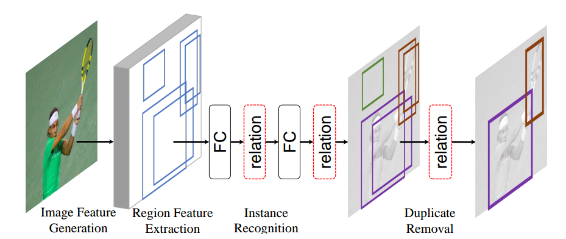

# relation networks for object detection 2017
## abstract
有这样一种观点，为待检测目标之间的关系建模，能够改善目标检测的质量，但是现有的目标检测方法并没有利用这一现象。  
本文提出了一种目标关系模型，利用了目标之间的外观特征、几何特征关系。是一种完全端到端训练的模型。

## introduction
现在大多数优秀的目标检测算法都是基于R-CNN的，然后接后处理步骤NMS。有一种共识就是上下文信息、目标之间的关系可以改善算法的性能，但是自从深度学习成为主流以来，算法对每个目标都是单独作用的。主要原因就是，目标之间的关系很难建模，如目标不同的位置、大小、类别、数目。  
本文受自然语言处理的注意力模型[49](attention is all you need)启发，一个元素的响应受元素所在句子内所有元素影响，并且权重是可学习的。本文将其扩展到图像中，叫做object relation module，模型主要包括两部分，original weight和几何权重，几何权重主要考虑目标的位置关系，并且需要是平移不变的。   

当前的R-CNN系列目标检测可以分为图中四个步骤，relation module可以融入其中的个体目标识别及NMS部分(NMS被取缔)。

## related work
- object relation in post-processing  
目标被提出后，再考虑目标之间的关系，以决定最后的取舍。推荐[16]()。
- sequential relation modeling  
先检测出的目标被用于推断下一个目标的检测，效果不突出。
- human centered scenarios  
主要关于人体各个部位之间关系的应用。
- duplicate removal 
使用relation module代替NMS，SoftNMS[4]()

## object relation module
Scaled Dot-Product Attention[49]()
> $$v^{out}=softmax(\frac{qK^T}{\sqrt{d_k}})V$$
object relation attention，一个目标包含几何特征$f_G$和表达特征$f_A$，$f_G$是bounding box的四维向量，$f_A$取决于具体任务。给定$N$个目标集合$\{(f_A^n,f_G^n)\}_{n=1}^N$，第$n$个目标与所有目标的relation feature是
> $$f_R(n)=\sum_{m}w^{mn} \cdot (W_V \cdot f_A^m)$$

## relation networks for object detection
### review
将relation network应用到R-CNN系列的目标检测框架里，而类似SSD的检测框架，由于候选anchor过多，加入relation会大大增加计算量。
尝试了Faster R-CNN，FPN，DCN
### relation for instance recognition
