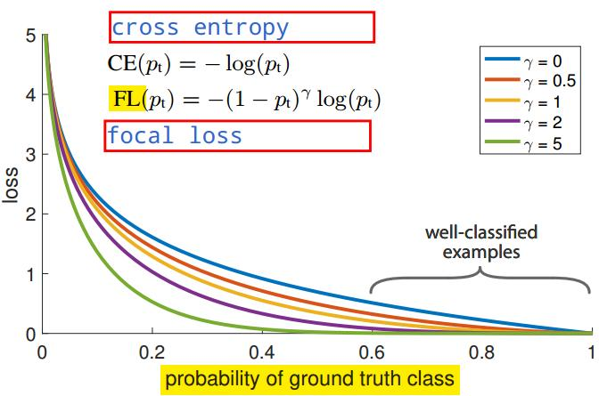

# focal loss for dense detector, FAIR, best student paper iccv 2017
## abstract
two-stage的目标检测方法对稀疏的proposal box进行分类，one-stage的目标检测方法是对密集采集的possible box做分类，然而虽快但准确率没有two-stage的高。作者认为是one-stage训练时的正、负样本不均衡造成的，所以修改了 cross entropy 的形式，并称作focal loss来结局类别不平衡问题，对应的网络称为retinanet。

## introduction
作者认为类别不平衡是one-stage检测器性能不好的主要原因。R-CNN使用two-stage cascade(selective search已经将候选框的位置降低了)和启发式采样proposal box(正负样本比例$1:3$，在线难例学习)来解决类别不平衡问题，而one-stage检测器必须处理大量的候选框，遍布各种spatial position、scale、aspect ratio。于是作者提出focal loss来解决类别不平衡问题。
retinanet使用了in-network feature pyramid，anchor boxes
达到coco 39.1% 5fps，不是说速度快吗？？cao

## related work
- classic object detectors  
使用滑动窗口，分类器作用在dense image grid上。最早的有LeCun使用卷积网络识别手写数字，VJ使用boost方法人脸检测，HOG、ICF的行人检测，DPM的目标检测，DPM在PASCAL数据集上风骚数年。
- two-stage detector  
第一阶段是proposal box，第二阶段是box分类。RCNN将第二阶段的分类器换成CNN，由此有了大的突破。
- one-stage detector  
Overfeat是首先使用CNN的one-stage检测器，其后是SSD,yolo，滑动窗口也算one-stage？
- class imblance  
数据不均衡会导致两个问题，1.大部分负样本很容易识别为背景，那么损失很小，这样训练没有效率，2.大量的负样本导致模型趋向于生成负类标签(**overwhelm training, degenerate models**)。
- robust estimation  
robust loss function，计算损失时减少outlier(难例)的权重。focal loss，计算损失时减少inlier(容易区分的样本)的权重，主要在有sparse set of hard example时使用。

## focal loss
focal loss主要用于解决one-stage目标检测中极度的样本不均衡问题($1:1000$)。 
这里以二分类为例子，但focal loss同样适用于多分类。 
二分类cross entropy loss:
> $$\text{CE}(p) = \begin{cases} -\log(p) &\text{if } y=1 \\
-\log(1-p) &\text{otherwise} \end{cases}$$
为了符号简介些，定义$p_t$，这样$p_t > 0.5$时，表示样本容易识别:
> $$p_t=\begin{cases} p &\text{if } y=1 \\
1-p &\text{otherwise}\end{cases}$$
由于样本不平衡问题，大量的负样本主导了cross entropy loss，也就主导了梯度。常见的均衡方式是修改正负样本的权重，如下式
> $$\text{CE}(p_t)=-\alpha_t \log(p_t)$$
但是上式只能均衡正负样本的权重，不会考虑到难易样本的权重的均衡，由此提出focal loss:
> $$\text{FL}(p_t)=-(1-p_t)^{\gamma} \log(p_t)$$  
其中，$p_t$表示**probability of ground truth class??** ，看定义式即正确分类的概率，$\gamma$叫做focal参数。   
    
最后作者使用的是$\alpha$-blanced variant focal loss：  
> $$\text{FL}(p_t)=-\alpha_t (1-p_t)^{\gamma} \log(p_t)$$
模型初始化时数据不均衡容易导致早期训练的不稳定？？，对于平常的二分类问题，模型的输出是以$0.5$的概率输出$1$或$0$，但是对于样本严重不均衡的情景，这会造成早期训练损失的不稳定。

## retinanet detector
网络由一个backbone和两个subnetwork构成。  
- feature pyramid network backbone  
特征图为$P3-P7$，每个输出特征图的通道数为$256$
- anchors  
$P3-P7$的特征图上的anchor大小为$32^2-512^2$，每个anchor有三种比例$\{1:2,1:1,2:1\}$，使用了三种相对尺寸$\{2^0,2^{1/3},2^{2/3}\}$，所以一个位置共对应$9$个anchor，每个anchor对应的label有分类标签$K$元素向量的独热编码，$4$元素向量的坐标回归标签。  
正样本为IOU$>0.5$的，负样本为IOU$\in [0,0.4)$，对于IOU$\in [0.4,0.5)$的被舍弃。  
**突然发现RCNN系列的two-stage目标检测与one-stage的目标检测的正、负样本选择有着本质上的区别，对于RCNN系列中每一个样本都是proposal box与ground truth box的差值，而SSD类的是从预设的anchor box中选出样本，固然，对于一幅图像，anchor都是固定的，也就是正负样本是固定的，而预测值也是固定的anchor与ground truth box的差值。**
- classification subnet  
这里好像与SSD不同，分类网络的参数在不同层的特征图上也是共享的，因此用于输出的特征图的通道数都是相同的。**并且这里输出特征图后接sigmoid，直接输出Box是某个类的概率，而这里也就没有了背景类的输出，这也就是为什么网络输出$KA$通道的原因($K$为目标类别)，而最后也是根据阈值$0.5$来排除背景的。**  
- box regression subnet: 

inference and training
- inference:
- focal loss  
作者使用$\gamma=2,\gamma \in [0.5,5]$，$\alpha =0.25$,计算损失时包括了带有标签的所有anchor的损失。
> $$total\_focal\_loss = \frac{1}{num\_pos\_anchor}\sum_i focal\_loss _i$$
- initialization  
使用ResNet-50-FPN和ResNet-101-FPN作为backbone网络，网络使用ImageNet预训练以初始化参数。   
所有新的conv层的bias初始化为$0$，weight初始化为$\sigma=0.01$的高斯随机数，
特别改变了分类层偏置系数$b$的初始化，$b=-\log((1-\pi)/ \pi)$，这样初始化后，默认的一个anchor为目标的概率为$\pi$，作者采用$\pi =0.01$，PS：$\pi$与$3.1415$无关，这里只是个符号。 
- optimization:  
> $$loss = focal\_loss + smooth\_l1\_loss$$
```
iteration = 90k
batch_size = 16
learning_rate = 0.01, 0.001(60k), 0.0001(80k)
SGD
weight_decay = 0.0001
momentum = 0.9
only horizontal_flipping
10-35 hours
```

## experiments
coco trainval35k

## conclusion

