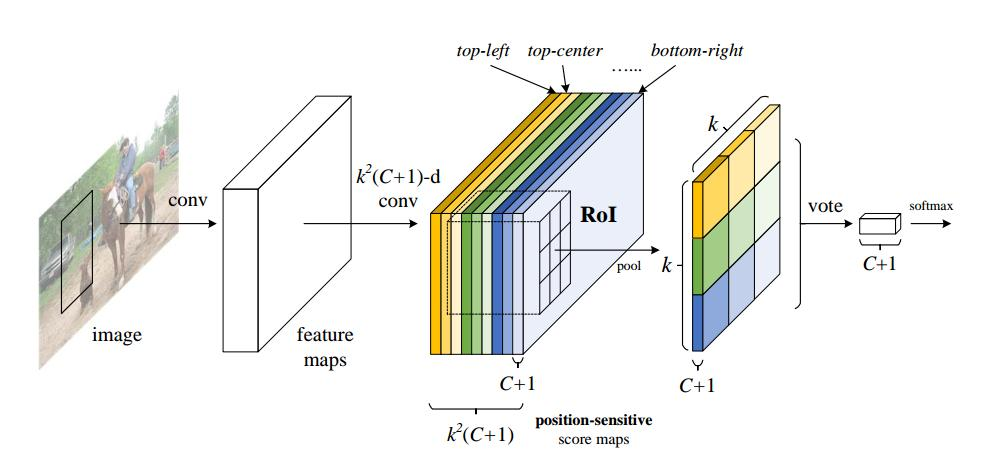
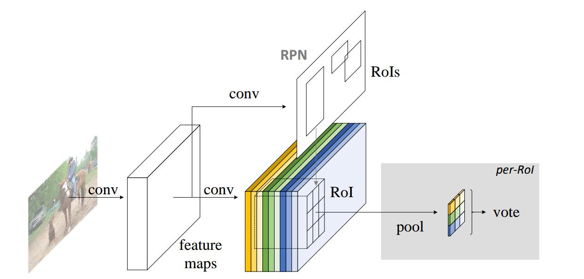

# R-FCN:object detection via region-based fully convolutional networks

## abstract
R-CNN系列的时间主要耗费在计算per-region subnetwork几百次上，本篇文章使用卷积网络来共享计算，但这样必须要解决一个问题就是图像分类的平移不变性和目标检测的平移敏感性(translation variance)，为此提出position-sensitive score maps，改为使用卷积网络后，就可以使用性能强劲的ResNet做为主干网络。  
基本网络ResNet101  
PASCAL VOC 2007 83.6% mAP 170ms  
PASCAL VOC 2012 82.0% 

## introduction

## our approach
overview:  
采用了一个two-stage的目标检测策略，1.region proposal 2.region classification，即便SSD,YOLO是one-stage并且效果不错，但是分数依旧在two-stage的后面。数据流程图如下：  
  
上图中，每一种颜色表示一个position-sensitive score map，共有$k\times k= 3\times 3=9$个map，每一个score map包含$C+1$维。  
同Faster R-CNN，RPN与detector共享特征，RPN自身就是全卷积网络。提供一张图像的Roi后，RFCN的任务就是区分Roi的类别(目标类别或背景)，从上图中可以看到RFCN最后一层卷积的输出是$k^2(C+1)$维的特征图，也就是$k^2$个position-sensitive score maps，$k^2$表示一个Roi被均分成$k\times k$个小格子，$k^2$个map分别表示Roi的{top-left, top-center,……,bottom-right}。每一个map包含$C+1$维，$C+1$表示目标类别或背景的特征图。   
最后一层网络是position-sensitive Roi池化层，它的功能是整合卷积层的输出，为每一个Roi输出类别分数。它的操作方式不同于普通的pooling层，执行的是selective pooling，具体的解释就是，每一个position-sensitive score map内执行pooling得到$C+1$维向量，这样每一个Roi就得到$k^2$个$(C+1)$维的向量。通过端到端的学习，可以让map具有位置信息？？如何端到端？？通过池化，然后就可以直接联系到损失函数

backbone architecture:  
使用ResNet101，去掉全局均值池化层，及$1000$ class的全连接层，这样输出为$2048$-d，作者又加了一层$1024\times 1 \times 1$的卷积层来降低维度，最后接输出维度为$k^2(C+1)$的卷积层(没有讲卷积核的大小)

position-sensitive score maps & position-sensitive Roi pooling:  
对score map上的每一个Roi做position-sensitive Roi pooling后生成的$k^2$个$(C+1)$维的输出投票生成$C+1$维的向量，执行softmax生成类别输出。  
为了bounding box regression，和score map同时输出的还有一个输出$4k^2$维的卷积层，position-sensitive Roi pooling也对$4k^2$操作，输出$k^2$个$4$维的向量，然后使用average vote，输出$4$维向量，也就是$t=(t_x,t_y,t_w,t_h)$，可以注意到，这是与类别无关的坐标回归。

training:  
一个Roi上的loss function:
> $$L(s,t_{x,y,w,h})=L_{cls}(s_{c^*})+\lambda[c^*>0]L_{reg}(t,t^*)$$
其中，$s$表示网络预测Roi的类别，$t_{x,y,w,h}$表示网络预测Roi的坐标，$c^*$表示Roi的ground truth类别标签，$c^*=0$表示背景，可以看出这里的坐标损失是没有针对一类目标的(class-agnostic)，$L_{cls}(s_{c^*})$是分类交叉熵损失，它等于$L_{cls}(s_{c^*})=-\log(s_{c^*})$，$L_{reg}$同Fast R-CNN，设置$\lambda = 1$。  
正样本为Roi中与ground truth box的IOU大于$0.5$的，否则为负样本。  
采用了online hard example mining(OHEM)[22]，RPN在一张图像上提出N个proposal box，计算这N个proposal box的损失(包括正样本、负样本)，排序后，选出B个损失最大的proposal box的损失，送入反向传播。  
权重衰减项$0.0005$，动量$0.9$，输入图像为短边缩放到$600$，一张图像选取$128$个Roi，RPN与R-FCN共享特征，同样采用了Faster R-CNN的交替训练策略。  

inference:  
RPN提出proposal box，R-FCN计算每个proposal box的类别概率及坐标回归，最后使用nms(non-maximum suppression)  

atrous and stride:  
算法atrous??，来源于wavelet，FCN

visuallization:  
$k^2$ position-sensitive score maps

## related work
## experiments
- pascal voc  
- ms coco
## conclusion and future work