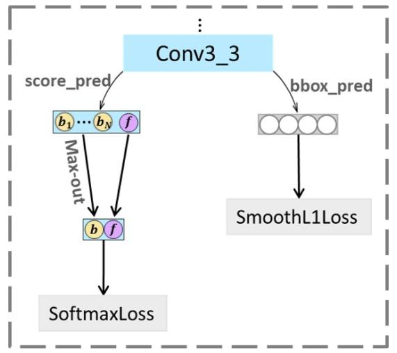

# S3FD: single shot scale-invariant face detector 2017 iccv
[论文实验部分写得细致，测试部分有公开代码，很值得学习](https://github.com/lxg2015/SFD)

## abstract
为解决基于anchor机制的目标检测，对于小目标检测的缺陷
- 基于感受野大小设计anchor的大小，还有equal proportion interval principle
- 通过scale compensation anchor matching策略弥补小目标的召回率
- 通过max-out background label降低小目标的虚警率(false positive)
TiTan X上 36fps for VGA分辨率

## introduction
作者分析了anchor based detectors对于小目标检测性能低下的原因：
- biased framework
- anchor matching strategy
- background from small anchors

## related work
VJ，DPM等传统技术的人脸检测  
CascadeCNN，Faceness等基于CNN的人脸检测  
Faster R-CNN等将广泛意义目标检测用于人脸检测

## single shot scale-invariant face detector
### scale-equitable framework
选用更多的层做anchor，步长成倍增长包括$4-128$像素，基于有效感受野和等比例间隔原则设计的anchor大小是$16-512$，保证各层的anchor密度是一致的。  
基于VGG16设计的网络。  
其中normalization layer是什么？
anchor大小的设计考虑到了两个因素，1.步长的大小，2.有效感受野的大小。   
anchor密度归一化后，任何一个anchor内所包含的anchor中心点数量一致。   
### scale compensation anchor matching strategy
包括两步，1.降低IOU阈值，从$0.5$降到$0.35$，2.以IOU阈值$0.1$，排序选出top-N个anchor
### max-out background label
由于增加的小anchor特别多，对应的背景anchor也占大多数，所以模型为background增加了类别输出来稳定模型。   
max-out结构：  

### training
数据集： 12880 WIDER FACE  
数据增强：1.color distort,2.random crop,3.水平翻转，对一张图片三个步骤是连续做的。  
损失函数：与Fast RCNN相同，是Multi-task loss，其中分类损失使用正、负样本总数目归一化，坐标回归损失使用正样本数目归一化，同时有$\lambda$来平衡两个损失。  
难例学习：使用损失排序，选出损失最大的正、负样本$3:1$，同时设置background label $N_m=3$，$\lambda =4$
训练参数：使用预训练模型初始化参数，使用SGD，动量$0.9$，权重衰减$0.0005$，batch size $32$，学习率前$80k 0.001$，然后$20k 0.0001$，$20k 0.00001$

## experiment
## conclusion

