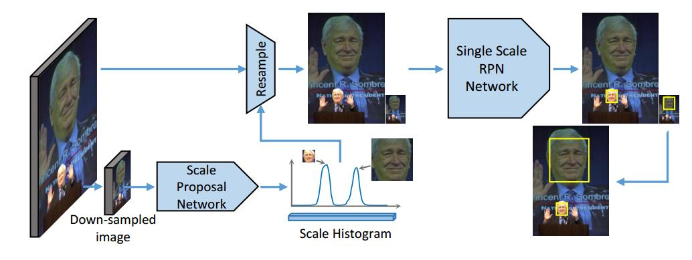

# scale aware face detect 2017

## abstract
基于CNN的人脸检测在解决多尺度人脸的问题上往往是低效的，要么使用一个大模型来检测多尺度，要么使用多尺度的图像来做检测。文章提出检测之前，使用CNN预测图片内人脸尺寸的分布直方图，然后缩小或放大图像到统一人脸的大小，接着使用一个小的CNN对这张图片检测。

## introduction
人脸检测系统应该能够检测不同尺度、不同姿态、不同外貌的人脸，基于大模型容量的CNN算法，能够处理不同姿态、不同外貌，但是对于不同尺度，CNN还没有很好的解决方案，仍有改善的空间。  
本篇提出的检测策略包含两个步骤，第一，预测尺度，是一个全卷积网络，scale proposal network(SPN)，网络的最后是全局最大值池化，以生成一个包含图像人脸大小信息的固定长度特征向量。第二，单尺度的人脸检测，使用一个region proposal network(RPN)作为检测器。  
贡献有两点，1.将人脸检测分成两个简单的任务，尺度估计、单尺度检测，2.提出SPN。

## related work
作者引用了一大堆论文。  
分析了当前多尺度人脸检测的缺点，1.不同尺度的人脸并没有恭喜特征，只是共用了卷积网络的一部分。2.速度慢，因为要检测图片内可能存在的大人脸、小人脸，所以需要大图像，即便图像内没有小人脸，这造成计算损失。

## scale-aware face detection pipeline
包括两个stage，
1. global scale proposal，估计图像内存在的所有人脸的尺度，并估计各尺度存在人脸的置信度
2. single scale detection，为每一个判定为有人脸的尺度，做单尺度人脸检测。

### scale proposal network
CNN接global max pooling的结构，不受输入图像大小、人脸位置的影响，输出固定长度的尺度直方图。  
RPN自身包含了一个假设，就是里物体的中心点越近，那个特征图的像素就更应该检测出对应的物体，而SPN没有这个约束，并且通过池化，移除了位置信息，从而对尺度预测更加准确。？？
### scaling strategy generation
对直方图，先使用滑动窗口均值平滑，再使用NMS得到局部峰值，从而确定人脸的分布的尺度。
### single-scale RPN
rpn with one anchor

## implementation details
### global supervision
sigmoid cross-entropy loss
> $$L=-\frac{1}{N}\sum_{n=1}^{N}[p_n \log{\hat p_n} + (1-p_n)\log(1-\hat p_n)]$$
其中，$N$表示所有的尺度估计，即尺度直方图的bin数目，$\hat p_n$是SPN的输出，并使用$sigmoid$归一化，$p$是标签。  
看图5，文章分析的很有道理。
### ground truth preparation
- defining of bounding box  
使用人脸的眼睛、鼻子、嘴巴来获得更加精准的人脸box
- ground truth generation  
最直接的方式，是根据人脸大小，找最近邻的bins赋值为二值的，但是效果很差。作者提出，对于每一个$s$尺度的人脸，使用高斯函数
> $$f(x)=e^{-\frac{(x-\log_2 s)^2}{2{\sigma}^2}}$$
其中，$\sigma = 0.4$，尺度直方图的取值为
> $$a_i=f((s_i^l+s_i^r)/2)$$
如果同一张图片里包含多个人脸，尺度直方图使用element-wise masximum为每个bin取值。
- receptive field problem  
虽然SPN中fcn的感受野较小，但是同样可以估计出大尺度人脸的尺度值，因为像眼睛是小面积的但是也包含了人脸大小信息。
## experiments
training data，正样本是AFLW与从网上爬下来的带人脸图像，负样本是COCO与网络上的不包含人的图片。不符合标注规范的人脸被随机颜色填充。
## conclusion