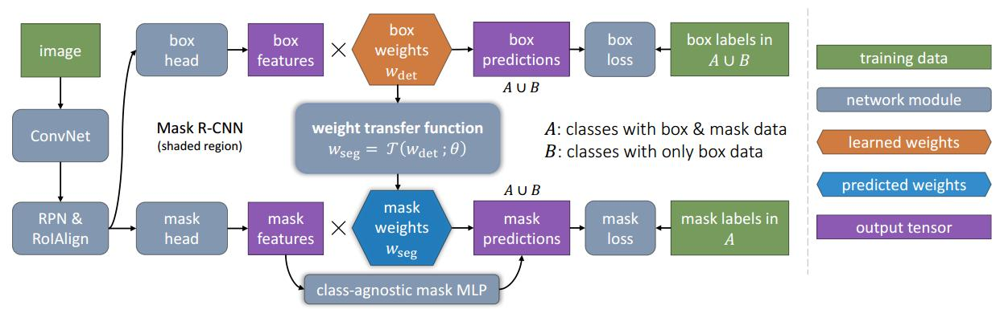

# learning to segment every thing 2017
## abstract
鉴于现有的实例分割方法都必须有分割标签才能够训练，而标注分割数据是很昂贵的，所以造成实例分割被限制于已有标注好的大约$100$类目标上。提出一个新的partially supervised training，和新的迁移学习方法，能够在只有小部分有mask标签而大部分分类目标只有box标签的情况下，对Mask R-CNN训练，得到所有类别目标都能够做到实例分割的模型。  
数据集：Visual genome dataset,COCO 80实例分割数据集

## introduction
- partially supervised instance segmentation  
训练数据集中，只有一部分类别有mask标签，而剩余部分类别只有box标签；算法需要从这个数据集中学习到对所有类别训练数据集实例分割的模型。这样的任务就叫做partially supervised。
- transfer learning   
为了解决上面的任务，基于Mask R-CNN，提出一个新的transfer learning方法。因为Mask R-CNN已经将box的预测与Mask的预测分成两个独立的任务，而直觉告诉我们，box预测分支的参数包含了目标类别信息，而这个信息可以通过学习用于mask分支。作者通过parameterized-weight transfer function来实现这个直觉，这个函数以box predict的参数为输入，以mask预测的参数为输出，以已有mask标注信息的数据来对这个函数进行端到端的监督训练，测试阶段，这个函数用于预测mask分支的参数。  

## related work
- instance segmentation  
已有实例分割方法都被限制在数据集上，本篇文章的方法突破了语义分割数据集的限制。
- weight prediction and task transfer learning  
迁移学习就是把解决一个问题过程中获取的知识用于解决另一个问题。
- weakly supervised semantic segmentation  
- visual embeddings    
class embedding vectors   
embedding数学上的含义，是一个映射，$f:X\rightarrow Y$，也就是一个函数，它是injective(单射函数，每一个Y只有唯一的X与之对应，同时每一个X也只有一个Y与之对应)和structure-preserving(结构保存，例如映射前后不改变大小关系)的。更常见的是word embedding。

## learning to segment every thing
通过迁移学习得到的模型叫做$\text{Mask}^{X} R\text{-}CNN$
### mask prediction using weight transfer
Mask R-CNN中，最后的box与mask分支参数都是category specific的，也是相互独立的一起训练的。而这篇文章是使用weight transfer function将category specific的box分支参数转换到category specific的mask分支参数上，并且是作为一个整体，一起训练的。  
weight transfer function
> $$w_{seg}^c = T(w_{det}^c;\theta)$$
其中$T()$是转移函数，可以是全连接网络，作者这里使用了FCN，$\theta$是与类别无关的可学习参数，$w_{det}^c$是box预测参数，它包含有类别预测及框位置预测两种参数，作者通过做实验来对比效果。  

从图中可以看到，作者不仅使用了class specific分割参数，也添加了class agmostic的多层感知机分割。
### training
有训练集A和B，A有mask标签与box标签，而B只有box标签。A和B训练box参数，A训练mask及weight transfer function参数。  
- stage wise training  
第一阶段使用A和B训练Faster R-CNN，第二阶段固定Faster R-CNN的参数，包含$w_{det}^c$也是固定的，使用B训练mask分支及weight transfer function参数。但是也有缺点，后文讨论
- end-to-end training  
Mask R-CNN通过多任务训练得到的模型是优于各任务单独训练的结果的，所以这里试图使用多任务训练。使用A和B计算box loss，使用A的计算mask loss，但是这样会导致一个矛盾，因为A数据集里的类别的$w_{det}^c$参数会接收到来自于weight transfer function的梯度，而B数据集里的类别是不会接收到这种梯度的，不过这个问题可以通过下式解决
> $$w_{seg}^c=T( stop\_grad(w_{det}^c);\theta )$$
- baseline: class-agnostic mask prediction  
使用class-agnostic FCN mask prediction head的Mask R-CNN作为基础网络。
- extension: fused fcn+mlp mask heads
Mask R-CNN中尝试了两种mask head，FCN和MLP，由于FCN效果更好，所以选择了FCN。但是两者可能各有优点，FCN趋向于保留细节，MLP趋向于把握目标，所以两者结合，效果更优。使用class specific输出$K\times M \times M$，class agnostic输出$1\times M\times M$，将class agnostic的输出复制$K$份，加到class specific的输出上，测试时使用$sigmoid$得到概率，然后resize到box尺寸，加阈值，得到最后的mask。训练时，使用binary cross-entropy loss到$K\times M\times M$上。(交叉熵是一种计算损失的方式，而sigmoid是一种输出)

## experiments
## conclusion