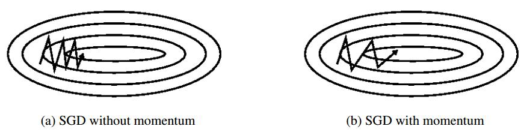

# an overview of gradient descent optimization algorithms
[from blog](http://ruder.io/#open)  
[中文翻译](http://blog.csdn.net/google19890102/article/details/69942970)  
[原文有动图](http://ruder.io/optimizing-gradient-descent/index.html#adam)  

## abstract
本文重在培养对算法不同之处的直觉

## introduction
[基础介绍推荐cs231n document](http://cs231n.github.io/optimization-1/)  
学习率$\eta$也叫做步长。

## gradient descent variants
梯度下降算法依据计算目标函数的梯度时使用数据的大小分为三种，这是一个参数更新的精度与更新过程中所需时间的平衡。
### batch gradient descent
批梯度下降法，又叫 Vanilla gradient descent，每次参数更新时，在整个训练数据集上计算损失函数关于参数$\theta$的梯度：
> $$\theta = \theta - \eta \cdot \nabla _{\theta}J(\theta)$$
因为在每次更新参数时，都需要在整个数据集上计算梯度，所以批梯度下降法会很慢，同时，它无法处理超出内存容量限制的数据集。批梯度下降法也不能在线更新模型，即不能在运行过程中添加新样本。
它的代码是这样的
```python
for i in range(nb_epochs):
    params_grad = evaluate_gradient(loss_function, data, params) # data(包含了label), params(要计算梯度的模型参数)
    params = params - leraning_rate * params_grad
```
对于给定的迭代次数，首先，计算损失函数在整个数据集上的损失关于参数的梯度向量。现有的深度学习库已经提供了高效自动计算参数的函数，如果要自己实现，梯度验证是一个比较可靠的方法来验证计算的正确性。  
更新参数时，使用learning_rate决定更新的步长。对于凸误差函数，批梯度下降法会收敛到全局最优点，而对于非凸误差函数，批梯度下降法只能够收敛到局部最优值。
### stochastic gradient algorithm(SGD)  
随机梯度下降法，每一次参数更新时，使用一个样本$x^{(i)}$和标签$y^{(i)}$来计算梯度：
> $$\theta = \theta - \eta \cdot \nabla _{\theta}J(\theta ;x^{(i)};y^{(i)})$$
对于大数据集，批梯度下降算法在更新参数之前，会计算所有样本的梯度，而其中也包括相似的样本，这样对相同的参数重复计算梯度就会造成计算冗余。而SGD在对每个样本计算梯度后，都更新参数，从而消除了冗余，因此它会更快并且可以在线学习(训练过程中，添加样本)。但是SGD的高方差的频繁更新会导致目标函数的震荡。  
批梯度下降法会收敛到局部最优值，SGD由于震荡，可以从一个局部最小调到另一个局部最小，从而收敛到更优的局部最小上。另一方面，SGD的持续波动使得最终收敛到特定最小值的过程异常复杂。随着学习率的降低，SGD与批梯度下降法类似，对于非凸误差函数，会收敛到局部最小，对于凸误差函数，会收敛到近似全剧最小上。
```python
for i in range(nb_epochs):
    np.random.shuffle(data)
    for example in data:
        params_grad = evaluate_gradient(loss_funcation, example, params)
        params = params - learning_rate * params_grad
```
### mini-batch gradient descent(SGD)
小批量梯度下降法对上述两种方法进行折中，每次更新参数时，使用$n$个样本计算梯度
> $$\theta = \theta - \eta \cdot \nabla_{\theta}J(\theta;x^{i:i+n};y^{i:i+n})$$
这个方法，第一，降低了参数更新量的方差，从而收敛得更加稳定，第二，可以利用深度学习库中高度优化的矩阵优化方法，高效的求解小批量数据的梯度。batch_size一般在$50-256$，通常也叫作SGD。  
batch size越大，学习率也应该增大？
```python
for i in range(nb_epochs):
    np.random.shuffle(data):
    for batch in get_batches(data, batch_size=50):
        params_grad = evaluate_gradient(loss_function, batch, param)
        params = params - learning_rate * params_grad
```

## chanllenge
Vanilla mini-batch gradient descent方法并不能保证收敛，依然有挑战
- 学习率的选择，小学习率会导致收敛过程缓慢，大学习率不容易收敛，导致损失函数在最小值附近震荡或发散。
- 学习率的调整，如退火随着训练过程的进行调整学习率，如依据预定义的策略调整学习率，如当损失函数下降量少于一个阈值时调整学习率，但是策略与阈值都需要预先定义，因此无法适应数据集的各种特点。
- 针对所有参数使用相同的学习率也有问题，如数据比较稀疏或者特征的频率不同，那么我们更希望提高出现频次较低的特征的学习率。
- 是神经网络的误差函数通常是高度非凸的，所以学习算法需要避开无数的局部最小值。[5]解释学习算法遇到的更大阻力其实来自于鞍点，即那些在一个方向是凸的，另一个方向是凹的，马鞍的形状，鞍点的周围通常是误差的平原地带，由于各个轴的梯度都趋向于0，导致SGD很难离开鞍点。

## gradient descent optimization algorithms
接下来讲解决挑战的深度学习中经常用到的算法，不会涉及对高维数据很难计算的二阶方法如牛顿法
### momentum
  
图中，椭圆表示损失函数的等高图，带箭头的折线段的每一段表示一次更新的步长的更新向量。  
在局部最小值附近经常出现沟壑一样结构的损失函数，如上图，SGD在这样的场景中很容易出现在沟壑两边摇摆的情况，导致收敛速度降低。动量法是一种对SGD改进的方法，它将历史步长的更新向量的一个分量$\gamma$增加到了当前的更新向量中，能够减少震荡，趋向于收敛方法。 
> $$\begin{aligned} v_t &= \gamma v_{t-1}+\eta \nabla_{\theta}J(\theta) \\
\theta &= \theta - v_t \end{aligned}$$
$\gamma$通常为$0.9$
### nesterov accelerated gradient(NAG)
对于动量法的改进，因为参数$\theta$肯定会以$-\gamma v_{t-1}$更新，所以这里在更新$-\gamma v_{t-1}$后的位置求梯度，再做实际的参数更新。假设梯度下降算法为一个小球的滚动，那么NAG能够让小球提前在下坡到爬坡的位置减速，而动量法里，只要小球在下坡，就会一直加速。
> $$\begin{aligned} v_t &=\gamma v_{t-1}+\eta \nabla_{theta}J(\theta - \gamma v_{t-1}) \\
\theta &= \theta - v_t\end{aligned}$$
在RNN的优化中，效果很好。  
  
蓝色表示动量法参数的更新，蓝色小段表示$\eta\nabla_{\theta}J(\theta)$，蓝色大段表示$\gamma v_{t-1}$。  
棕色表示NAG算法里的$\gamma v_{t-1}$，红色表示NAG算法里$\eta\nabla_{\theta}J(\theta-\gamma v_{t-1})$，青色表示NAG算法最后的更新。
### Adagrad
是一种基于梯度的优化算法，它会对更新频次少的参数调大学习率，对更新频次高的参数调小学习率，因此它适于稀疏数据集。比SGD要鲁棒。   
首先，设置$g_{t,i}$为第$t$次更新时，目标函数对参数$\theta_i$的梯度：
> $$g_{t,i}=\nabla_{\theta_t}J(\theta_{t,i})$$
Adagrad调整学习率后的更新规则是
> $$\theta_{t+1,i}=\theta_{t,i}-\frac{\eta}{\sqrt{G_{t,ii}+\epsilon}} \cdot g_{t,i}$$
其中，$G_{t} \in \mathbb{R}^{d\times d}$是一个对角矩阵，每一个对角线上的元素$G_{t,ii}$表示第$t$次更新前，参数$\theta_i$以往更新梯度的平方和，$\epsilon$是为了避免出现分母为$0$的情况，取值为$1e-8$。注意，去掉上式中的平方根会导致结果很差。  
向量化表示参数更新为：
> $$\theta_{t+1}=\theta - \frac{\eta}{\sqrt{G_t+\epsilon}} \odot g_t$$
$\odot$这里表示矩阵对角线元素与列向量元素间的乘积。
优点：可以不用调整学习率。  
缺点：随着更新次数的增多，$G_t$会变得越来越大，导致学习率急剧降低，下一个算法对此做出改进。
### Adadelta
为了改变Adagrad里学习率单调递减的缺点，使用下式替换$G_t$
> $$E[g^2]_t=\gamma E[g^2]_{t-1} + (1-\gamma)g_t^2$$
如同动量法，设置$\gamma=0.9$，那么Adadelta的更新公式是
> $$\begin{aligned} \Delta \theta_t &= -\frac{\eta}{\sqrt{E[g^2]_{t}+\epsilon}} \odot g_t \\
\theta_{t+1} &=\theta_t+\Delta \theta_t\end{aligned}$$(1)
简单起见，上式可以简写为
> $$\Delta \theta_t=-\frac{\eta}{RMS[g]_t} \odot g_t$$
其中，$RMS[g]_t=\sqrt{E[g^2]_{t}+\epsilon}$，表示均方根值  
作者注意到更新参数的单位不同？？所以又定义了个指数衰减的量
> $$E[{\Delta \theta}^2]_t=\gamma E[{\Delta\theta}^2]_{t-1} + (1-\gamma){\Delta\theta}_t^2$$
那么
> $$RMS[\Delta\theta]_t=\sqrt{E[{\Delta\theta}^2]_{t}+\epsilon}$$
最后的Adadelta更新规则为
> $$\begin{aligned}\Delta\theta_t &= \frac{RMS[\Delta\theta]_{t-1}}{RMS[g]_t} \odot g_t \\
\theta_{t+1} &=\theta_t+\Delta \theta_t\end{aligned}$$(2)
学习率参数已被舍弃
### RMSprop
实际上与Adadelta的$(1)$式相同，但是两个算法的作者是独立提出的
> $$\begin{aligned} E[g^2]_t &= 0.9E[g^2]_{t-1}+0.1g_t^2 \\
\theta_{t+1} &= \theta_t - \frac{\eta}{\sqrt{E[g^2]_t+\epsilon}} \odot g_t \end{aligned}$$
### Adam
Adaptive Moment Estimation 是一种为每一个参数计算自适应学习率的算法
> $$\begin{aligned} m_t&=\beta_1 m_{t-1}+(1-\beta_1)g_t \\
v_t &= \beta_2 v_{t-1}+(1-\beta_2)g_t^2\end{aligned}$$
$m_t$和$v_t$分别是一阶矩(均值)、二阶矩(无减均值的方差)估计？？？  
$m_t$和$v_t$初始化为$0$，如果$\beta_1,\beta_2$趋向于$1$，那么学习率会偏向于$0$，$1-\beta$为decay rates？？？，所以作者设法纠正
> $$\begin{aligned} \hat m_t &= \frac{m_t}{1-\beta_1^t} \\
\hat v_t &= \frac{v_t}{1-\beta_2^t} \end{aligned}$$
更新规则为
> $$\theta_{t+1} = \theta_t - \frac{\eta}{\sqrt{\hat v_t + \epsilon}} \odot \hat m_t \qquad \text{这里不知道原文是不是有笔误}$$
设置$\beta_1=0.9$，$\beta_2=0.999$，$\epsilon=1e-8$
### AdaMax
是直接基于Adam的改进，解释的不清楚？？
> $$\begin{aligned} u_t&=\beta_2^\infty v_{t-1}+(1-\beta_2^\infty)|g_t|^\infty \\ 
&= \max(\beta_2 \cdot v_{t-1},|g_t|)\end{aligned}$$
更新规则
> $$\theta_{t+1} = \theta_t - \frac{\eta}{u_t} \odot \hat m_t $$
### Nadam
Adam相当于结合了momentum与RMSprop，同样Nesterov-accelerated Adaptive Moment Estimation(Nadam)结合了Adam与NAG。写的比较复杂。

## 算法可视化
似乎Adam算法的效果与速度是最好的，但是现在很多论文都只使用SGD与learning rate annealing schedule。但是，根据实验观察，SGD也能够找到最小值，但是通常更费时间，并且更易陷于鞍点或局部极小值，因此，对于比较深、复杂的网络，推荐使用自适应学习率的算法

