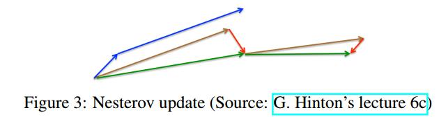

# an overview of gradient descent optimization algorithms
[from blog](http://ruder.io/#open)  
[中文翻译](http://blog.csdn.net/google19890102/article/details/69942970)

## abstract
本文重在培养对算法不同之处的直觉

## introduction
[基础介绍推荐cs231n document](http://cs231n.github.io/optimization-1/)
学习率$\eta$决定所采用的步长的大小。

## gradient descent variants
梯度下降算法依据计算目标函数的梯度时使用数据的大小分为三种，这是一个参数更新的精度与更新过程中所需时间的平衡。
### batch gradient descent
批梯度下降法，又叫 Vanilla gradient descent，每次参数更新时，在整个训练数据集上计算损失函数关于参数$\theta$的梯度：
> $$\theta = \theta - \eta \cdot \nabla _{\theta}J(\theta)$$
因为在每次更新参数时，都需要在整个数据集上计算梯度，所以批梯度下降法会很慢，同时，它无法处理超出内存容量限制的数据集。批梯度下降法也不能在线更新模型，即不能在运行过程中添加新样本。
它的代码是这样的
```python
for i in range(nb_epochs):
    params_grad = evaluate_gradient(loss_function, data, params) # data(包含了label), params(要计算梯度的模型参数)
    params = params - leraning_rate * params_grad
```
对于给定的迭代次数，首先，计算损失函数在整个数据集上的损失关于参数的梯度向量。现有的深度学习库已经提供了高效自动计算参数的函数，如果要自己实现，梯度验证是一个比较可靠的方法来验证计算的正确性。  
更新参数时，使用learning_rate决定更新的步长。对于凸误差函数，批梯度下降法会收敛到全局最优点，而对于非凸误差函数，批梯度下降法只能够收敛到局部最优值。
### stochastic gradient algorithm(SGD)  
随机梯度下降法，每一次参数更新时，使用一个样本$x^{(i)}$和标签$y^{(i)}$来计算梯度：
> $$\theta = \theta - \eta \cdot \nabla _{\theta}J(\theta ;x^{(i)};y^{(i)})$$
对于大数据集，批梯度下降算法在更新参数之前，会计算所有样本的梯度，而其中也包括相似的样本，这样对相同的参数重复计算梯度就会造成计算冗余。而SGD在对每个样本计算梯度后，都更新参数，从而消除了冗余，因此它会更快并且可以在线学习(训练过程中，添加样本)。但是SGD的高方差的频繁更新会导致目标函数的震荡。  
批梯度下降法会收敛到局部最优值，SGD由于震荡，可以从一个局部最小调到另一个局部最小，从而收敛到更优的局部最小上。另一方面，SGD的持续波动使得最终收敛到特定最小值的过程异常复杂。随着学习率的降低，SGD与批梯度下降法类似，对于非凸误差函数，会收敛到局部最小，对于凸误差函数，会收敛到近似全剧最小上。
```python
for i in range(nb_epochs):
    np.random.shuffle(data)
    for example in data:
        params_grad = evaluate_gradient(loss_funcation, example, params)
        params = params - learning_rate * params_grad
```
### mini-batch gradient descent(SGD)
小批量梯度下降法对上述两种方法进行折中，每次更新参数时，使用$n$个样本计算梯度
> $$\theta = \theta - \eta \cdot \nabla_{\theta}J(\theta;x^{i:i+n};y^{i:i+n})$$
这个方法，第一，降低了参数更新量的方差，从而收敛得更加稳定，第二，可以利用深度学习库中高度优化的矩阵优化方法，高效的求解小批量数据的梯度。batch_size一般在$50-256$，通常也叫作SGD。  
batch size越大，学习率也应该增大？
```python
for i in range(nb_epochs):
    np.random.shuffle(data):
    for batch in get_batches(data, batch_size=50):
        params_grad = evaluate_gradient(loss_function, batch, param)
        params = params - learning_rate * params_grad
```

## chanllenge
Vanilla mini-batch gradient descent方法并不能保证收敛，依然有挑战
- 学习率的选择，小学习率会导致收敛过程缓慢，大学习率不容易收敛，导致损失函数在最小值附近震荡或发散。
- 学习率的调整，如退火随着训练过程的进行调整学习率，如依据预定义的策略调整学习率，如当损失函数下降量少于一个阈值时调整学习率，但是策略与阈值都需要预先定义，因此无法适应数据集的各种特点。
- 针对所有参数使用相同的学习率也有问题，如数据比较稀疏或者特征的频率不同，那么我们更希望提高出现频次较低的特征的学习率。
- 是神经网络的误差函数通常是高度非凸的，所以学习算法需要避开无数的局部最小值。[5]解释学习算法遇到的更大阻力其实来自于鞍点，即那些在一个方向增，另一个方向减的点？？鞍点的周围通常是误差的平原地带，由于各个轴的梯度都趋向于0，导致SGD很难离开鞍点。

## gradient descent optimization algorithms
接下来讲解决挑战的深度学习中经常用到的算法，不会涉及对高维数据很难计算的二阶方法如牛顿法
### momentum
  
图中，椭圆表示损失函数的等高图，带箭头的折线段的每一段表示一次更新的步长的更新向量。  
在局部最小值附近经常出现沟壑一样结构的损失函数，如上图，SGD在这样的场景中很容易出现在沟壑两边摇摆的情况，导致收敛速度降低。动量法是一种对SGD改进的方法，它将历史步长的更新向量的一个分量$\gamma$增加到了当前的更新向量中，能够减少震荡，趋向于收敛方法。 
> $$\begin{aligned} v_t &= \gamma v_{t-1}+\eta \nabla_{\theta}J(\theta) \\
\theta &= \theta - v_t \end{aligned}$$
$\gamma$通常为$0.9$
### nesterov accelerated gradient(NAG)
> $$\begin{aligned} v_t &=\gamma v_{t-1}+\eta \nabla_{theta}J(\theta - \gamma v_{t-1}) \\
\theta &= \theta - v_t\end{aligned}$$
