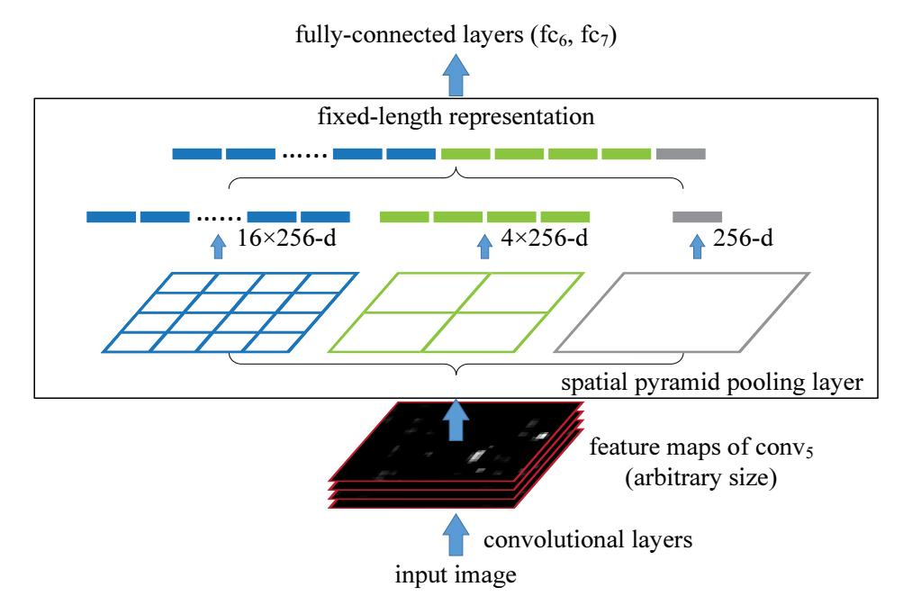
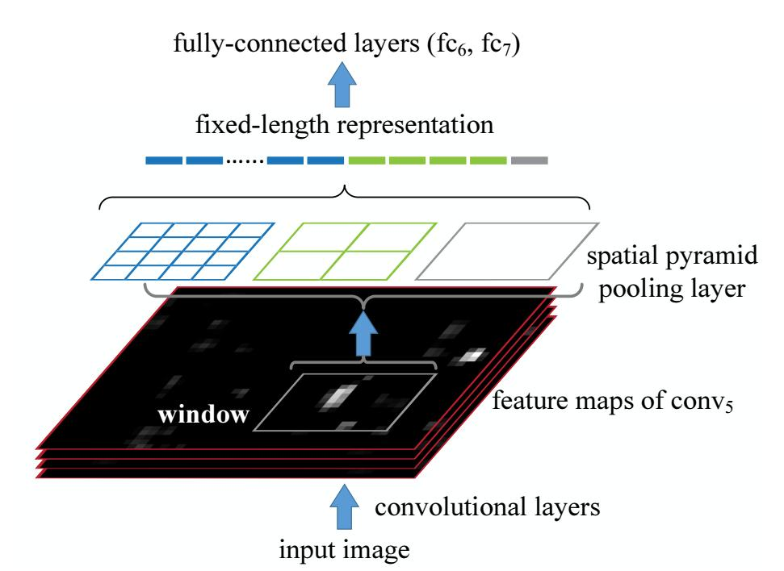

## spatial pyramid pooling in deep convolutional networks for visual recognition
## abstract
当前的目标检测网路都需要固定大小的输入图像，这可能会减少任意大小、长宽比的图像的目标检测精度，所以提出spatial pyramid pooling来消除这个影响，它可以不受图像大小的影响而输出固定长度的特征向量。

## introduction
使用edge box来做 proposal box

## deep networks with spatial pyramid pooling
- convolutional layers and feature maps  
流行的7层网络结构，5层卷积，2层全连接，最后是N-way的softmax分类层，其间分布有池化层，池化层在使用滑动窗口求值的意义上也可以看做是一种卷积。  
卷积网络的输出之所以称为特征图(feature map)，是因为这些特征不仅代表了对输入响应的大小，它还带有位置信息。
传统特征提取方法 Bag of Words，能够不受输入图像大小的影响而生成固定长度的特征向量，所以卷积层的输出也可以使用这样的方法。
- the spatial pooling layer  
spatial pyramid pooling 方法可以保留特征的空间位置信息，从而可以改善Bag of Words的特征提取。spatial pooling方法是通过将图像分成与图像大小成比例的spatial bins，然后在每个bins内pooling的方式(本文中在spatial pooling中的操作都是max pooling)，这样任意大小的图像的spatial bins数目是固定的，从而pooling后的特征向量的长度也是固定的。这和sliding window pooling的方式不同，而slinding window的数目由图像大小决定。  
spatial pooling layer 示意图如下，可以注意到，取名为spatial pyramid是因为spatial bins的大小是多尺度的。   
**注：这个示意图是针对图像分类的**   
    
这样，输入图像可以是任意大小，任意长宽比，输出都是固定长度的特征向量。
当输入图像是多尺度时，而filter是固定大小的，那么提取的特征也是多尺度的，传统图像特征提取中，SIFT是通过不同大小的patch与高斯滤波器实现多尺度的，并且对性能影响很大，在深度网络中多尺度也是很重要的。  
spatial pooling中有一个spatial bin是与原图像大小一样的，而它等同于global pooling(用于减少模型参数，减少过拟合)，本质上还是Bag of Words的内容。  
- training the network  
虽然任意大小的输入图像都可以使用梯度下降算法进行训练，但是为了使用GPU加速，固定大小的输入是必须的，作者提出了一种解决方法，能够固定输入大小同时保留spatial pyramid pooling的特性。
single size training: 输入图像是从原图像random crop的$224\times 224$大小的图像，做这个的目的是使能multi-level pooling。  
multi-size training: 作者有定义了一个输入为$180\times 180$的网络，这个网络和输入为$224\times 224$的网络参数是共享的，因为特征图经过spatial pooling layer后提取的特征向量是一样大小的。输入是直接将$224\times 224$的图像resize到$180\times 180$的。训练时是$224\times 224$与$180\times 180$的网络一个epoch换一种网络进行的。测试时，输入是可以任意大小的图像，并没有resize到固定大小。

## SPPnet for object detection
SPPnet可以对全图进行一次CNN，然后对特征图上每个proposal windows内的特征进行spatial pyramid pooling，从而对于每一个proposal window都提取到了固定大小的特征向量。RCNN是在图像区域提取的特征，而SPPnet是在feature map上提取的区域特征，这对比到传统的图像处理上，DPM在HOG特征图上提取区域特征，selective search在sift特征图像提取区域特征，Overfeat目标检测同样是从卷积特征图上提取特征(但是是固定大小的窗口)，而本篇文章是任意大小窗口上提取特征。
- detection algorithm    
与RCNN相同，使用selective search生成object porposal windows，作者先将原图像缩放$min(w,h)=s$，然后使用SPPnet版的ZFnet(single size trained)对全图提取特征图，之后使用4-level spatial pooling layer(1x1,2x2,3x3,6x6 bins)为每一个candidate window提取共$(1+4+9+36)\times 256 = 50\times 256 = 12800$长的特征向量，接着连接全连接网络，最后是binary linear SVM分类器，训练SVM时，使用hard negative mining方法【23】，这里与RCNN中的训练类似，使用ground-truth windows做正样本，使用proposal window与ground-truth window的IOU少于30%的做负样本，同时负样本中只保留了相互之间IOU小于70%的。  
作者同样尝试了多尺度的提取特征的方法，具体是将原图像缩放到$min(w,h)=\{480,576,688,864,1200\}$，然后对于一个proposal window，选取其中与$224\times 224$最相近的一个尺度提取特征向量，这样做法类似于resize proposal window到$224\times 224$再convolution获取特征类似，但计算量更小。
作者也尝试了fine-tune pre-trained网络，但是由于特征是直接从特征图中pool到的，为了方便(这里作者可能没有想到比较好的梯度方向传播的方法)，只微调了全连接网络的参数。网络结构是在5层卷积，2层全连接的基础上，接了一个21-way 的全连接网络类别输出(带上背景类)，训练时，正样本是与ground truth window的IOU大于0.5的proposal window，负样本是与ground truth window的IOU在[0.1,0.5)之间的proposal window的随机采样？？。最后同样使用了bounding box regression来处理predicted windows。
- detection result  
速度上是RCNN的100倍，性能上基本一样。
**注：这个示意图是针对图像目标定位的**     
