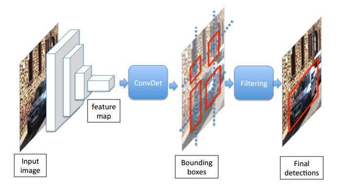

# squeezeDet: unified, small, low power fully convolutional neural networks for Real-Time object detection for autonomous driving 2016
## abstract
用于自动驾驶，模型要小，前向计算要快，计算量要小以满足嵌入式的要求

## introduction
accuracy, speed, small model size, energy efficiency  
squeezeDet是受yolo的启发，backbone网络为squeezeNet，head网络叫convDet，输入$1242\times 374$，速度是$57.2$fps。

## related work
- cnn： 目标检测，hog+svm，dpm，rcnn系列，yolo，general-purpose object detection model。
- small cnn model：AlexNet 240MB 80%，VGG19 575MB 87%，GoogLeNetv1 53MB，squeezeNet 4.8MB
- fcn： 这里接上global average pooling用于分类，看不出放在这里讲的意图，可能只是背景知识

## method description
### detection pipeline
  
一张图像输入到backbone网络，得到低分辨率、高维度的特征图，之后，特征图输入到convDet，输出$W\times H \times (C+1)$维的结果，其中$W\times H$是均匀分布的格子数目，一个bounding box对应一个$C+1$维的向量输出，表示$C$个条件概率，$1$个confidence score，与yolo类似。  
confidence score:  
> $$Pr(Object) \times IOU_{truth}^{pred}$$
conditional probabilities:($c$表示分类类别)
> $$Pr(class_c|Object)$$
预测的时候，一个bounding box的label判定为
> $$ \max_c Pr(class_c|Object)\times Pr(Object) \times IOU_{truth}^{pred}$$
之后保留分数最大的$N$个bounding box，使用NMS。
### convDet
并没有明说$W\times H$代表什么，根据图推理就是输入到convDet特征图的尺寸。convDet与RPN类似，也是在特征图上进行滑窗。
### training protocol 
训练与Faster R-CNN的交替训练不同，采用与YOLO相同的端到端训练。
### neural network design
