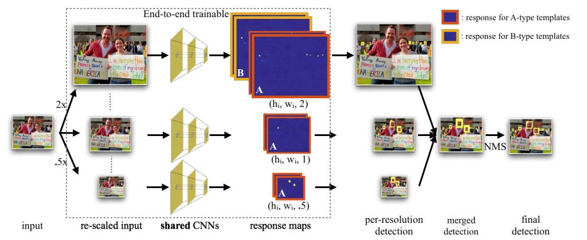

# finding tiny faces 2017 CVPR
[比你写的好得多的笔记blog](http://blog.csdn.net/shuzfan/article/details/66971130)

## abstract
小目标检测依然是个难题，这篇文章从三个方面分析了这个问题：
- 尺度不变性
- 图像分辨率
- 上下文信息(contextual reason)
对于尺度不变性，作者认为检测3px与检测300px的人脸使用的特征是不同的，所以针对不同大小人脸，训练了不同的检测器，检测器使用的是同一个网络不同层的特征，所以是一个Multi-task。对于小目标的检测，作者发现上下文信息至关重要，所以提高了templates的大小。最后，作者尝试了微调已经训练好的网络来提高它的检测范围的方法。
AP 82% Wider Face数据集(小目标，且被遮挡目标较多)

## introduction
从客观上讲，依据尺度不变性设计的算法是没有办法解决小目标检测的问题的。  
- multi-task modeling of scales  
大部分目标检测中使用的分类器的输入都是统一尺寸的，像建立图像金字塔然后滑动窗口的方法，Faster R-CNN中使用Roi pooling来得到统一大小的。那么这个检测模板的大小要如何定呢？往往要顾此失彼，one-size-fits-all的方法并不适用，所以作者想到分别训练检测器来检测大、小目标。然而训练大量的检测器，也会有缺点，如缺失固定目标尺度训练数据，测试时效率低。为此，作者采用了一种multi-task的形式，充分利用不同层的特征。
- how to generalize pre-trained networks  
作者验证了预训练好的模型是针对个别大小目标检测的，那么如何从预训练好的模型中获取尺度不变的特征？作者采用了测试时，使用图像金字塔
- how best to encode context   
作者实验表明，人眼对于小目标的识别也是严重依赖于context信息的。并且验证使用来自多层的卷积特征(hypercolumn feature)可以有效捕捉高分辨率的细节与低分辨率的线索信息的(使用大的感受野)，这个特征叫做'foveal' feature
- 主要贡献  
深度分析了图像分辨率、目标大小、上下文信息在检测小人脸时的作用。

## related work
- scale-invariance  
大量的工作聚焦于图像的尺度不变特征表达，如SIFT，R-CNN，Faster R-CNN(使用Roi Pool，不同大小的区域使用相同大小的特征向量表示)。作者对scale-variant templates方法进行了深入探讨，SSD就是一种scale-variant templates的方法(但是特征图上的卷积核大小是一样的，这里的variant是指不同的特征图？？)，templates是啥？？这篇文章与SSD不同于使用了上下文信息 
- context
使用大的local context in a scale-variant way
- multi-scale representation
使用hypercolumns特征，即来自不同层的卷积特征一起构成描述符
- RPN
不同与RPN的地方就是hypercolumns特征

## exploring context and resolution
首先想一下这个问题，当已知待检测人脸大小是$25\times 20$时，该怎样设计检测器？ 应该考虑的因素有上下文信息与模板大小  
同时，在解决第一个问题的同时，想一下这个问题，当已知待检测人脸大小是$250\times 200$时，该怎样设计检测器？  
实验设置：采用ResNet50的FCN结构，输出二分类概率图(热度图)
### context
提出foveal structure feature
### resolution
使用wider face训练的检测器对大目标检测效果很差的原因是，wider face数据集中大目标的数量很少，也就是缺乏大目标训练样本。

## approach: scale specific detection
有没有一种策略能够为特定大小的目标设计特定的检测模板？作者使用的方法是训练不同大小的检测模板，然后在检测结果中选择最好的一个尺度。  
定义一个检测器$t(h,w,\sigma)$，其专门检测$(h/ \sigma,w/ \sigma)$大小的目标，$\sigma =1$表示在原图上做检测，$\sigma=0.5$表示将原图缩小为原来的$\frac{1}{2}$做检测  
对于一个给定的数据集，作者使用聚类来选择预设框的尺寸(这里不能这么选的，目标框的大小应该符合高斯分布)，聚类使用的Jaccard距离，公式如下
> $$d(s_i,s_j)=1-J(s_i,s_j)$$
其中$s_i$表示大小为$(w_i,h_i)$的目标框，$J(s_i,s_j)$是jaccard similarity也叫IOU、jaccard index。  
对于目标$s_i=(w_i,h_i)$，要如何选择$\sigma _i$以最大化$t_i(h_i \sigma _i,w_i \sigma _i, \sigma _i)$的检测性能。作者以不同输入图像尺度$0.5X,1X,2X$训练模型，然后绘制模型对不同尺度的目标的AP曲线，最后训练一个Hybrid Resolution的Multi-task Model。  
- prunning  
因为原来的配置对于检测会有重复，所以剪切重复的功能。
### architecture
  
A-type templates用于检测$40-140$px，B-type templates用于检测less than $20$px。虚线部分是可以进行端到端的训练的。 
CMS-RCNN同样使用了上下文信息，但是采用的是比例的形式，文中探索了这种方法，但性能有限。
### details

## experiments
- wider face数据集  
使用25个模板，模型HR-ResNet101(A+B)，HR表示hybrid resolution。
- FDDB数据集  
使用HR模型测试离散ROC曲线，使用HR+ER(elliptical regressor)做连续ROC曲线绘制。
- run time算法耗时   
主要耗费在$2X$图像的检测上，基于ResNet101的模型在1080p上1.4frame per second，在720p上3.1FPS。  
模型的耗时不随人脸的增多而增加，与Faster R-CNN不同，目标增多，检测时间也增多。

## B experimental details
- Multi-scal feature  
仿照了FCN，不同层的学习率进行了调整，在res3层的特征上进行预测。
- input sampling  
随机缩放原图到$0.5X,1X,2X$，然后随机crop一个$500\times 500$的图，当超出图像时，使用均值填充。
- border cases  
与Faster R-CNN类似，忽略了超出图像边界的检测窗口的梯度，这里也把填充的图像看做边界。
- online hard mining and balanced sampling  
正样本、负样本的选择都使用了hard example。
- loss function  
使用Huber loss，它的简化版就是Smooth L1
- bounding box regression  

## tips
template： 模板，相当于滑动窗口方法中的窗口大小；也相当于Faster R-CNN中，将proposal box经Roi Pooling后得到的统一尺寸的大小。