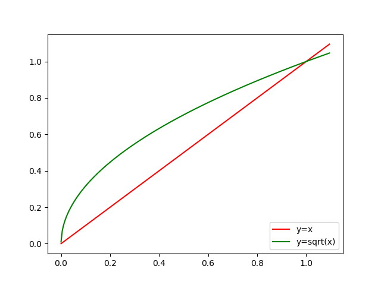
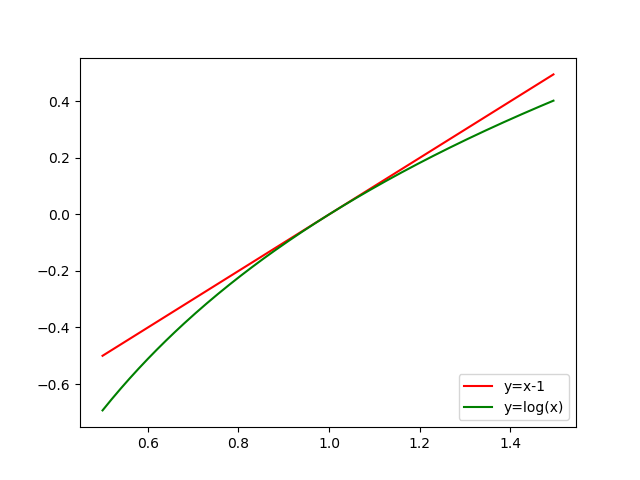

# you only look once
[yolo](https://zhuanlan.zhihu.com/p/25236464)   
[有深度的yolo博客](http://blog.csdn.net/tangwei2014/article/details/50915317) 

## abstract 
以往的目标检测都是把检测当做分类器做的，这篇文章是看做回归做的，直接回归bounding boxes和class probabilities。  
base yolo model 45fps  PASCAL VOC 2007 mAP 63.4%   
Fast yolo model 155fps， PASCAL VOC 2007 mAP 52.7%   
yolo的错误更多的是在定位上，很少出现把背景误认为目标的错误。   

## introduction
yolo 输入$448\times 448$  
yolo的优点：
1. 快速，因为是把检测看做回归，输入一幅图像，直接对输出做阈值处理就得到结果，而不需要像RCNN一样复杂的流水线
2. 输出的时候，利用了全图的信息。不像slinding window和区域CNN的方法，yolo结合了全图的信息，也包含目标的周围图像，由此yolo相对于Fast RCNN产生更少的将背景看做目标的错误。
3. yolo有更好的泛化能力，与其它目标检测网络做对比试验得出的结论。

## unified detection
首先把整幅图像均分成$7*7$的格子，然后把目标检测的任务分到图像中物体中心所在图像中的小格子内。每一个小格子的输出信息是B个Bounding boxes加上confidence scores for those boxes，confidence score包含两层意思，第一模型认为这个格子包含目标的概率，第二这个格子输出目标的准确能有多高。  
confidence score 的定义：
> $$Pr(Object)*IOU_{pred}^{truth}$$
如果一个小格子不包含目标的中心，那么它的confidence score为0，否则confidence score就等于$IOU_{pred}^{truth}$   
Bounding box(每一个小格子输出B个Bounding box，每一个Bounding box包含物体的矩形区域及confidence score，注意，不是划分的小格子)  
- x,y：是物体即目标框的中心，相对于划分的小格子中心(bounds of the grid cell?)的偏移，使用小格子的长和宽??归一化;  
- width,height：bounding box的长和宽，使用图像的长和宽归一化;  
- confidence：是由两个数字乘积得到的，第一个是该小格子内是否有目标$Pr(object)$，有是1，无是0;第二个是3预测的物体框与标记数据的框的重合面积(intersection over union)$IOU^{truth}_{pred}$(是否归一化？？是)，这个是输出数据，训练的时候由标记数据与预测框一起计算误差做truth-label，测试的时候没有标记数据时怎么计算？？由网络直接输出预测重合面积;

每一个小格子的输出还包括C个conditional class probability：
> $$Pr(Class_i|Object)$$
是条件概率，即只有小格子内有目标时，这个概率才会被定义。这里C的大小与B的大小无关。  
测试时，输出每个bounding box的class specific confidence score：
> $$Pr(Class_i|Object) * Pr(Object) * IOU_{pred}^{truth}=Pr(Class_i) * IOU_{pred}^{truth}$$
第一项是每个网格预测的类别信息，第二、三项一起组成每个bounding box输出的confidence。  
这样就把问题转换为回归问题，而不再是分类器。具体地网络输出层包括:$7*7*(B*5+C)$维度向量，相当于每个格子输出$B*5+C$维向量。
### network design
yolo 高仿GoogLeNet的图像分类结构，使用24层卷积，2层全连接，  
Fast yolo使用9层卷积  
采用$B=2,C=20$即$7*7*30$维的输出，那么其中每个格子回归坐标的有$2*4=8$维，用于分类的有$20$维  

### training
在ImageNet 1000class数据集上进行预训练，预训练网络为yolo的前20层卷积接平均池化、全连接，a single crop top-5 accuracy 88% on ImageNet 2012。  
预训练网络输入为$224\times 224$，修改为目标检测网络时，输入修改为$448\times 448$，bounding box的w、h使用图像的长和宽归一化，bounding box的x、y是offsets of a particular grid cell location，取值范围为$0-1$。  
网络最后一层的激活函数是linear activation，其它层的激活函数都是leaky rectified linear activation:
> $$\phi(x)=\begin{cases} x &\text{if }{x>0}\\  0.1x &\text{otherwise}\end{cases}$$

回归使用的是平方和误差损失，一张图像的loss function:
> $$\begin{aligned} loss =& \lambda_{coord} \sum_{i=0}^{S^2}\sum_{j=0}^{B} \mathbb{1}_{ij}^{obj} \lbrack (x_i-\hat x_i)^2+(y_i-\hat y_i)^2 \rbrack \text{}\\
+& \lambda_{coord}\sum_{i=0}^{S^2}\sum_{j=0}^{B}\mathbb{1}_{ij}^{obj} \lbrack (\sqrt{w_i}-\sqrt{\hat{w}_i})^2 + (\sqrt{h_i}-\sqrt{\hat{h}_i})^2\rbrack \\
+& \sum_{i=0}^{S^2}\sum_{j=0}^{B} \mathbb{1}_{ij}^{obj}(C_i-\hat{C}_i)^2  \\
+& \lambda_{noobj}\sum_{i=0}^{S^2}\sum_{j=0}^{B} \mathbb{1}_{ij}^{noobj}(C_i-\hat{C}_i)^2  \\
+& \sum_{i=0}^{S^2}\mathbb{1}_{i}^{obj} \sum_{c\in classes}(p_i(c)-\hat{p}_i(c))\end{aligned}$$
$S^2$表示格子的数目，$B$表示每个格子预测的Bounding box数目，$\mathbb{1}_{i}^{obj}$表示目标是否出现在第$i$个小格子内，$\mathbb{1}_{ij}^{obj}$表示第$i$个小格子需要预测第$j$个Bounding box，即要计入损失，
- $\lambda_{coord}=5$，损失函数中，将8维的定位损失与20维的分类损失的权重看做相等是不合理的，至于为什么是$5$，可以这样理解，每一个小格子预测的$2$个bounding box中只有一个y与ground truth box的IOU最大的那个计入loss，也就是一个格子只有一个$\mathbb{1}_{ij}^{obj}$为$1$，也就是有$4$维的损失，那么$4*5=20$就等于$20$维的分类损失
- $\lambda_{noobj}=0.5$，一张图像中，只有小部分小格子包含目标，将不包含目标与包含目标的格子的confidence loss权重设置相同，会导致输出趋向于0???。
- 对不同大小的box预测，相比于大box的长、宽预测偏一点，小box预测长、宽的偏差是更不能忍受的，而sum-squared error loss中对同样的偏差loss是一样的，所以要采取一种方式来增大小box的预测偏差损失的权重，由此产生了对$\sqrt{w},\sqrt{h}$的预测，通过看图可以理解它的作用，这和RCNN中的bounding box regression中的$\log w, \log h$的效果是一样的。
  
- yolo为每个小格子预测多个bounding box，但是训练阶段，作者只让一个bounding box也就是与ground truth box的IOU最大的那个匹配ground truth box。这个称作box predictor的specialization
训练数据集PASCAL VOC 2007和2012,batch_size为64，动量为0.9，权重衰减项(权重规则化)0.0005，学习率第一个epoch是$10^{-3}$逐渐升到$10^{-2}$，因为开始学习率较大会震荡到发散状态。作者使用了dropout和大量的数据增强操作。
### inference
### limitation of yolo
## comparsion to other detection systems
## experiments
## tips
- 输出层是全连接层，所以输入层的图像大小需要一致。
- 每个小格子可以输出B个Bounding Box，但是只保留一个$IOU$最大的框为物体检测输出。这意味着每个格子最多只能检测出一个物体。