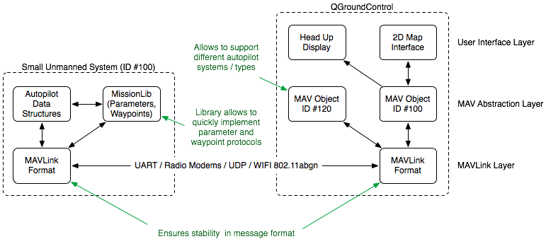

## 框架


## 协议
[tutorial](http://qgroundcontrol.org/mavlink/start)

# mavlink v1
## 安装
1. 下载源代码
```shell
git clone --recursive '.git'
```
2. 添加PYTHONPATH环境变量
把当前路径添加进入.bashrc，语句如下
```shell
export PYTHONPATH=~/path:$PYTHONPATH
```
3. 生成特定语言的mavlink协议代码，包含两种方法
- gui模式
gui模式生成代码需要python-tk模块，可直接运行如下命令安装
```shell
sudo apt-get install python-tk
```  
打开gui，生成协议信息
```shell
python -m mavgenerare
```
运行错误
```
from future import standard_library  
ImportError: No module named future
[解决方法](https://github.com/ArduPilot/pymavlink/issues/25)  
pip install future
```
生成mavlink头文件后，包含mavlink.h就好，要修改为包含mavlink_bridge.h，最好读README.txt

- 直接脚本模式

# mavlink v2


# QGroundControl
[各种版本](https://github.com/mavlink/qgroundcontrol/releases/)
地面站软件，3.1.2版本比较好用，使用Mavlink的实例可以直接连接，最新的不好用，可能需要其它设置。