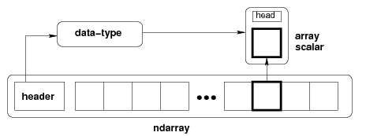

## NumPy   [referrence](https://docs.scipy.org/doc/numpy/reference/arrays.html)

1. the n-dimensional array  
    - 提供了一个N维的矩阵，简写为 ndarray，
    - [array creation routines](https://docs.scipy.org/doc/numpy/reference/routines.array-creation.html#routines-array-creation)
3. indexing
    - 有三种indexing方法
        filed access  
        basic slicing：通过slicing得到的矩阵，是original矩阵的views   
        advanced indexing  
