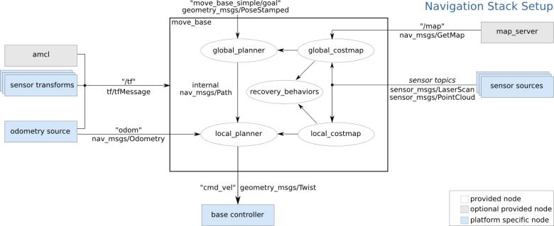

## ros-navigation
  
[navigation bag:   hector_exploration_planner](http://wiki.ros.org/hector_exploration_planner?distro=kinetic)   
[西工大一学生讲解navigation](http://blog.exbot.net/archives/1129)  

[ros navigation](http://wiki.ros.org/navigation  )   
这一个集合就称为 navigation stack，它的输入是里程计、传感器数据、目标姿态，输出是速度控制。
- base_local_planer  
<pre>
    Trajectory RollOut  
    Dynamic Window Approach(DWA) 
</pre>
- amcl
<pre>
    是一个用于2d机器人移动概率定位的方法，实现了基于粒子滤波的蒙特卡洛定位法。
</pre>
- dwa_local_planner
<pre>
    DWA 局部地图路径规划
</pre>
- global_planner
<pre>

</pre>
- costmap_2d
<pre>
主要有两种方法来初始化costmap_2d，第一种是利用用户已经生成好的静态地图，使用map_server节点，但同时也接收当前传感器的数据来更新地图；
第二种是使用rolling_window保持机器人在地图的中心。
</pre>
- [map_server](http://wiki.ros.org/map_server)
<pre>
是一个ROS节点，从磁盘内读取地图，然后通过service传输消息。
</pre>
- map_saver
<pre>

</pre>

- [nav_core](http://wiki.ros.org/nav_core?distro=electric)  

<pre>
    nav_core包含了导航堆栈的数据接口，所有的路径规划程序都是依赖于这样的接口，来呈现在move_base节点中。
    nav_core::BaseGlobalPlanner提供了全局路径规划程序的接口，这里全局路径规划程序是一插件的形式体现在move_node上。类初始化函数需要提供全局路径规划程序节点名，即全局路径规划名称，代价地图；制作路径函数需要提供当前地址，目标地址，返回所规划路径。
    nav_core::BaseLocalPlanner提供了局部路径规划程序的接口。类初始化函数需要提供局部路径规划程序节点名，接收路径规划的节点名，代价地图；设置局部路径，（路径是传进去函数的参数）；计算速度函数，提供Twist信息。
    nav_core::RecoveryBehavior规定move_base行为集合中处理异常的行为。初始化时需要提供全局代价地图，局部代价地图。
</pre> 

[ros setup tf(transform)](http://wiki.ros.org/navigation/Tutorials/RobotSetup/TF)   
navigation stack  
  需要设置目标点，navigation stack应该只是做导航，路径规划，目标地址需要其他节点提供。

costmap fonfiguration  
  local_costmap：局部地图，用于本地的避障与规划  
  global_costmap：全局地图，意味着用于整个环境的长期规划  
  如此存在三个设置，common configuration, global configuration, local configuration  
