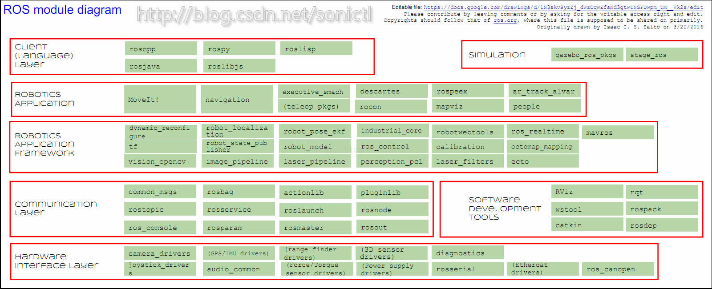

## 移植到树莓派需要修改的地方
tfPublish.cpp
trackPublish.cpp
gridmap.h内的char getData(unsigned int index)要换成 signed char getData()，因为-1被结算出为255，表现为膨胀地图把未知区域也膨胀掉了
gridmap.h内的char getData(unsigned int x, unsigned int y)要换成signed char getData(unsigned int x, unsigned int y)，表现为无法找到未知点

## cartographer包运行
  
```shell
#运行cartographer
roslaunch cartographer_ros demo_backpack_2d.launch bag_filename:=${HOME}/slam/cartographer_paper_deutsches_museum.bag
#或者
roslaunch cartographer_ros mycartographer.launch bag_filename:=${HOME}/slam/cartographer_paper_deutsches_museum.bag
#ros运行路径规划节点
roslaunch my_robot_name2dnav move_base.launch 
```

## nav2d
```shell
#发布tf
rosrun beginner_tutorials tfpublish
#运行nav2d
roslaunch nav2d_tutorials tutorial5.launch
rosservice call /StartExploration 

#运行mynav2d
roslaunch mynav tutorial3.launch

```

## 自己的雷达在线测试
```shell
#改变权限
sudo chmod 777 /dev/ttyUSB0
#跑雷达串口程序
roslaunch beginner_tutorials myserial.launch 
#运行cartographer
roslaunch cartographer_ros demo_revo_ldsmy.launch
#运行显示轨迹的节点
rosrun beginner_tutorials nav
#轨迹规划
rosrun mappublish mapPublish 
```
## cartographer的设置
```shell
#demo_revo_ldsmy.launch文件内容
<launch>
  <node name="cartographer_node" pkg="cartographer_ros"
      type="cartographer_node" args="
          -configuration_directory $(find cartographer_ros)/configuration_files
          -configuration_basename revo_lds.lua"
      output="screen">
    <remap from="echoes" to="horizontal_laser_2d" /> 
  </node>

  <node name="rviz" pkg="rviz" type="rviz" required="true"
      args="-d $(find cartographer_ros)/configuration_files/demo_2d.rviz" />
</launch>

#revo_lds.lua文件内容
include "map_builder.lua"

options = {
  map_builder = MAP_BUILDER,
  map_frame = "map",
  tracking_frame = "base_link",
  published_frame = "base_link", 
  odom_frame = "odom",
  provide_odom_frame = true,
  use_odometry = false,
  use_laser_scan = true,
  use_multi_echo_laser_scan = false,
  num_point_clouds = 0,
  lookup_transform_timeout_sec = 0.2,
  submap_publish_period_sec = 0.3,
  pose_publish_period_sec = 5e-3,
}

MAP_BUILDER.use_trajectory_builder_2d = true

TRAJECTORY_BUILDER_2D.laser_min_range = 0.3
TRAJECTORY_BUILDER_2D.laser_max_range = 15.
TRAJECTORY_BUILDER_2D.laser_missing_echo_ray_length = 1.
TRAJECTORY_BUILDER_2D.use_imu_data = false
TRAJECTORY_BUILDER_2D.use_online_correlative_scan_matching = true

SPARSE_POSE_GRAPH.optimization_problem.huber_scale = 1e2

return options
```

## 接口程序已更改，下面的不一定能成功
## 运行cartographer，使用数据包
```shell
roslaunch cartographer_ros demo_revo_ldsbag.launch bag_filename:=${HOME}/data/cartographerOutput/mytest.bag
#使用数据包时的 demo_revo_lds.launch 的配置
<launch>
  <param name="/use_sim_time" value="true" />

  <node name="cartographer_node" pkg="cartographer_ros"
      type="cartographer_node" args="
          -configuration_directory $(find cartographer_ros)/configuration_files
          -configuration_basename revo_lds.lua"
      output="screen">
    <remap from="echoes" to="horizontal_laser_2d" />
  </node>

  <node name="rviz" pkg="rviz" type="rviz" required="true"
      args="-d $(find cartographer_ros)/configuration_files/demo_2d.rviz" />
  <node name="playbag" pkg="rosbag" type="play"
      args="--clock $(arg bag_filename)" />

</launch>
```
## ros如何编译指定的包？？
[ros中文wiki](http://wiki.ros.org/cn) ，
[ros入门讲解](http://www.jianshu.com/p/b604b00b7053) 
# aim: complete coverage path planning
FAQ   http://answers.ros.org/question/212614/complete-coverage-path-planning-ros/

## ros workspace setup
创建工作空间文件夹，创建ws/src  
创建包catkin_create_package   
添加依赖文件时，不只要修改CmakeLists.txt，需要同步到package.xml  

## rosApi
ros头文件在PC上的路径： /opt/ros/kinetic/include  
[rosApi网址](http://wiki.ros.org/APIs)  
[common_msgs](http://wiki.ros.org/common_msgs) 包含, nav_msgs, geometry_msgs， sensor_msgs……
- [geometry\_msgs](http://docs.ros.org/api/geometry_msgs/html/index-msg.html)
```
PoseStamped，是一个姿态结构体，包含信息头，位置，姿态信息
Twist，线速度，角速度，都是三元素结构。
```

## ros map
[map数据结构](http://wiki.ros.org/rviz/DisplayTypes/Map) 


nav_msgs/Path.msg路径数据
.child_frame_id   tf结构成员，搜索结果少，可以用作定位代码

输出的tf文件夹内有两种child_frame_id（odom, base_link），是用同一个结构体（geometry_msgs::TransformStamped）连续两次输出的结果。
验证后不是上面的这种结构，而是tf2_msgs::TFMessage

cpp读写 tf 数据： http://wiki.ros.org/tf/Tutorials/

## 雷达数据采集结构
laserScan http://docs.ros.org/api/sensor_msgs/html/msg/MultiEchoLaserScan.html  
采样角度间隔、时间间隔都视为均匀的，没有每一个数据都记录一个对应的角度和采样时间。
```
// Modeled after ROS's MultiEchoLaserScan message.
// http://docs.ros.org/api/sensor_msgs/html/msg/MultiEchoLaserScan.html
message LaserScan {
  message Values {
  repeated float value = 1 [packed = true];
  }
  optional float angle_min = 2;
  optional float angle_max = 3;
  optional float angle_increment = 4;
  optional float time_increment = 5;
  optional float scan_time = 6;
  optional float range_min = 7;
  optional float range_max = 8;

  repeated Values range = 9;
  repeated Values intensity = 10;
}

点云数据结构
//point_cloud.h
typedef std::vector<Eigen::Vector3f> PointCloud;

//.proto
// Collection of 3D 'points'.
message PointCloud {
  // Points as repeated floats for efficiency. All fields have the same size.
  repeated float x = 3 [packed = true];
  repeated float y = 4 [packed = true];
  repeated float z = 5 [packed = true];
}
```
## protobuf
```
谷歌的一个跨平台、跨语言的
生成代码
protoc -I=$SRC_DIR --cpp_out=$DST_DIR $SRC_DIR/addressbook.proto

scan-to-scan matching 存在误差累计的问题,用于计算pose change
scan-to-map matching 会限制误差，使用 gauss-newton
scan-to-submap

local error accumulation, partical filter and graph-based SLAM
不适用粒子滤波，而做姿态优化

pose包括 x,y,theta
```

# FAQ
- navigation包中，使用move_base.launch问题
```
问题： Trajectory Rollout planner initialized with param meter_scoring not set. Set it to true to make your settins robust against changes of costmap resolution
解决方法： 在base_local_planner_params.yaml内加上meter_scoring: true

问题： Timed out waiting for transform from base_link to tf to become available before running costmap, tf error:
解决方法：从 base_link 到 tf 的转换？？tf是一个包含 odom 和 base_link 的结构体，参考 navigation 的手册进行了修改，添加 tf::TransformBroadcaster odom_broadcaster;转换节点可行。

问题： The origin for the sensor at (-49.29, -29.03) is out of map bounds. So, the costmap cannot raytrace for it.
解决方法： 传感器原点超出地图边界？？？ 坐标即是机器人参照？？？？坐标系的坐标，好像是没有map帧的原因

```
- 未定义函数
```
在package.xml， CMakeLists.txt,中添加依赖文件
可以在CMakeLists.txt中add_executable前加上一行 
find_package(catkin REQUIRED COMPONENTS tf)
```