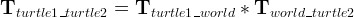

[setting up your robot using tf](http://wiki.ros.org/navigation/Tutorials/RobotSetup/TF)
----------


tf树结构保证了只有一种遍历整棵树的方法，并且所有的边都是从父节点到子节点的有向边,即所有的转换默认的都是从父坐标系到子坐标系的转换。   
如下：  把base\_laser下的雷达数据转换到base\_link下只需加上转换矩阵


### tf的用途
tf主要有两种用途，
第一种收听转换，第二种广播转换


## [introduction to tf](http://wiki.ros.org/tf/Tutorials/Introduction%20to%20tf)  

### 运行实验的两只乌龟
```shell
$ roslaunch turtle_tf turtle_tf_demo.launch
```

**这个实例包含三个坐标系(three coordinate frames)**
- a world frame
- turtle1 frame
- turtle2 frame
tf broadcaster 
tf listener

### 生成由tf发布的坐标系转换树结构
```shell
$ rosrun tf view_frames
$ evince frames.pdf
```
### 实时查看tf树结构
```shell
$ rosrun rqt_tf_tree rqt_tf_tree
或者
$ rqt &  #好像不行
```

### 查看两个坐标系之间的转换
```shell
#用法 rosrun tf tf_echo [reference_frame] [target_frame]
$ rosrun tf tf_echo turtle1 turtle2
```


**这里的坐标系转换是有参考方向的，不同的方向，translantion的值不同，即两个坐标系的转换存在旋转和平移**

### 使用rviz查看 tf
```shell
$ rosrun rviz rviz -d `rospack find turtle_tf`/rviz/turtle_rviz.rviz
```

### tf监控
```shell
#输出tf树的所有监控
$ rosrun tf tf_monitor
#只输出监控的frame之间的转换
$ rosrun tf tf_monitor <source_frame> <target_frame>
```
### 发布tf的静态转换
```shell
#平移矩阵和欧拉旋转角，yaw绕z轴，pitch绕y轴，roll绕x轴，period_in_ms为转换tf的发布周期
$ rosrun tf static_transform_publisher x y z yaw pitch roll frame_id child_frame_id period_in_ms
#平移矩阵和四元数
$ rosrun tf static_transform_publisher x y z qx qy qz qw frame_id child_frame_id  period_in_ms
```


